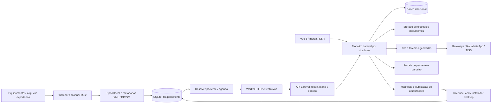

# Avaliação técnica e econômica preliminar — EasyEye + Integrator

Data-base: 17/09/2026. Valores em reais. Objeto: software existente, arquitetura, implementações, testes e documentação; empresa sem operação comercial, conforme informação do proprietário.

## 1. Conclusão e significado dos valores

**Custo estimado de reconstruir um produto funcionalmente equivalente: R$ 375 mil a R$ 830 mil.**

**Faixa indicativa do ativo técnico no estado atual, para um adquirente com interesse no domínio e capacidade de aproveitamento: R$ 200 mil a R$ 400 mil. Referência central de discussão: R$ 300 mil.**

A segunda faixa é um cenário de custo ajustado, de confiança baixa a moderada, não um preço de mercado observado. Não foram obtidas propostas de compradores, transações comparáveis, orçamento externo ou avaliação independente. Não é laudo contábil, jurídico ou avaliação certificada. Ausência de demanda pode produzir preço muito inferior à faixa, inclusive nenhum comprador.

A primeira faixa considera reconstrução com ferramentas atuais, reaproveitamento de bibliotecas e assistência de IA; não reprodução de cada linha, comentário ou decisão histórica. A segunda considera utilidade para outro operador, assimilação, pendências e risco de entrega. Não se somam as duas.

Não foram incluídos receita futura, marca com reconhecimento comprovado, carteira de clientes, contratos, dados de pacientes, canais comerciais, caixa, dívidas ou patrimônio externo aos repositórios. Não há avaliação de eficácia clínica da IA, certificação do prontuário ou homologação comercial de todos os equipamentos/gateways.

## 2. Método, alcance e limites

Foram inventariados 1.947 arquivos de código, configurações, dependências, testes e documentação selecionados por diretório/extensão: 1.879 do EasyEye e 68 do integrador. O arquivo `inventario.csv` registra caminho, tamanho, linhas e SHA-256; `referencia.json` registra os commits-base. O estado analisado é o da árvore de trabalho, incluindo alterações locais preexistentes.

Havia modificações anteriores em `app/Providers/AppServiceProvider.php`, `config/session.php` e `tests/Feature/Security/SessionCookieSecurityTest.php`, além de arquivos do sistema operacional. Não foram revertidas ou corrigidas para esta análise.

O trabalho incluiu:

- Inventário de camadas e domínios, rotas realmente registradas, dependências e pontos de entrada.
- Leitura dirigida de implementações e testes dos fluxos centrais, em vez de confiar apenas em PRD/README.
- Revisão de autenticação, isolamento por clínica, autorização, persistência, filas, uploads, atualização desktop e distribuição.
- Execução de testes disponíveis e builds web/SSR; investigação de bloqueios encontrados durante a verificação.
- Estimativa de reconstrução de baixo para cima, por entregáveis sem duplicar backend/frontend de cada domínio.
- Separação de implementação local, verificação automatizada e homologação operacional.

**Inventariar todos esses arquivos não significa auditoria humana de cada linha.** A revisão cobre os domínios identificados, mas não certifica ausência de bugs. Dependências de terceiros não foram auditadas linha a linha. Arquivos `.env`, credenciais, bancos reais e conteúdo clínico não foram usados como base de precificação nem incluídos no relatório. Não foram realizadas chamadas pagas de IA, cobranças, mensagens para pacientes ou publicações.

Não foram executados pilotos clínicos, testes de carga, restauração de backup, homologação com aparelhos físicos, instalação Windows real, revisão visual completa de todas as telas, validação jurídica de licenças/titularidade ou revisão de infraestrutura remota. Esses limites são relevantes para o valor.

## 3. Dimensão observada

| Área | Quantidade observada | Interpretação |
|---|---:|---|
| Código PHP em `app/` | 748 arquivos; 81.147 linhas físicas | Inclui comentários e módulos AI/TISS; não é medida de produtividade |
| Frontend em `resources/js/` | 237 arquivos; 55.574 linhas | Inclui legado e componentes; 185 arquivos Vue na árvore de Pages, não 185 telas independentes |
| Migrations Laravel | 221 arquivos; 10.332 linhas | Evolução do esquema, não 221 tabelas |
| Testes e suporte EasyEye | 219 arquivos; 34.519 linhas | 169 Feature, 32 Unit, 12 JavaScript e 6 de bootstrap/suporte |
| Rotas Laravel registradas | 578 | Inclui autenticação, framework e todos os contextos; não 578 funcionalidades comerciais |
| Código Rust em `src/` | 30 arquivos; 16.834 linhas | Inclui testes internos e comentários |
| Integração Rust em `tests/` | 15 arquivos; 2.807 linhas | Complementa testes dentro dos módulos |
| Migrations SQLite desktop | 6 | Configuração, fila, tentativas, metadados e índices |
| Manuais de perfis web | 5 | Administração, médico, secretaria, financeiro e paciente |

As linhas e contagens ajudam a impedir omissão de módulos. Não foram multiplicadas por preço por linha. Bibliotecas, arquivos gerados e funcionalidades sem utilidade para um comprador não ganham valor apenas por tamanho.

## 4. Arquitetura integrada

### Decisões existentes e seus efeitos econômicos

| Decisão observada | Benefício | Custo/limite |
|---|---|---|
| Monólito Laravel com Services/Actions e domínios AI/TISS | Deploy e evolução centralizados; contratação mais simples que arquitetura distribuída | Alguns controllers extensos e dependências de sessão aumentam regressão |
| Banco compartilhado e `entity_id` | Operação inicial econômica | Isolamento depende de contexto, filtros e autorização; não é isolamento físico por cliente |
| Vue + Inertia + SSR | Backend e telas compartilham contratos e rotas; build reproduzível | Mistura Bootstrap/Tailwind e recursos legados amplia superfície de manutenção |
| SQLite + spool no integrador | Captura tolera indisponibilidade de internet; dados não dependem só de RAM | Banco, arquivos e servidor exigem reconciliação após falhas |
| Rust/Iced/Tokio para desktop | Um núcleo multiplataforma e controle de concorrência | Habilidades e distribuição desktop mais especializadas; testes macOS não provam Windows |
| Adaptadores para IA e cobrança | Reuso de orquestração, fallback e auditoria | Adaptador implementado não equivale a homologação externa |
| Bibliotecas abertas e templates | Reduzem esforço e prazo | Licenças, atualizações e manutenção de terceiros permanecem relevantes |

São observações da arquitetura existente, não decisões novas de migração ou refatoração. Não há necessidade arquitetural demonstrada de transformar o produto em microserviços para atribuir valor ao ativo.

## 5. Mapa funcional — EasyEye

| Domínio | Implementação identificada | Evidência principal | Limite da avaliação |
|---|---|---|---|
| Identidade e acesso | Cadastro, login, recuperação, verificação, múltiplas entidades, papéis, permissões, 2FA e impersonação | `bootstrap/app.php`, `app/Http/Middleware/`, `app/Providers/AuthServiceProvider.php` | Segurança global não certificada; fluxos fora de HTTP precisam de escopo explícito |
| Multi-tenancy | Contexto, scope global, catálogo global e filtros por clínica | `app/Support/TenantContext.php`, `app/Models/Scopes/EntityScope.php`, `app/Providers/TenantScopeServiceProvider.php` | Scope fica inerte sem vínculo; benefício real, mas não barreira universal |
| Cadastros clínicos | Pacientes, médicos, convênios, medicamentos, CID, procedimentos e importação | `app/Services/PatientService.php`, `PatientImportService.php`, `DiagnosisCatalogService.php` | Catálogos não foram avaliados quanto a atualização clínica/licença de origem |
| Agenda e recepção | Horários médicos, recursos, bloqueios, espera, reagendamento, situações, avisos e painel de chamadas | `app/Services/ScheduleService.php`, páginas `Panel/Schedules`, `CallPanel` | Concorrência e picos reais de atendimento não medidos |
| Prontuário especializado | Campos oftalmológicos, evolução, prescrições, lentes, histórico e fluxo de atendimento | `app/Models/MedicalRecord.php`, `app/Services/MedicalRecordService.php`, `MedicalRecordForm.vue` | Componente principal tem 3.220 linhas; revisão/manutenção exige atenção |
| Documentos clínicos | Templates globais/clínica, variáveis, adoção/publicação, receitas, laudos e PDFs | `ReportSettingService.php`, `MedicalRecordQuickActionService.php`, `MedicalRecordPdfService.php` | Geração depende de binário PDF e ambiente; hash interno não prova certificação externa |
| Imagens e exames | Upload, importação externa, comparação, laudos, vínculos e derivados | `EyeImagesController.php`, `ExternalExamImportService.php`, `app/Services/Api/PatientExamService.php` | Não foi comprovado um PACS completo, arquivo DICOM integral ou conectividade DICOM de rede |
| Portal do paciente | Convite, autenticação própria, documentos, compartilhamento/revogação e exportação | `routes/patient-portal.php`, `PatientDocumentAccessService.php` | Testes não substituem revisão de jornada em todos os dispositivos |
| Privacidade e rastreabilidade | Consentimentos, logs de acesso, auditoria, termos, versões e solicitações | `LgpdService.php`, `ConsentService.php`, `AuditService.php`, `app/Traits/` | Mecanismos técnicos não certificam conformidade institucional |
| Financeiro clínico | Caixa, categorias, preços, fechamento, relatórios e BI | `app/Services/Financial/`, páginas `Panel/Financial` | Não é evidência de contabilidade fiscal completa ou conciliação bancária homologada |
| TISS | Guias, lotes, XML, validações, transmissões, retornos, glosas e recursos | `app/Domains/Tiss/` | Driver padrão mock; sem XSD na pasta padrão; homologação com operadoras não provada |
| Estoque e compras | Produtos, fornecedores, lotes, validade, inventário, custos, compras/recebimento e alertas | `app/Services/Stock/`, `StockService.php` | Há transações e locks; validar concorrência e processos da clínica em campo |
| Cirurgias e lentes IOL | Catálogo, prescrição, consumo de materiais e vínculo a procedimentos | `IolLensStockBridgeService.php`, `MedicalRecordProcedureExecutionService.php` | Código registra pendência de mapeamento TISS para materiais/OPM |
| Plataforma SaaS | Entidades, planos, trial, limites, uso, ativação e assinaturas | `FeatureGateService.php`, `UsageMeterService.php`, `SubscriptionService.php` | Estrutura de monetização existe, receita não foi presumida |
| Cobrança multi-gateway | Seis adaptadores, DTOs, webhooks, idempotência, fallback, circuit breaker, renovação e cancelamento | `app/Services/Billing/`, `app/Jobs/Billing/` | Assinaturas/cobranças reais de todos os gateways não foram homologadas nesta revisão |
| IA | OpenAI/Anthropic/Gemini, geração/revisão/consolidação sequenciais, prompts, anexos, aprovação, custos, créditos, reservas e devoluções | `app/Domains/AI/`, `AiOrchestrator.php`, `AiCreditWalletService.php` | Valor é de integração/orquestração; não de modelo proprietário ou eficácia médica comprovada |
| WhatsApp | Confirmação/cancelamento, pesquisa, verificação de telefone e processamento de webhook | `app/Services/WhatsApp/`, `routes/console.php` | Depende de Z-API e configuração externa; nenhuma mensagem real foi enviada |
| Parceiros e indicação | Leads, comissões, portal, referrals e indicadores de ativação | `PartnerService.php`, `ReferralService.php`, `routes/portal.php` | Não se atribuiu valor a um canal comercial ainda não operante |
| Manager, site e relatórios | Administração, indicadores, financeiro da plataforma, saúde das filas, releases, site e navegação | `routes/manager.php`, páginas `Panel/Manager`, `Site/Home.vue` | Métricas implementadas não significam dados comerciais reais |
| Frontend compartilhado | Layouts, formulários, componentes, temas, gráficos, calendário e SSR | `resources/js/`, `vite.config.js` | Builds passam; acessibilidade, responsividade e qualidade visual completas não auditadas |

## 6. Mapa funcional — Integrator

| Subsistema | O que existe | Evidência/limite |
|---|---|---|
| Aplicação e configuração | Inicialização, caminhos por SO, ambientes de build, estado e snapshots | `src/main.rs`, `src/app`, `src/config`; dados locais e permissões demandam validação por SO |
| Banco local | Migrations embutidas, pool, WAL, foreign keys e timeout de escrita | `src/database`, `migrations`; banco local não foi avaliado em restauração de desastre |
| Autenticação remota | Ativação, validação/renovação de expiração e logout | `src/auth`, `src/api`; token também é persistido na configuração SQLite |
| Bloqueio local | Senha com Argon2, tentativas e desbloqueio offline | `src/auth/local.rs`; não equivale a criptografia dos exames em disco |
| Segurança e logs | HTTPS, abstração keyring, redação de segredos, retenção e logs | `src/security`, `src/logger`; revisão não afirma que nenhum dado sensível possa aparecer em todos os caminhos |
| Catálogo de equipamentos | Presets, fabricante/modelo, modalidade e caminhos sugeridos | `src/equipment/catalog.rs`; catálogo não é certificação de integração por aparelho |
| XML/EMR e metadados | Extração de paciente/data/lateralidade e arquivos acompanhantes | `src/equipment`, `src/watcher`; exige amostras reais por fabricante/formato |
| DICOM | Conversão local do primeiro frame para PNG, cabeçalhos e formatos suportados | `src/dicom`; limitações de transfer syntax, frames e representação; não é PACS completo |
| Captura | Scanner e eventos de pasta, estabilidade, extensões, tamanho e checksum | `src/watcher`; avaliar arquivos sobrescritos, pastas de rede e indisponibilidade real |
| Spool | Cópia local, staging, rename, espaço mínimo, retenção e reconciliação | `src/spool`; não é backup remoto ou garantia contra perda do disco |
| Fila | Estados persistentes, deduplicação, claim atômico, retries, bloqueados e recuperação | `src/queue`; consistência é diferencial, ainda requer teste de falhas em campo |
| Resolução de vínculo | Metadados, nomes com PAC/SDL/UUID, cache de agenda e fallback | `src/scheduler`; fallback de primeiro agendamento não prova identidade do paciente |
| Upload | Multipart, limites, classificação de falhas e duplicidade | `src/uploader`, `src/api`; interoperabilidade real inclui rede, API e configuração |
| Serviço | Scan/drain, polling/watch loop, proteção de tarefas e shutdown | `src/service`; watcher persistente e UI precisam de testes prolongados |
| Exclusão mútua | Locks de scanner/worker e instância única | `src/lock`, `src/instance`; código Windows não é exercitado integralmente no macOS |
| Interface | Ativação, equipamentos, fila, correção, logs, bloqueio, temas e idiomas | `src/ui`; arquivo views tem 2.567 linhas, mod tem 1.793 |
| Bandeja/autostart | Implementações condicionais para sistemas suportados | `src/tray`, `src/autostart`; macOS e Windows possuem diferenças |
| Atualizador | Consulta manifesto, download, checksum e assinatura | `src/updater`; chave pública zerada e instalação/rollback automáticos não entregues |
| Distribuição Windows | MSI WiX, autostart, upgrades e preservação dos dados locais | `packaging/windows`, workflow de release; execução real não observada nesta análise |
| CI e dependências | Build/test em matriz, lint, cargo-deny e artefatos | `.github/workflows/`; presença do workflow não confirma última execução remota |

## 7. Evidências que sustentam valor

1. **Domínio especializado implementado:** prontuário, exames e rotinas oftalmológicas integrados à operação clínica. O valor não está apenas em CRUD genérico.
2. **Fluxo local + nuvem:** captura, persistência local, tentativas, resolução e disponibilização web reduzem trabalho manual quando homologados.
3. **Tratamento de consistência:** transações, locks de estoque/carteira, deduplicação e recuperação de fila. Em `PatientExamService`, arquivo novo é salvo antes de atualizar a referência e o antigo é removido após commit.
4. **Monetização técnica já construída:** planos, quotas, assinaturas, cobrança, créditos de IA e portais. Isso poupa reconstrução, mas não cria receita automaticamente.
5. **Testes e documentação úteis:** regressões de escopo, fluxo clínico, cobrança, créditos e fila; manuais por perfil e pipeline desktop.
6. **Stack comum no servidor:** facilita encontrar profissionais e transferir manutenção. Rust no desktop agrega capacidade, mas não recebe prêmio apenas pela linguagem.

## 8. Pendências e descontos técnicos

### Confirmadas no código ou na execução

| Achado | Evidência | Efeito na avaliação |
|---|---|---|
| Suíte PHP completa não inicia no comando original | `actingAsDoctor` e `actingAsSecretary` duplicadas em `tests/Feature/EyeImages/EyeImageManualReportTest.php:62` e `tests/Feature/Stock/MedicalRecordProceduresTest.php:56` | Falta um gate reproduzível de regressão; verificação separada não elimina o defeito do comando normal |
| Suíte funcional não está inteiramente verde | 1.423 casos passaram e 17 falharam nas duas execuções complementares; Unit: 255 passaram | Parte é teste/fixture desatualizado; investigar seleção de assinatura e alinhar expectativas antes de afirmar prontidão plena |
| Exportação Excel depende de bibliotecas ausentes | `app/Exports/PartnersReportExport.php`; autoload não encontra Maatwebsite Excel/PhpSpreadsheet, ausentes do composer declarado/lock | Recurso existente na interface/código não pode ser precificado como entrega operacional confirmada |
| Chave do updater não configurada | `integrator/src/updater/mod.rs:28`; workflow barra release taggeada com placeholder | Pipeline precisa de configuração de assinatura e ensaio de entrega |
| Token gravado também em SQLite | `integrator/src/auth/mod.rs`, criação de `PublicAppConfig` antes do keyring | Keyring não remove a cópia em texto no banco; proteção local precisa ser resolvida ou formalmente aceita |
| Matching automático sem identidade forte | `integrator/src/scheduler/mod.rs`, `match_first_pending` | Arquivo sem identificação pode ser ligado por ordem/data; homologação e regra de bloqueio/confirmação são prioritárias |
| DICOM com escopo limitado | `integrator/src/dicom/mod.rs` | Não atribuir valor de armazenamento diagnóstico DICOM completo, vídeo ou todos os frames |
| TISS padrão é mock e XSD opcional | `config/tiss.php`, `ValidateTissXmlService.php`; zero XSD na pasta padrão local | Não atribuir prêmio de homologação com operadoras |
| Worker versionado não escuta as filas TISS padrão | `.docker/supervisor/easyeye-worker.conf` escuta `default,high`; workflow TISS despacha `tiss-xml`, `tiss-send`, `tiss-returns` | Configuração padrão apresentada não escoa esses jobs; um worker externo pode existir, mas não foi verificado |
| Isolamento depende do contexto/caller | `EntityScope` não filtra sem tenant; serviços e jobs têm caminhos explícitos | Exige disciplina de autorização; não é prova de vazamento atual em todos esses caminhos |
| Componentes/controllers grandes | Formulário 3.220 linhas, imagens 2.521, controller IA 1.340 | Aumenta custo de absorção, alteração e revisão; não demanda reescrita total |
| Documentação não acompanha o código | PRD exclui IA apesar do domínio existente; specs registram 367 rotas, comando registra 578; README desktop ainda menciona stub | Handover precisa usar código e testes como evidência principal |
| Licenciamento TinyMCE precisa de confirmação | `TinyMceEditor.vue:70` declara `license_key: 'gpl'`; licença instalada oferece GPL ou comercial | Confirmar compatibilidade e eventual contrato antes de cessão; não foi concluída irregularidade jurídica |

Não foi encontrado nem reproduzido neste relatório um token real hardcoded. O achado sobre SQLite é comportamento de armazenamento, não descoberta de uma credencial específica. Se cópias desse banco tiverem sido expostas, revogação/rotação dos tokens afetados deve fazer parte da correção.

### Não comprovados — não confundir ausência de evidência com inexistência

- Operação prolongada com equipamentos de cada fabricante, inclusive arquivos ambíguos, sobrescritas, quedas, disco cheio e relógios divergentes.
- Compatibilidade e assinatura dos instaladores Windows/macOS em máquinas de destino. Testes desta avaliação rodam no macOS.
- Homologação real dos seis gateways, de TISS e dos fluxos externos de WhatsApp.
- Metas e medidas de carga, latência, disponibilidade, RPO/RTO e recuperação de backup.
- CI automatizado do SaaS em serviço externo: não há workflow de CI em `.github/workflows` no repositório web examinado.
- Agendador Laravel executando na infraestrutura: schedules existem no código, mas o Compose não demonstra um serviço scheduler dedicado.
- Certificação regulatória/assinatura com certificado: `Signable` implementa hash e bloqueio, sem comprovação de uma cadeia de certificação externa.
- Qualidade clínica da IA: supervisão, notas e revisão sequencial são implementações; não são validação de eficácia.
- Titularidade, cessão de direitos de colaboradores e licenças do template visual. Ausência de `LICENSE` na raiz não prova titularidade nem domínio público.

## 9. Estimativa de reconstrução

Premissas: equipe competente usando Laravel/Vue/Rust e ferramentas modernas, requisitos conhecidos a partir do produto, escopo equivalente ao implementado, testes funcionais e documentação de entrega. Horas são **estimativas de engenharia**, não histórico medido do autor. Não há multiplicador por quantidade de linhas nem cobrança repetida de telas em cada camada.

Cada domínio abaixo inclui seu backend, persistência, UI específica e testes locais. A linha de frontend cobre somente estrutura compartilhada. A linha final cobre regressão integrada e entrega, sem recontar testes locais dos módulos. API servidor pertence à linha de exames; cliente Rust pertence ao integrador.

| Entregável | Horas mínimas | Horas máximas |
|---|---:|---:|
| Fundação, identidade, tenants e autorização | 220 | 360 |
| Pacientes, médicos, agenda e recepção | 280 | 440 |
| Prontuário oftalmológico, documentos e templates | 380 | 600 |
| Imagens, exames e API servidor | 180 | 300 |
| Portal paciente, privacidade, versões e auditoria | 180 | 300 |
| Financeiro clínico e estrutura TISS | 220 | 380 |
| Estoque, compras, materiais cirúrgicos e IOL | 180 | 300 |
| Planos, assinaturas, quotas e gateways | 240 | 400 |
| IA, provedores, aprovação, créditos e custos | 240 | 400 |
| WhatsApp, parceiros, indicação, dashboards e site | 160 | 260 |
| Componentes/layouts compartilhados e SSR | 100 | 180 |
| Integrador: fila, spool, watcher, serviço e HTTP | 260 | 420 |
| Integrador: equipamentos, metadados e DICOM | 120 | 220 |
| Integrador: UI, segurança local, instalador e updater atual | 160 | 280 |
| Regressão integrada, documentação e preparação de entrega | 200 | 360 |
| **Total** | **3.120** | **5.200** |

Taxa de cálculo adotada: **R$ 120–160/h**, como premissa de custo médio de execução técnica, não tarifa oficial de mercado. Referência externa de plausibilidade: salários full-stack sênior de R$ 12.450–20.950/mês na Robert Half; salário e preço de projeto não são equivalentes. Custos de gestão, encargos, margem e garantia variam por fornecedor.

- Extremo inferior: 3.120 × R$ 120 = **R$ 374.400**.
- Referência intermediária: 4.160 × R$ 140 = **R$ 582.400**.
- Extremo superior: 5.200 × R$ 160 = **R$ 832.000**.

Arredondamento de comunicação: **R$ 375–830 mil**. Corresponde a 19,5–32,5 meses-pessoa de 160 horas. Essa estimativa de reconstrução não mede o tempo histórico de desenvolvimento: trabalho assistido por IA, ativos anteriores, prototipação e diferentes critérios de conclusão mudam a relação.

Sensibilidade à produtividade/taxa:

| Cenário | Conta | Resultado |
|---|---|---:|
| Execução muito acelerada/reaproveitamento maior | 2.400 h × R$ 100 | R$ 240 mil |
| Limite inferior do escopo estimado | 3.120 h × R$ 120 | R$ 374,4 mil |
| Referência de reconstrução | 4.160 h × R$ 140 | R$ 582,4 mil |
| Limite superior do escopo estimado | 5.200 h × R$ 160 | R$ 832 mil |

O cenário acelerado demonstra por que não se deve apresentar o custo de reconstrução como piso obrigatório de compra. Um comprador que deseja apenas prontuário e captura pode reconstruir um subconjunto e não pagar por TISS, estoque ou seis gateways.

## 10. Do custo de reconstrução ao ativo sem operação

Modelo de discussão: **valor técnico aproveitável = custo equivalente × fator de aproveitamento − esforço adicional de absorção/correção**.

O fator representa utilidade do escopo para o comprador, risco de integração e dependência de conhecimento do desenvolvedor. O esforço adicional representa trabalho no ativo comprado, não o trabalho de reconstruir novamente. Custos históricos de desenvolvimento não são somados novamente ao custo de reconstrução, para evitar dupla contagem.

| Cenário ilustrativo | Custo equivalente | Aproveitamento assumido | Absorção/correção | Resultado |
|---|---:|---:|---:|---:|
| Conservador, comprador aproveita parte do conjunto | R$ 500 mil | 50% | R$ 50 mil | R$ 200 mil |
| Central, comprador aproveita a maior parte | R$ 500 mil | 70% | R$ 50 mil | R$ 300 mil |
| Favorável, forte aderência e transição organizada | R$ 600 mil | 75% | R$ 50 mil | R$ 400 mil |

**Os percentuais são hipóteses explícitas de julgamento, não descontos comprovados por mercado.** R$ 50 mil é reserva de cenário, não orçamento fechado das correções. As cifras escolhidas estão dentro da estimativa de reconstrução; o modelo não pretende precisão matemática de valor justo.

Com custo equivalente de R$ 500 mil, cada 10 pontos percentuais de aproveitamento altera o resultado em R$ 50 mil. Mantendo 70%, uma absorção de R$ 100 mil em vez de R$ 50 mil reduz o resultado central de R$ 300 mil para R$ 250 mil. Direitos de uso indefinidos, comprador sem equipe ou ausência de demanda podem reduzir mais; não há piso garantido.

Para atribuição interna, não venda separada, aproximadamente 75–80% do valor técnico é concentrado no SaaS e 20–25% no desktop e sua ligação com a plataforma. No cenário central de R$ 300 mil, isso representaria cerca de R$ 225–240 mil no web e R$ 60–75 mil no desktop. **Não são avaliações independentes:** separados, ambos perdem utilidade integrada e podem valer menos.

Gastos com ferramentas de desenvolvimento e horas de execução compõem o custo histórico, mas não determinam o preço do ativo. IA não torna a entrega gratuita nem torna toda linha gerada economicamente valiosa. O que conta é funcionalidade aproveitável, confiabilidade verificável e custo evitado pelo adquirente.

## 11. Condições para defender a faixa superior

1. Comando de teste PHP reproduzível, sem colisões; falhas relevantes resolvidas e registradas.
2. Captura em clínica piloto comprovando vínculo correto paciente/exame, recuperação de falhas e preservação dos originais.
3. Release instalável, assinatura configurada e ensaio de upgrade/preservação de dados no Windows de destino.
4. Escopo de TISS, gateways e IA descrito com clareza: implementação, homologado, experimental e fora do escopo.
5. Ambiente documentado com workers corretos, scheduler, backup e restauração ensaiada.
6. Titularidade e licenças demonstradas; transição de conhecimento com duração e entregáveis definidos.

Essas ações elevam a confiança no ativo. Não garantem aumento de preço sem comprador ou aplicação econômica. Não é necessário implementar todos os itens de roadmap para vender: é necessário não vender uma promessa como funcionalidade já entregue.

## 12. Fontes e bases

- Código e testes locais: referências por caminho nas tabelas e arquivos anexos.
- [Robert Half — Desenvolvedor(a) Full-Stack Sênior](https://www.roberthalf.com/br/pt/vagas-detalhes/desenvolvedora-full-stack-senior): referência salarial externa, consultada nesta avaliação. A taxa/hora adotada é hipótese própria.
- [IVSC — Perspectives Paper: Deciphering Technology](https://ivsc.org/perspectives-paper-deciphering-technology/): distingue valor da tecnologia, valor da empresa e realização de benefícios comerciais. O relatório não declara conformidade formal com IVS.
- [TinyMCE — License key](https://www.tiny.cloud/docs/tinymce/latest/license-key/): opções de licenciamento do editor; deve ser confrontado com contratos efetivos do titular.

Resultados detalhados da execução e falhas: consultar `VALIDACAO.md`. Memória de cálculo: `estimativa.csv`. Inventário estrutural: `inventario.csv`.
