# Manual do Administrador — EasyEye

Guia completo de utilização do sistema para o perfil **Administrador da clínica**, passo a
passo com telas reais. O administrador tem acesso total à clínica: além de tudo que os
perfis de secretária e financeiro fazem, ele gerencia o **corpo clínico**, os **usuários e
permissões**, todas as **configurações**, o **compliance** e os **créditos de IA**.

Este manual foca no que é **exclusivo do administrador**. Para a operação do dia a dia,
consulte também:

- [Manual da Secretária](../manual-secretaria/README.md) — agenda, pacientes, fila, mural, importação
- [Manual do Financeiro](../manual-financeiro/README.md) — caixa, fechamento, preços, TISS, glosas
- [Manual do Médico](../manual-medico/README.md) — prontuário e assistente de IA

> As capturas são geradas automaticamente a partir do sistema real
> (`e2e/cypress/e2e/docs/admin-manual.cy.js`). Para atualizá-las:
> `cd e2e && npx cypress run --browser chrome --config excludeSpecPattern=__none__ --spec cypress/e2e/docs/admin-manual.cy.js`
> e copie as imagens de `e2e/cypress/screenshots/admin-manual.cy.js/` para
> `docs/manual-administrador/img/`. Nenhum dado é criado durante as capturas.

---

## Sumário

1. [Acesso e visão geral](#1-acesso-e-visão-geral)
2. [Médicos: cadastro e gestão](#2-médicos-cadastro-e-gestão)
3. [Escala e bloqueios dos médicos](#3-escala-e-bloqueios-dos-médicos)
4. [Usuários da clínica](#4-usuários-da-clínica)
5. [Perfis de acesso (permissões)](#5-perfis-de-acesso-permissões)
6. [Configurações: catálogos clínicos](#6-configurações-catálogos-clínicos)
7. [Convênios e salas](#7-convênios-e-salas)
8. [Lentes IOL e modelos de documento](#8-lentes-iol-e-modelos-de-documento)
9. [Painel de chamadas e 2FA da clínica](#9-painel-de-chamadas-e-2fa-da-clínica)
10. [Relatórios e Compliance (LGPD/CFM)](#10-relatórios-e-compliance-lgpdcfm)
11. [Financeiro](#11-financeiro)
12. [Assistente de IA: consumo e créditos](#12-assistente-de-ia-consumo-e-créditos)
13. [Operação: agenda e pacientes](#13-operação-agenda-e-pacientes)
14. [Minha conta e limites do perfil](#14-minha-conta-e-limites-do-perfil)

---

## 1. Acesso e visão geral

Após o login você chega ao **Painel de controle**, com o checklist de configuração da
clínica e os indicadores do dia:

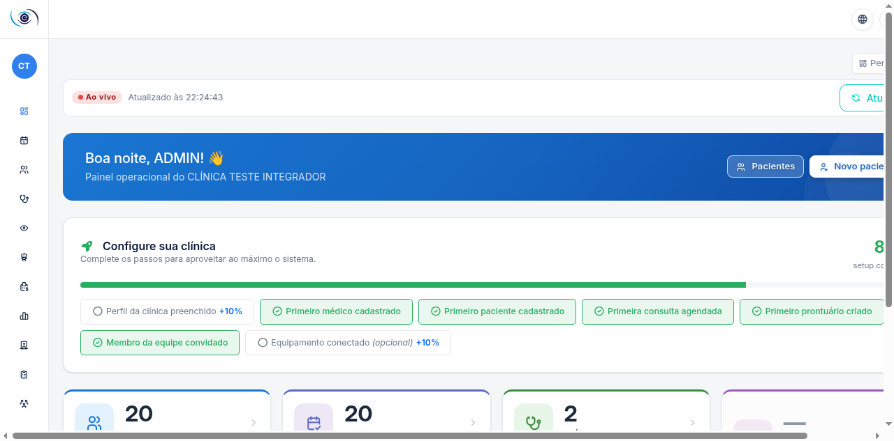

O menu do administrador é o mais completo do sistema:

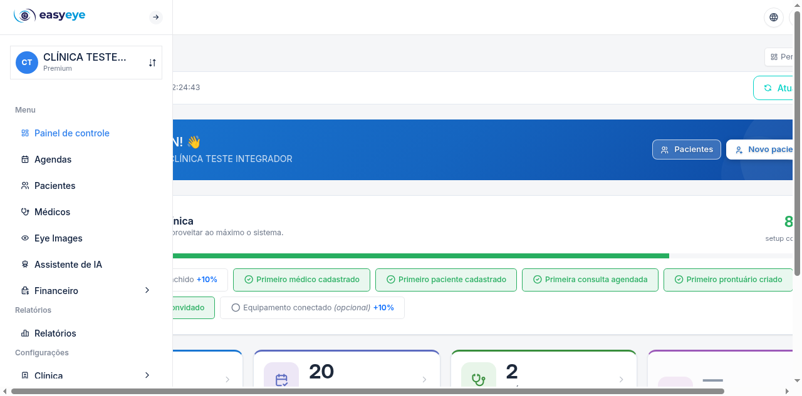

| Grupo | Conteúdo |
|---|---|
| Operação | Painel, Agendas, Pacientes, Médicos, Imagens oftálmicas |
| Assistente de IA | Consumo e compra de créditos |
| Financeiro | BI, Fluxo de Caixa, Faturamento TISS, Glosas, 2 relatórios |
| Relatórios | Produção, Absenteísmo e **Compliance** |
| Configurações | Unidades/salas, Segurança (2FA), Painel de chamadas, Convênios, catálogos clínicos, Lentes IOL, Modelos de documento, Parâmetros oftalmológicos |
| Controle de acesso | Usuários e Perfis e permissões |

---

## 2. Médicos: cadastro e gestão

**Médicos** no menu — gestão do corpo clínico (exclusiva do administrador, pois o cadastro
**cria a credencial de login** do médico):

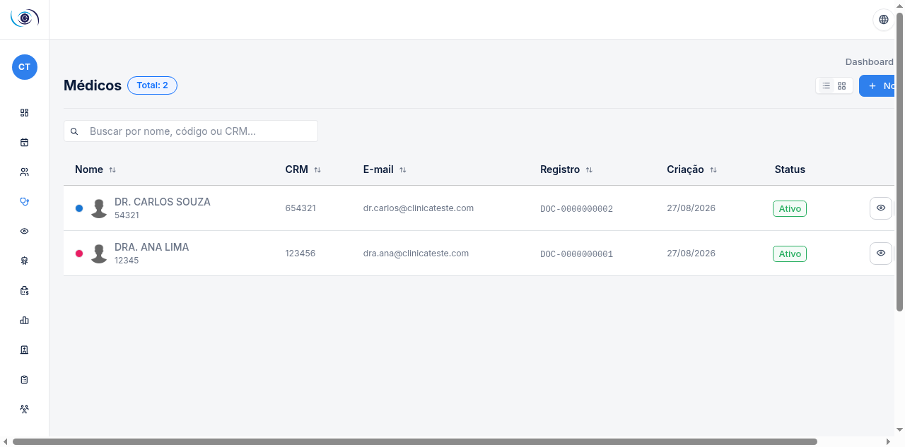

### Cadastrar um médico

Clique em **Novo médico**. O cadastro tem 4 abas:

**Pessoal** — nome completo, apelido (como aparece na agenda), CPF, nascimento, gênero,
estado civil e e-mail (será o login):

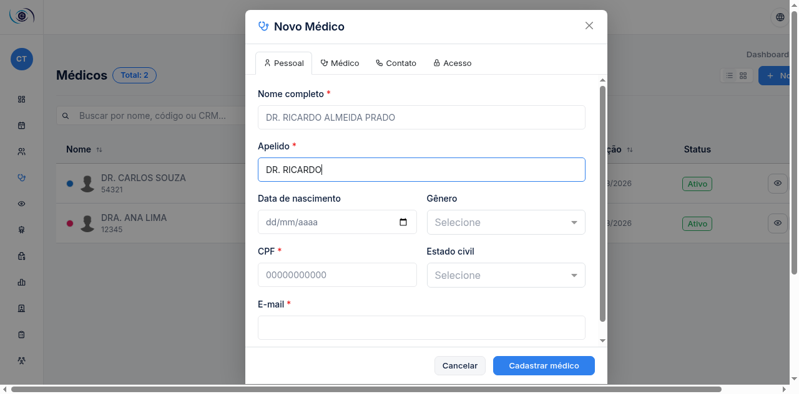

**Médico** — CRM, especialidade, **cor na agenda** (identifica os cards do profissional) e
se é médico parceiro:

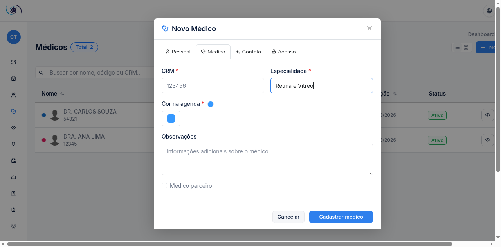

**Contato** — celular (com WhatsApp), telefone e endereço (CEP preenche sozinho).

**Acesso** — senha inicial do médico (mínimo 8 caracteres com maiúsculas, minúsculas,
números e símbolos):

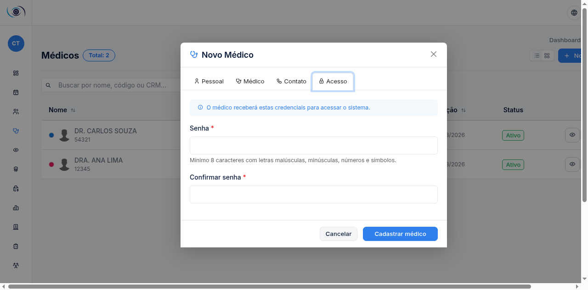

Clique em **Cadastrar médico**. O médico recém-criado nasce **Inativo** — ative-o pelo
menu **⋮ → Ativar** da linha quando estiver pronto para atender.

### Editar, desativar e excluir

- **⋮ → Editar** — altera os dados (a aba Acesso não reaparece; senha é do próprio médico).
- **⋮ → Desativar/Ativar** — tira/devolve o médico da agenda sem apagar nada.
- **⋮ → Excluir** — remove o médico (com confirmação). Não há restauração pela tela;
  em caso de erro, contate o suporte.

---

## 3. Escala e bloqueios dos médicos

Na linha do médico, clique em **Horários de atendimento**:

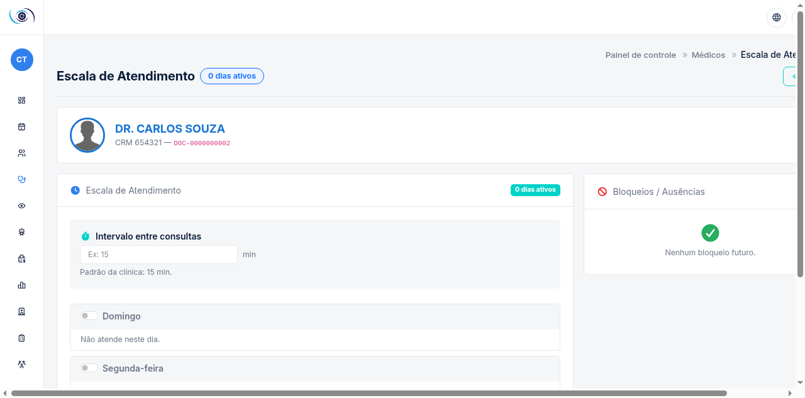

1. **Intervalo entre consultas** — duração de cada atendimento (a grade de horários do
   agendamento deriva daqui).
2. Ative os dias da semana e defina as **faixas** (ex.: 07:00–12:00 e 14:00–18:00);
   **+ Faixa** adiciona períodos no mesmo dia.
3. **Salvar Escala**.

No cartão **Bloqueios / Ausências**, registre férias, congressos e feriados — durante o
bloqueio o médico não recebe agendamentos.

---

## 4. Usuários da clínica

**Controle de acesso → Usuários** — as contas da equipe (exceto médicos, cadastrados na
área própria):

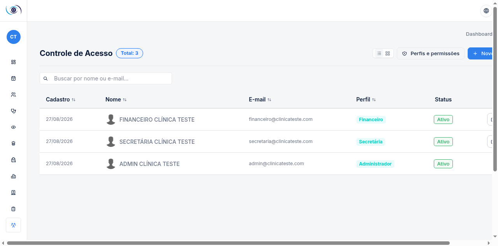

### Criar um usuário

1. Clique em **Novo usuário**.
2. Informe nome, e-mail (login), o **perfil de acesso** (Administrador, Financeiro,
   Secretária ou Usuário comum) e a senha inicial:

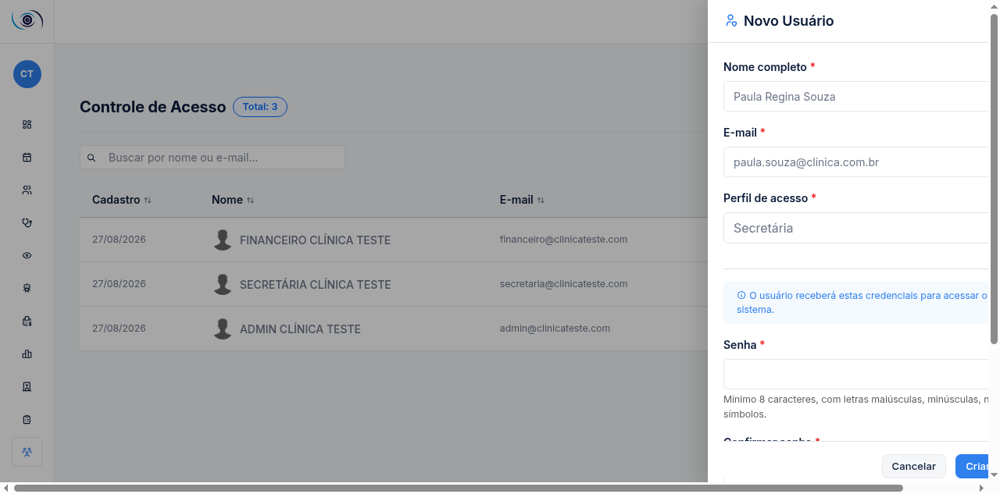

3. Clique em **Criar usuário** e repasse as credenciais com segurança.

### Gerenciar

- **Lápis (Editar)** — dados, perfil, switch **Usuário ativo** e os **perfis adicionais**
  (permissões extras — capítulo 5).
- **⋮ → Desativar/Ativar** — bloqueia/libera o login na clínica.
- **⋮ → Excluir** — remove o vínculo (reversível pelo botão **Restaurar** da linha).

> Proteções: o **proprietário** da clínica e a **sua própria conta** não podem ser
> desativados ou removidos.

---

## 5. Perfis de acesso (permissões)

**Controle de acesso → Perfis e permissões**:

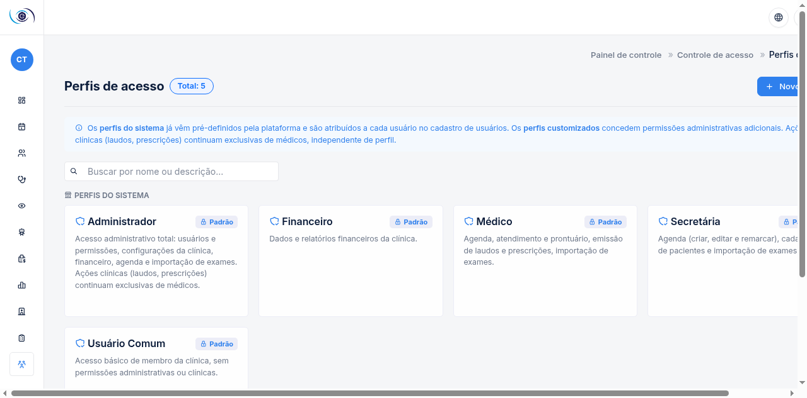

- **Perfis do sistema** (Administrador, Financeiro, Médico, Secretária, Usuário Comum) —
  padrão, somente leitura.
- **Perfis customizados** — permissões **adicionais** que você combina com o perfil base
  de um usuário.

### Criar um perfil customizado

1. Clique em **Novo perfil**, nomeie (ex.: "Recepção ampliada") e descreva quando usar.
2. Marque as permissões (agrupadas: Configurações, Usuários, Financeiro, Pacientes):

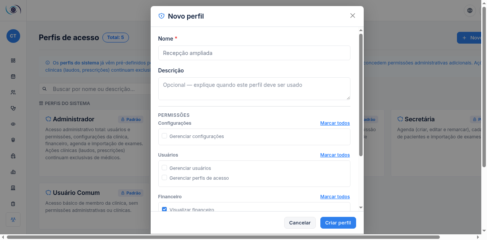

3. **Criar perfil**. Depois, atribua-o em **Usuários → Editar → Perfis adicionais**.

Exemplo: uma secretária de confiança que também consulta o financeiro → perfil base
Secretária + perfil customizado com "Visualizar financeiro".

---

## 6. Configurações: catálogos clínicos

Os catálogos alimentam os campos do prontuário e da agenda. Todos usam a **mesma tela**:

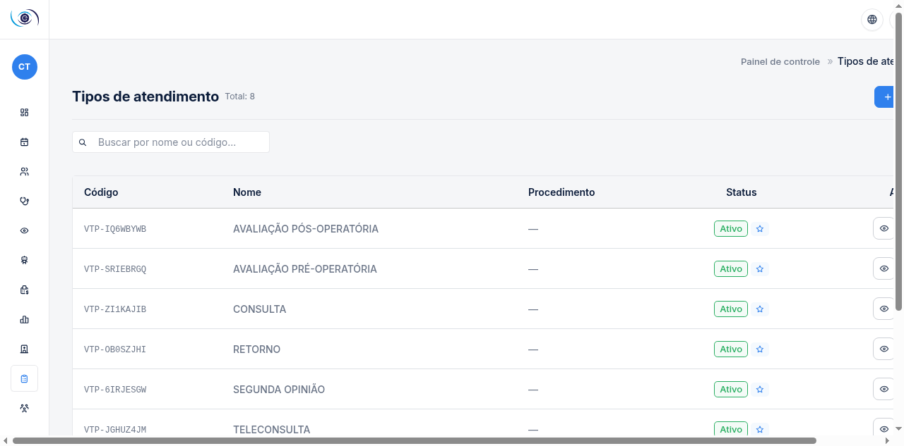

| Catálogo | Usado em |
|---|---|
| Tipos de atendimento | Agendamento (consulta, retorno, exame…) |
| Tipos de cirurgia | Agenda cirúrgica |
| Tipos de cútis, íris, visão cromática, adição, acuidade visual, teste de cobertura, convergência (PPC), lentes | Campos do prontuário oftalmológico |

Operações (iguais em todos):

1. **Novo** — abre o cadastro; preencha o **Nome** (e campos extras do catálogo, quando
   houver) e clique em **Cadastrar**:

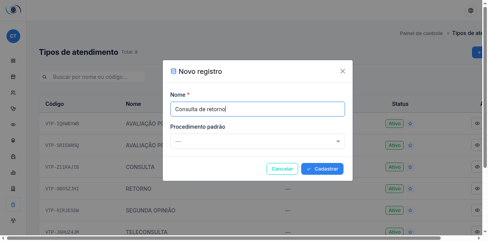

2. **⋮ → Editar / Desativar / Excluir** — desativado some das seleções; excluído fica
   listado como "Removido" e pode ser **restaurado** (ícone de reciclagem).

Os **Parâmetros oftalmológicos** reúnem os catálogos clínicos numa única tela com abas:

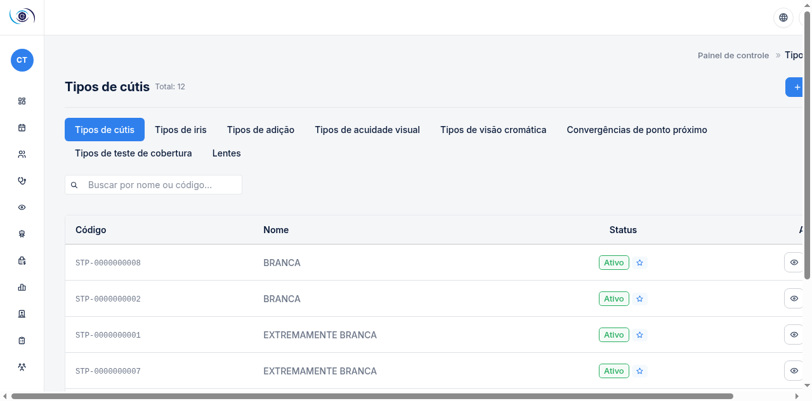

> Registros com a estrela "Padrão do sistema" vêm de fábrica e não podem ser removidos.

---

## 7. Convênios e salas

**Configurações → Convênios** — os convênios aceitos pela clínica, com **cor** (identifica
na agenda) e a opção **Cobrança** (entra no faturamento TISS):

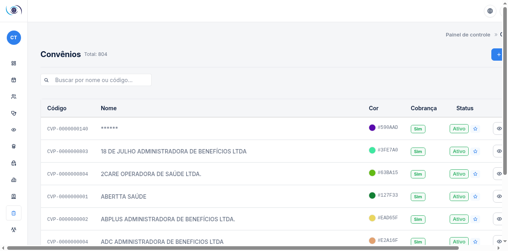

**Configurações → Unidades / salas** — salas e equipamentos agendáveis (tipo **Sala** ou
**Equipamento**):

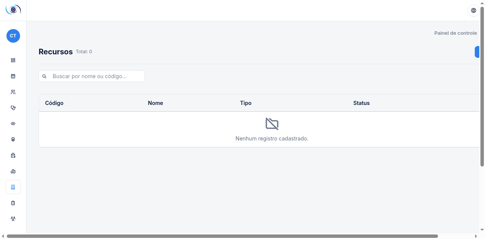

---

## 8. Lentes IOL e modelos de documento

**Configurações → Lentes de Catarata (IOL)** — o catálogo de lentes intraoculares da
clínica (fabricante, modelo, dioptrias, valor e foto). Clique no card para editar:

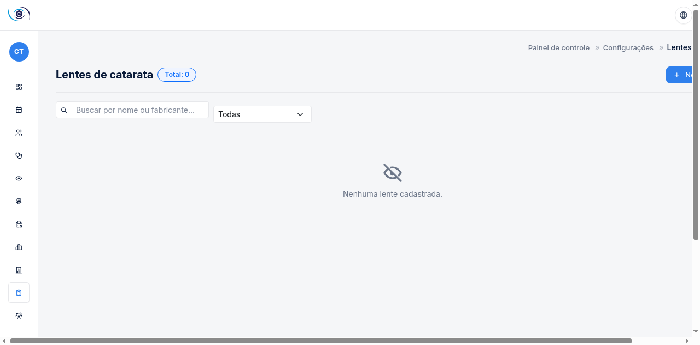

**Configurações → Modelos de Documento** — os modelos que geram receitas, laudos,
atestados e solicitações no prontuário, com o papel timbrado da clínica:

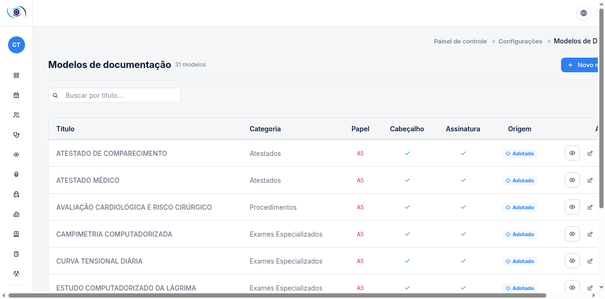

---

## 9. Painel de chamadas e 2FA da clínica

**Configurações → Painel de chamadas** — a TV da recepção que exibe as chamadas de
pacientes. Ative o painel e compartilhe o **link público** com o dispositivo da TV;
"Gerar novo link" invalida o anterior imediatamente:

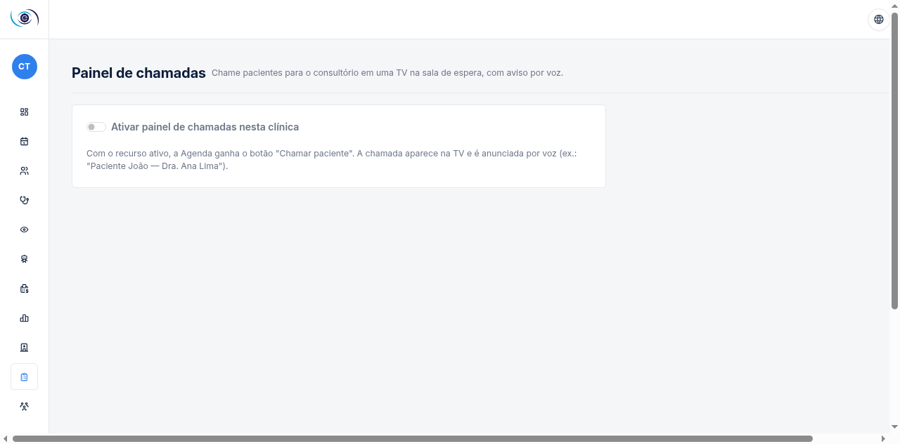

**Configurações → Autenticação em dois fatores** — exigir **2FA obrigatório** para todos
os usuários da clínica (recomendado — LGPD/CFM). A ativação pede justificativa e fica
registrada em auditoria:

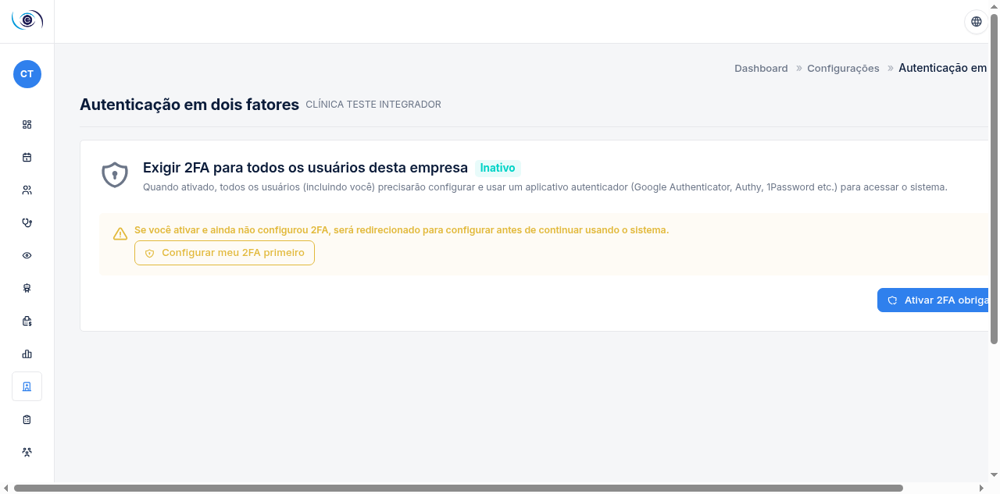

> Antes de ativar, configure o **seu** 2FA (Meu perfil) — a exigência vale para todos,
> inclusive você.

---

## 10. Relatórios e Compliance (LGPD/CFM)

**Relatórios** — produção e absenteísmo (detalhados no
[Manual do Financeiro](../manual-financeiro/README.md#9-relatórios-operacionais)):

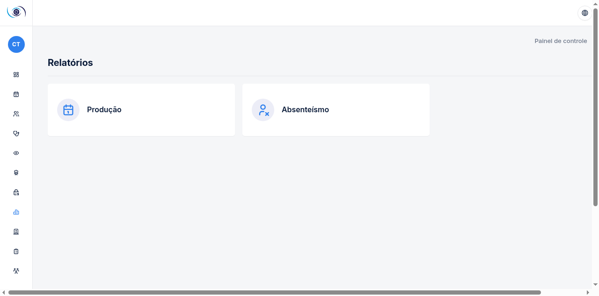

**Relatórios → Compliance** (exclusivo do administrador) — exportação das trilhas de
auditoria exigidas por LGPD e CFM:

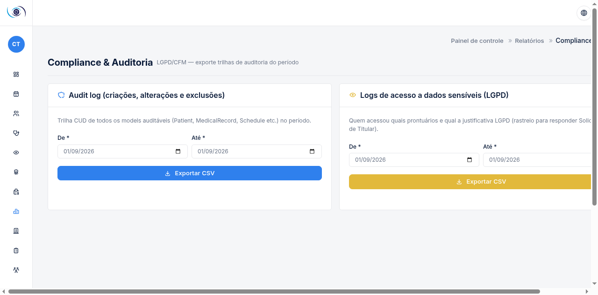

- **Audit log** — quem criou, alterou ou excluiu o quê (pacientes, prontuários, agenda…).
- **Logs de acesso a dados sensíveis** — quem **visualizou** quais prontuários e com que
  justificativa (base para responder Solicitações de Titular da LGPD).

Informe o período e clique em **Exportar CSV**.

---

## 11. Financeiro

O administrador acessa todo o módulo financeiro — dashboard BI, fluxo de caixa,
fechamento, tabela de preços, faturamento TISS, glosas e relatórios:

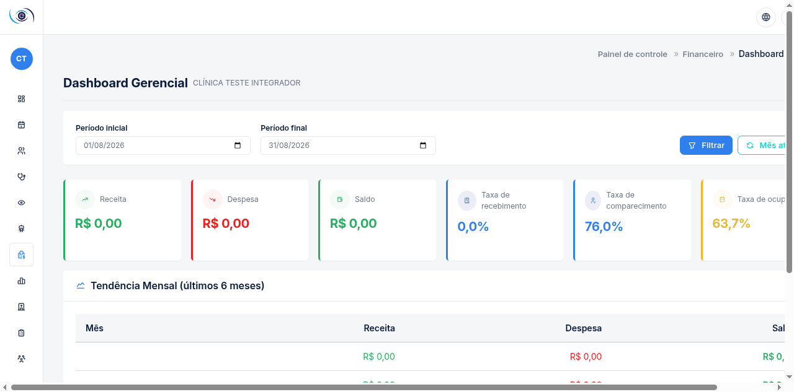

O passo a passo completo está no [Manual do Financeiro](../manual-financeiro/README.md).

---

## 12. Assistente de IA: consumo e créditos

**Assistente de IA** no menu — visão administrativa:

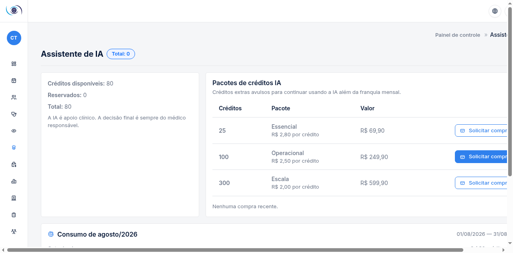

- **Créditos disponíveis / reservados** — a carteira da clínica.
- **Pacotes de créditos IA** (exclusivo do administrador) — compra de créditos avulsos
  quando a cota do plano não basta.
- **Consumo do mês** — por tipo de uso, por médico, taxa de aprovação e maiores execuções.

> A geração e aprovação de conteúdo de IA é dos **médicos**; o administrador acompanha e
> abastece os créditos.

---

## 13. Operação: agenda e pacientes

O administrador opera a agenda e os pacientes exatamente como a secretária — incluindo
mural de recados, fila de espera e importação por planilha:

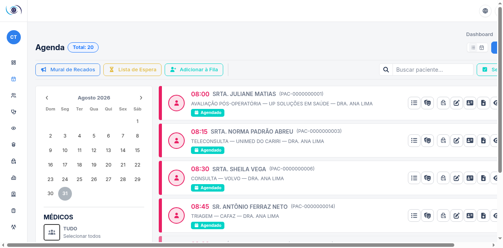

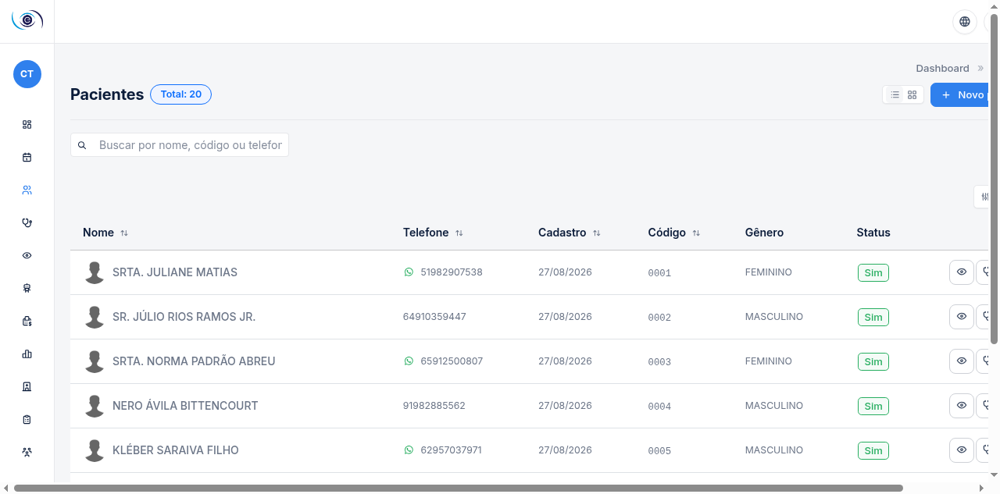

Passo a passo completo no [Manual da Secretária](../manual-secretaria/README.md).

---

## 14. Minha conta e limites do perfil

**Avatar → Editar perfil** — dados, senha e o seu 2FA pessoal:

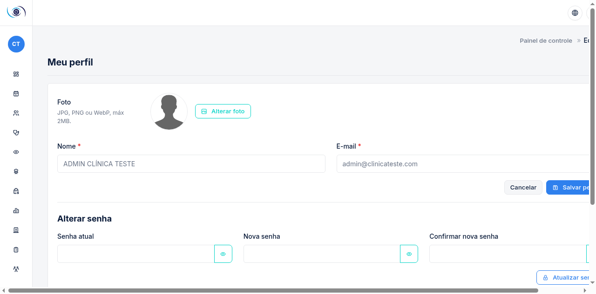

Mesmo sendo administrador da clínica, duas fronteiras permanecem:

- **Painel do SaaS** (`/panel/manager`) — administração da plataforma EasyEye; o acesso
  redireciona com o aviso de área exclusiva:

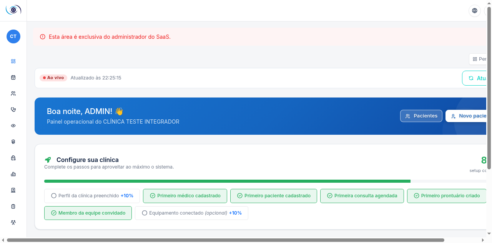

- **Atos médicos** — criação/edição de prontuário, diagnóstico e prompts de IA são
  exclusivos do perfil Médico (exigência CFM).

---

*Manual gerado a partir de telas reais do EasyEye — perfil Administrador da clínica.
Interface evoluiu? Gere novas capturas com o comando indicado no topo deste documento.*
