# Manual do Administrador — EasyEye

Guia completo de utilização do sistema para o perfil **Administrador da clínica**, passo a
passo com telas reais. O administrador tem acesso total à clínica: além de tudo que os
perfis de secretária e financeiro fazem, ele gerencia o **corpo clínico**, os **usuários e
permissões**, todas as **configurações**, o **compliance**, os **créditos de IA** e a
**assinatura do EasyEye** (plano, faturas e pagamento).

Este manual foca no que é **exclusivo do administrador**. Para a operação do dia a dia,
consulte também:

- [Manual da Secretária](../manual-secretaria/README.md) — agenda, pacientes, fila, mural, importação
- [Manual do Financeiro](../manual-financeiro/README.md) — caixa, fechamento, preços, TISS, glosas
- [Manual do Médico](../manual-medico/README.md) — prontuário e assistente de IA
- [Manual do Portal do Paciente](../manual-portal-paciente/README.md) — área externa do paciente (fora do `/panel`)

> As capturas são geradas automaticamente a partir do sistema real
> (`e2e/cypress/e2e/docs/admin-manual.cy.js`). Para atualizá-las:
> `cd e2e && npx cypress run --browser chrome --config excludeSpecPattern=__none__ --spec cypress/e2e/docs/admin-manual.cy.js`
> e copie as imagens de `e2e/cypress/screenshots/admin-manual.cy.js/` para
> `docs/manual-administrador/img/`. Nenhum dado é criado durante as capturas.
> As telas de assinatura e cobrança (imagens 34 a 48) vêm de
> `e2e/cypress/e2e/docs/billing-manual.cy.js`, que cria e remove sozinho clínicas de
> demonstração (`CY-BILL …`): rode-o com o mesmo comando trocando o `--spec` e copie
> `e2e/cypress/screenshots/billing-manual.cy.js/adm/` para `docs/manual-administrador/img/`.

---

## Sumário

1. [Acesso e visão geral](#1-acesso-e-visão-geral)
2. [Médicos: cadastro e gestão](#2-médicos-cadastro-e-gestão)
3. [Escala e bloqueios dos médicos](#3-escala-e-bloqueios-dos-médicos)
4. [Usuários da clínica](#4-usuários-da-clínica)
5. [Perfis de acesso (permissões)](#5-perfis-de-acesso-permissões)
6. [Configurações: catálogos clínicos](#6-configurações-catálogos-clínicos)
7. [Convênios e salas](#7-convênios-e-salas)
8. [Lentes IOL e modelos de documento](#8-lentes-iol-e-modelos-de-documento)
9. [Painel de chamadas e 2FA da clínica](#9-painel-de-chamadas-e-2fa-da-clínica)
10. [Relatórios e Compliance (LGPD/CFM)](#10-relatórios-e-compliance-lgpdcfm)
11. [Financeiro](#11-financeiro)
12. [Assistente de IA: consumo e créditos](#12-assistente-de-ia-consumo-e-créditos)
13. [Operação: agenda e pacientes](#13-operação-agenda-e-pacientes)
14. [Imagens oftálmicas e Portal do Paciente](#14-imagens-oftálmicas-e-portal-do-paciente)
15. [Minha conta e limites do perfil](#15-minha-conta-e-limites-do-perfil)
16. [Minha assinatura: plano, faturas e pagamento](#16-minha-assinatura-plano-faturas-e-pagamento)
17. [Avisos de cobrança: o que acontece em cada etapa](#17-avisos-de-cobrança-o-que-acontece-em-cada-etapa)

---

## 1. Acesso e visão geral

Após o login você chega ao **Painel de controle**, com o checklist de configuração da
clínica e os indicadores do dia:

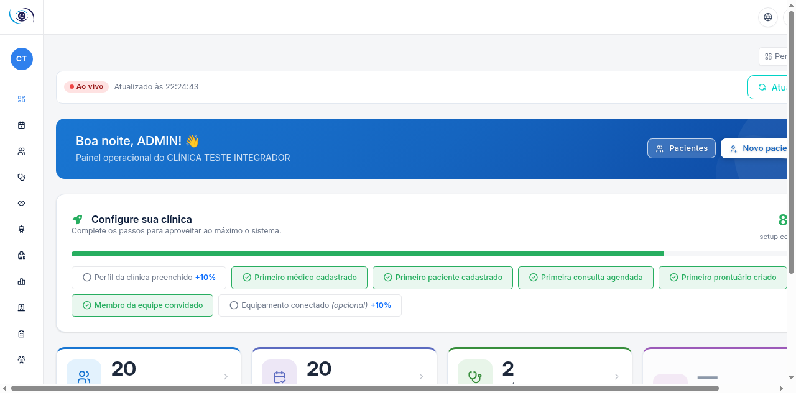

O menu do administrador é o mais completo do sistema:

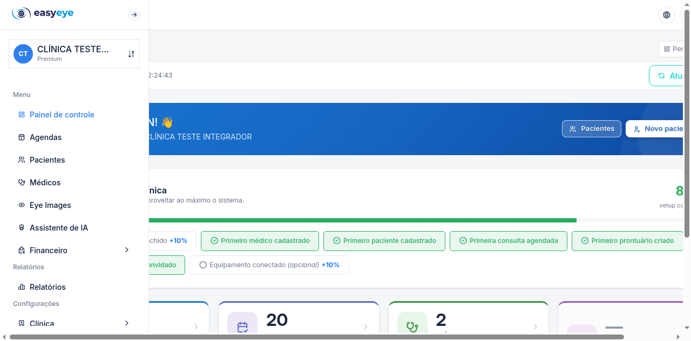

| Grupo | Conteúdo |
|---|---|
| Operação | Painel, Agendas, Pacientes, Médicos, Imagens oftálmicas |
| Assistente de IA | Consumo e compra de créditos |
| Minha assinatura | Plano do EasyEye, faturas, pagamento e troca de plano |
| Financeiro | BI, Fluxo de Caixa, Faturamento TISS, Glosas, 2 relatórios |
| Relatórios | Produção, Absenteísmo e **Compliance** |
| Configurações | Unidades/salas, Segurança (2FA), Painel de chamadas, Convênios, catálogos clínicos, Lentes IOL, Modelos de documento, Parâmetros oftalmológicos |
| Controle de acesso | Usuários e Perfis e permissões |

---

## 2. Médicos: cadastro e gestão

**Médicos** no menu — gestão do corpo clínico (exclusiva do administrador, pois o cadastro
**cria a credencial de login** do médico):

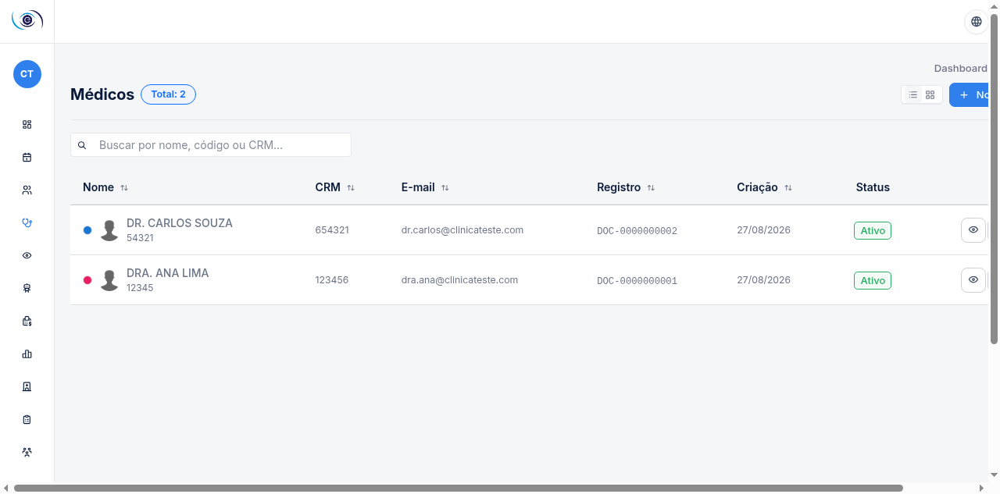

### Cadastrar um médico

Clique em **Novo médico**. O cadastro tem 4 abas:

**Pessoal** — nome completo, apelido (como aparece na agenda), CPF, nascimento, gênero,
estado civil e e-mail (será o login):

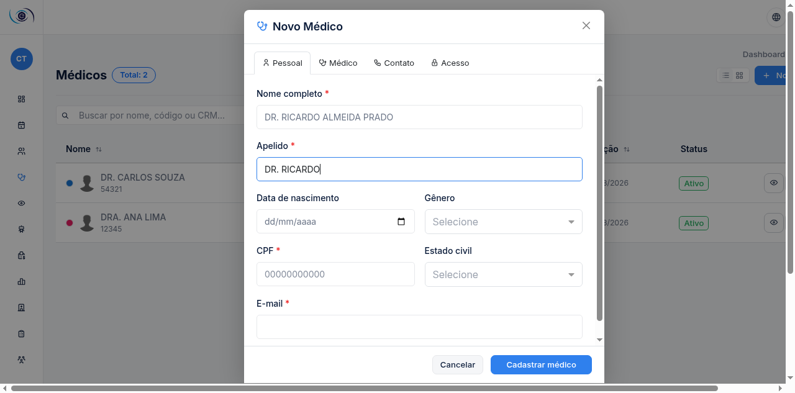

**Médico** — CRM, especialidade, **cor na agenda** (identifica os cards do profissional) e
se é médico parceiro:

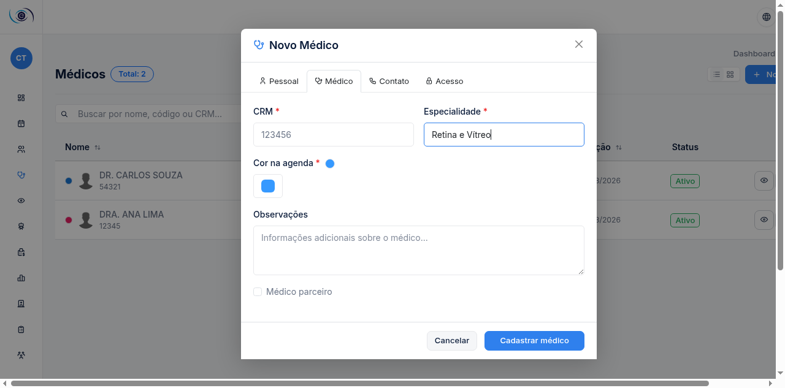

**Contato** — celular (com WhatsApp), telefone e endereço (CEP preenche sozinho).

**Acesso** — senha inicial do médico (mínimo 8 caracteres com maiúsculas, minúsculas,
números e símbolos):

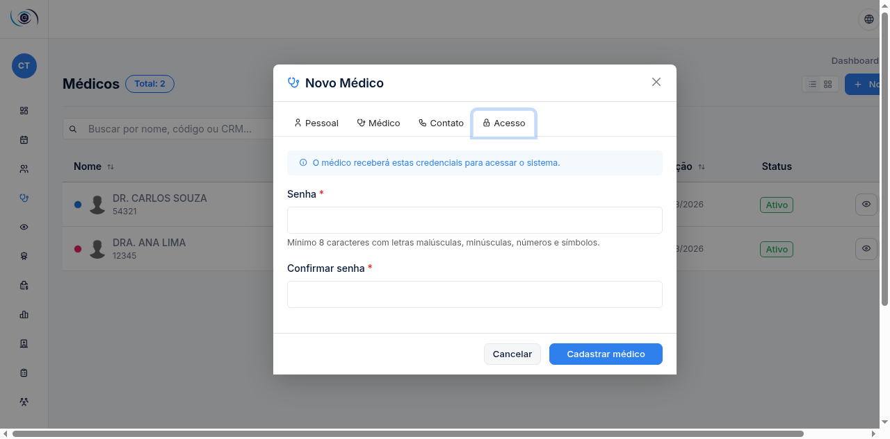

Clique em **Cadastrar médico**. O médico recém-criado nasce **Inativo** — ative-o pelo
menu **⋮ → Ativar** da linha quando estiver pronto para atender.

> **Segurança**: o e-mail do médico é validado contra **todos os usuários do sistema**,
> não só contra os pacientes/médicos desta clínica. Isso impede reaproveitar o e-mail de
> login de um médico/usuário de **outra clínica** para assumir a conta dele por engano
> (ou por má-fé) — o cadastro retorna erro de validação se o e-mail já estiver em uso.

### Editar, desativar e excluir

- **⋮ → Editar** — altera os dados (a aba Acesso não reaparece; senha é do próprio médico).
- **⋮ → Desativar/Ativar** — tira/devolve o médico da agenda sem apagar nada.
- **⋮ → Excluir** — remove o médico (com confirmação). Não há restauração pela tela;
  em caso de erro, contate o suporte.

---

## 3. Escala e bloqueios dos médicos

Na linha do médico, clique em **Horários de atendimento**:

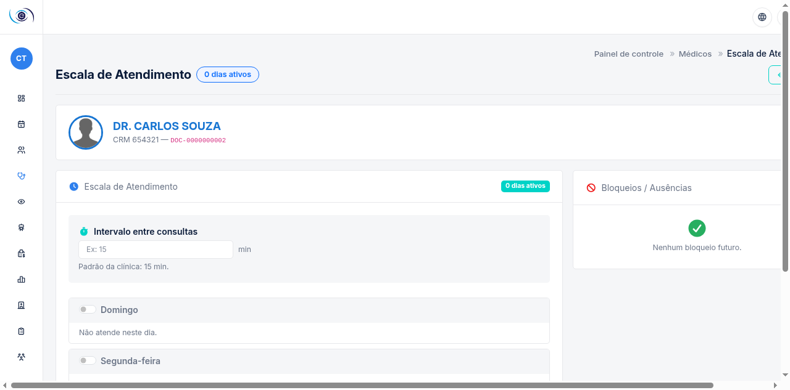

1. **Intervalo entre consultas** — duração de cada atendimento (a grade de horários do
   agendamento deriva daqui).
2. Ative os dias da semana e defina as **faixas** (ex.: 07:00–12:00 e 14:00–18:00);
   **+ Faixa** adiciona períodos no mesmo dia.
3. **Salvar Escala**.

No cartão **Bloqueios / Ausências**, registre férias, congressos e feriados — durante o
bloqueio o médico não recebe agendamentos.

---

## 4. Usuários da clínica

**Controle de acesso → Usuários** — as contas da equipe (exceto médicos, cadastrados na
área própria):

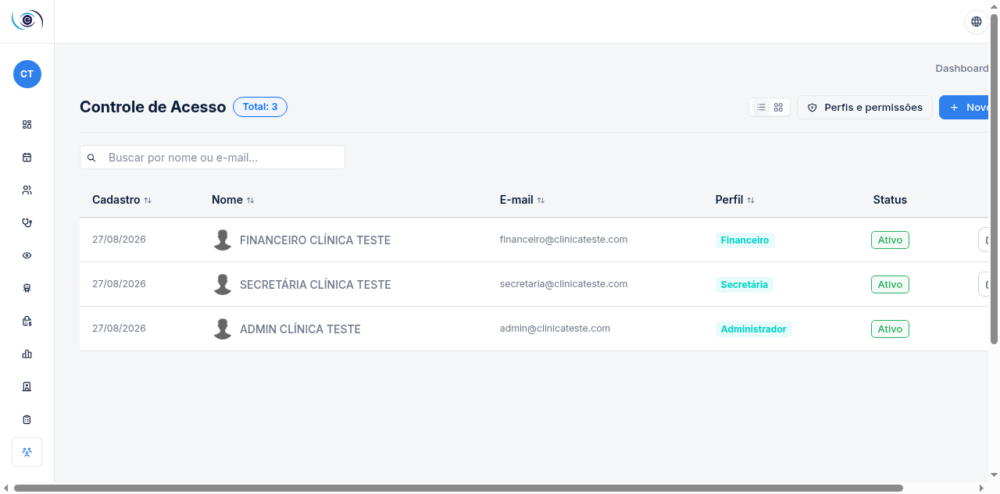

### Criar um usuário

1. Clique em **Novo usuário**.
2. Informe nome, e-mail (login), o **perfil de acesso** (Administrador, Financeiro,
   Secretária ou Usuário comum) e a senha inicial:

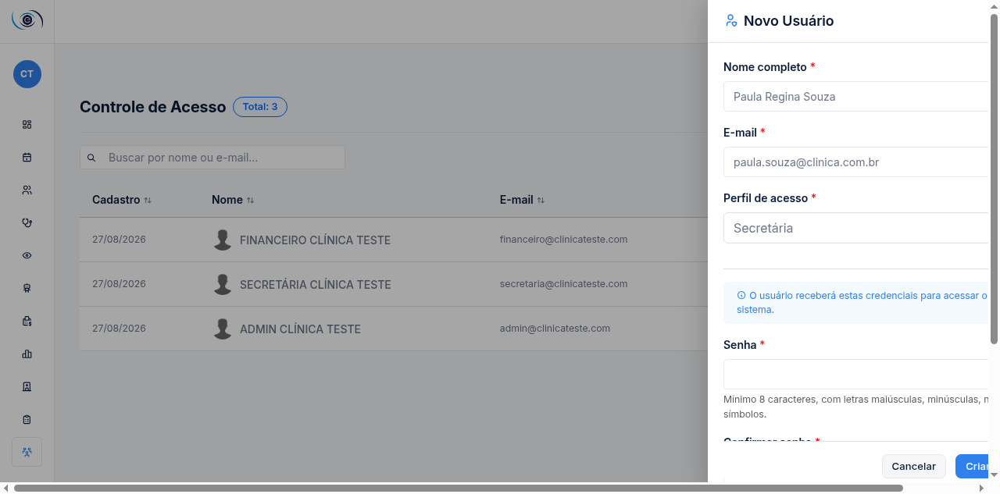

3. Clique em **Criar usuário** e repasse as credenciais com segurança.

> **Segurança**: assim como no cadastro de médicos, o e-mail é validado contra todos os
> usuários da plataforma (não só desta clínica) — evita que um e-mail de login de outra
> entidade seja reaproveitado aqui por engano.

### Gerenciar

- **Lápis (Editar)** — dados, perfil, switch **Usuário ativo** e os **perfis adicionais**
  (permissões extras — capítulo 5).
- **⋮ → Desativar/Ativar** — bloqueia/libera o login na clínica.
- **⋮ → Excluir** — remove o vínculo (reversível pelo botão **Restaurar** da linha).

> Proteções: o **proprietário** da clínica e a **sua própria conta** não podem ser
> desativados ou removidos.

---

## 5. Perfis de acesso (permissões)

**Controle de acesso → Perfis e permissões**:

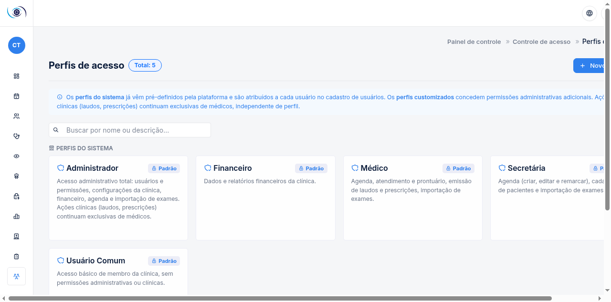

- **Perfis do sistema** (Administrador, Financeiro, Médico, Secretária, Usuário Comum) —
  padrão, somente leitura.
- **Perfis customizados** — permissões **adicionais** que você combina com o perfil base
  de um usuário.

### Criar um perfil customizado

1. Clique em **Novo perfil**, nomeie (ex.: "Recepção ampliada") e descreva quando usar.
2. Marque as permissões (agrupadas: Configurações, Usuários, Financeiro, Pacientes):

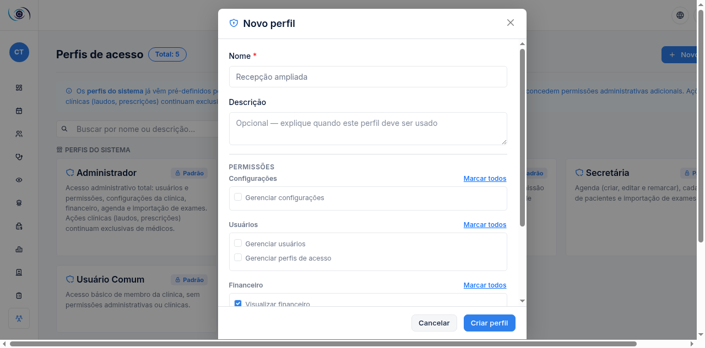

3. **Criar perfil**. Depois, atribua-o em **Usuários → Editar → Perfis adicionais**.

Exemplo: uma secretária de confiança que também consulta o financeiro → perfil base
Secretária + perfil customizado com "Visualizar financeiro".

---

## 6. Configurações: catálogos clínicos

Os catálogos alimentam os campos do prontuário e da agenda. Todos usam a **mesma tela**:

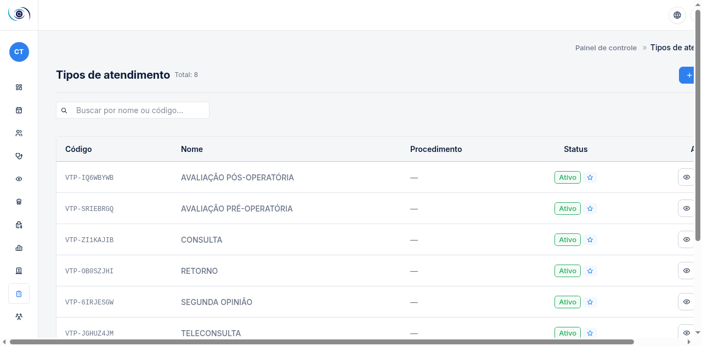

| Catálogo | Usado em |
|---|---|
| Tipos de atendimento | Agendamento (consulta, retorno, exame…) |
| Tipos de cirurgia | Agenda cirúrgica |
| Tipos de cútis, íris, visão cromática, adição, acuidade visual, teste de cobertura, convergência (PPC), lentes | Campos do prontuário oftalmológico |

Operações (iguais em todos):

1. **Novo** — abre o cadastro; preencha o **Nome** (e campos extras do catálogo, quando
   houver) e clique em **Cadastrar**:

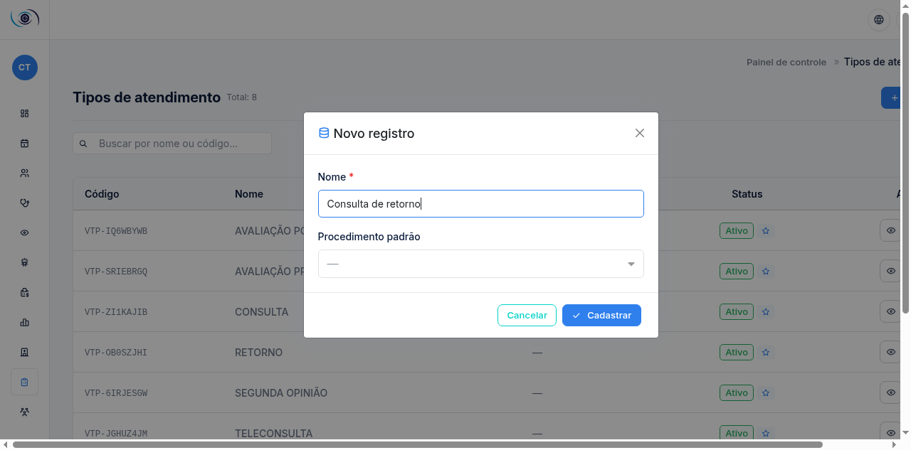

2. **⋮ → Editar / Desativar / Excluir** — desativado some das seleções; excluído fica
   listado como "Removido" e pode ser **restaurado** (ícone de reciclagem).

Os **Parâmetros oftalmológicos** reúnem os catálogos clínicos numa única tela com abas:

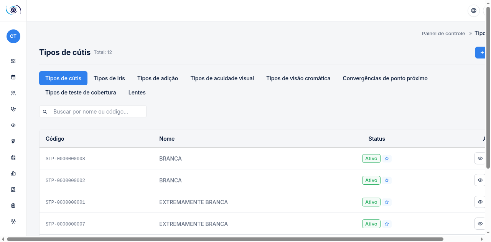

> Registros com a estrela "Padrão do sistema" vêm de fábrica e não podem ser removidos.

---

## 7. Convênios e salas

**Configurações → Convênios** — os convênios aceitos pela clínica, com **cor** (identifica
na agenda) e a opção **Cobrança** (entra no faturamento TISS):

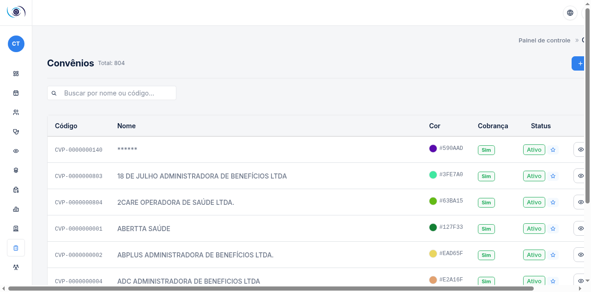

**Configurações → Convênios → aba Planos** — os planos dos convênios da ANS já vêm prontos
(o EasyEye os mantém atualizados com os dados abertos da ANS) e aparecem direto no cadastro do
paciente. Aqui você cadastra só o que **não** está nesse catálogo: plano de um convênio próprio
da clínica (ex.: convênio de empresa) ou plano que ainda não aparece na lista. Informe o
convênio, o nome e, se tiver, o **registro do produto na ANS** (impresso na carteirinha). O
convênio do plano não muda depois de criado; Particular não tem planos.

**Configurações → Unidades / salas** — salas e equipamentos agendáveis (tipo **Sala** ou
**Equipamento**):

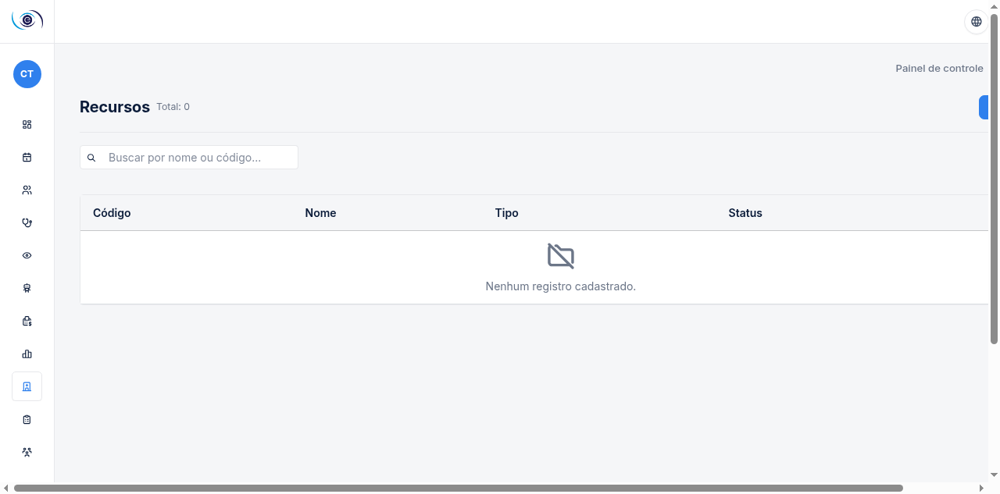

---

## 8. Lentes IOL e modelos de documento

**Configurações → Lentes de Catarata (IOL)** — o catálogo de lentes intraoculares da
clínica (fabricante, modelo, dioptrias, valor e foto). Clique no card para editar:

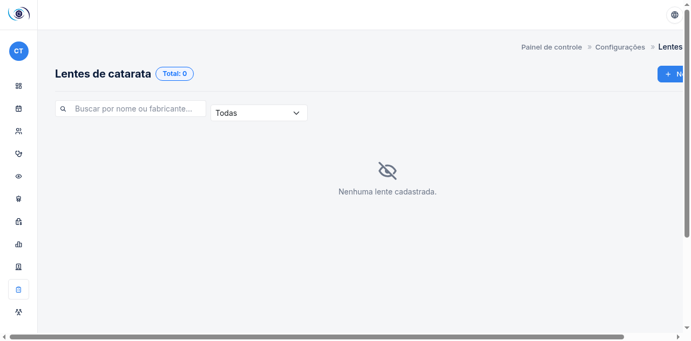

**Configurações → Modelos de Documento** — os modelos que geram receitas, laudos,
atestados e solicitações no prontuário, com o papel timbrado da clínica:

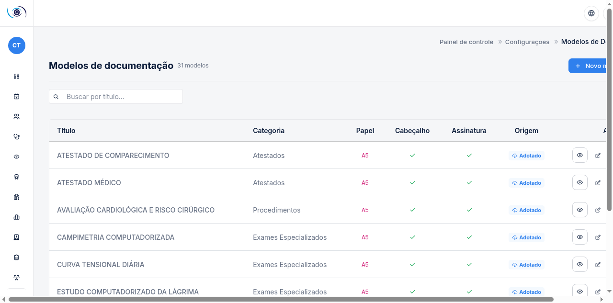

---

## 9. Painel de chamadas e 2FA da clínica

**Configurações → Painel de chamadas** — a TV da recepção que exibe as chamadas de
pacientes. Ative o painel e compartilhe o **link público** com o dispositivo da TV;
"Gerar novo link" invalida o anterior imediatamente:

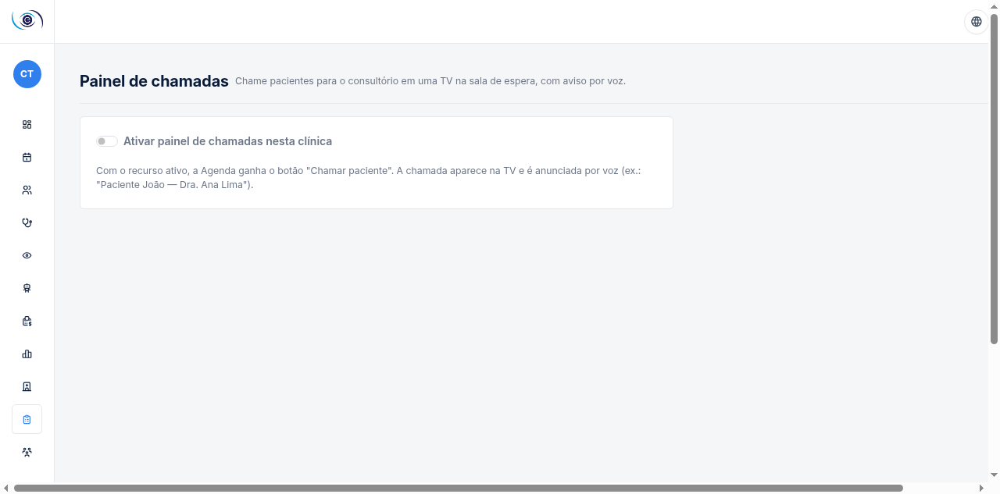

**Configurações → Autenticação em dois fatores** — exigir **2FA obrigatório** para todos
os usuários da clínica (recomendado — LGPD/CFM). A ativação pede justificativa e fica
registrada em auditoria:

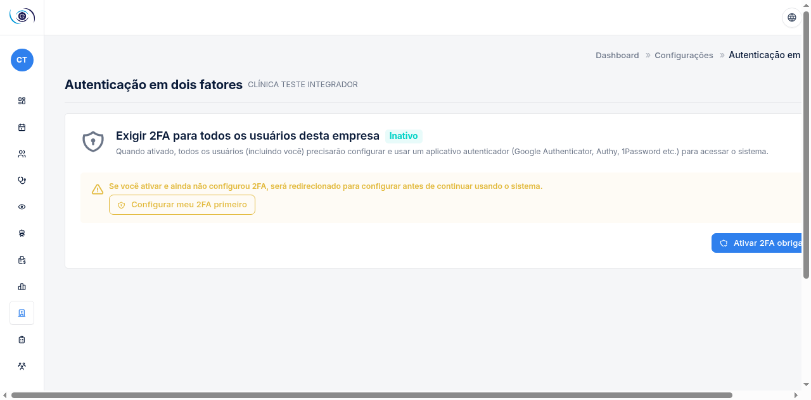

> Antes de ativar, configure o **seu** 2FA (Meu perfil) — a exigência vale para todos,
> inclusive você.

> Se o acesso da clínica ao EasyEye for **suspenso** por falta de pagamento, a TV passa a
> mostrar **"Serviço indisponível no momento"** e não exibe chamadas. Ela volta sozinha
> quando o pagamento é confirmado — não é preciso mexer no aparelho
> ([detalhes na seção 17](#17-avisos-de-cobrança-o-que-acontece-em-cada-etapa)).

---

## 10. Relatórios e Compliance (LGPD/CFM)

**Relatórios** — produção e absenteísmo (detalhados no
[Manual do Financeiro](../manual-financeiro/README.md#9-relatórios-operacionais)):

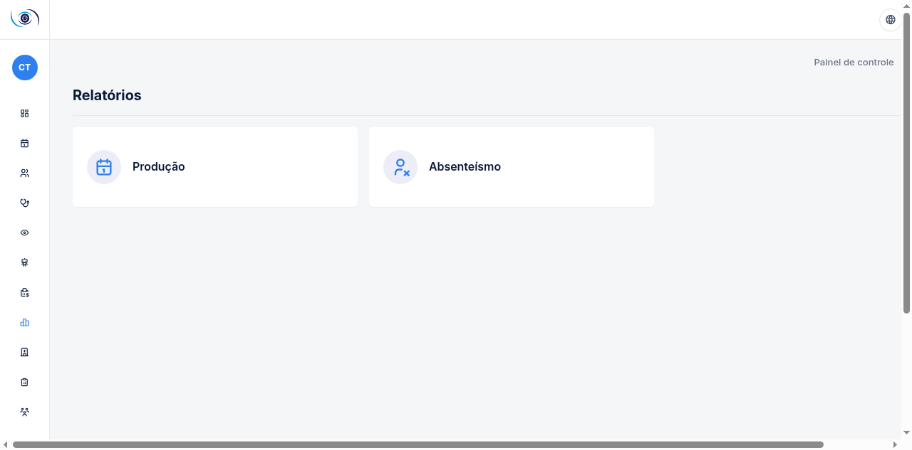

**Relatórios → Compliance** (exclusivo do administrador) — exportação das trilhas de
auditoria exigidas por LGPD e CFM:

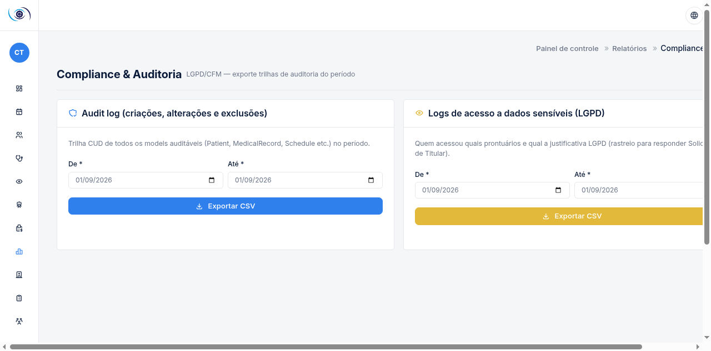

- **Audit log** — quem criou, alterou ou excluiu o quê (pacientes, prontuários, agenda…).
- **Logs de acesso a dados sensíveis** — quem **visualizou** quais prontuários e com que
  justificativa (base para responder Solicitações de Titular da LGPD).

Informe o período e clique em **Exportar CSV**.

---

## 11. Financeiro

O administrador acessa todo o módulo financeiro — dashboard BI, fluxo de caixa,
fechamento, tabela de preços, faturamento TISS, glosas e relatórios:

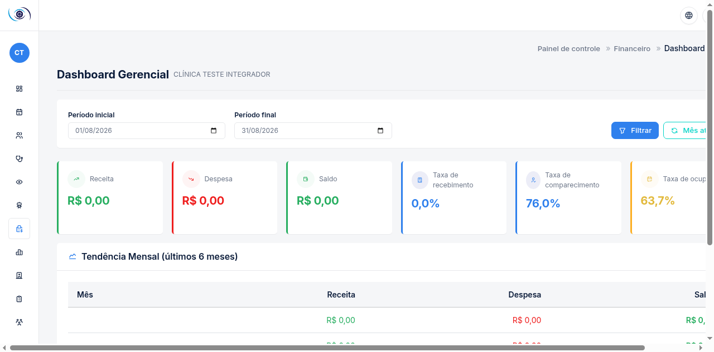

O passo a passo completo está no [Manual do Financeiro](../manual-financeiro/README.md).

---

## 12. Assistente de IA: consumo e créditos

**Assistente de IA** no menu — visão administrativa:

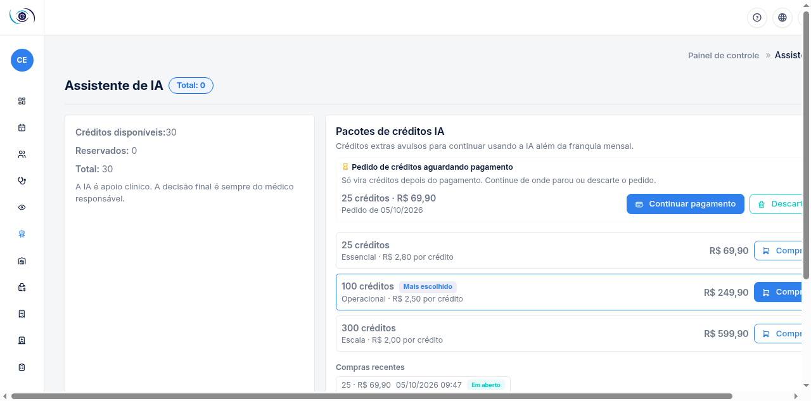

- **Créditos disponíveis / reservados** — a carteira da clínica.
- **Pacotes de créditos IA** (exclusivo do administrador) — compra de créditos avulsos
  quando a cota do plano não basta.
- **Consumo do mês** — por tipo de uso, por médico, taxa de aprovação e maiores execuções.

> A geração e aprovação de conteúdo de IA é dos **médicos**; o administrador acompanha e
> abastece os créditos.

### Comprar créditos de IA

Em **Pacotes de créditos IA**, clique em **Comprar** no pacote desejado. O pagamento é
feito **dentro do EasyEye**, sem sair do sistema, por **Pix**, **boleto** ou **cartão de
crédito** (no cartão, à vista):

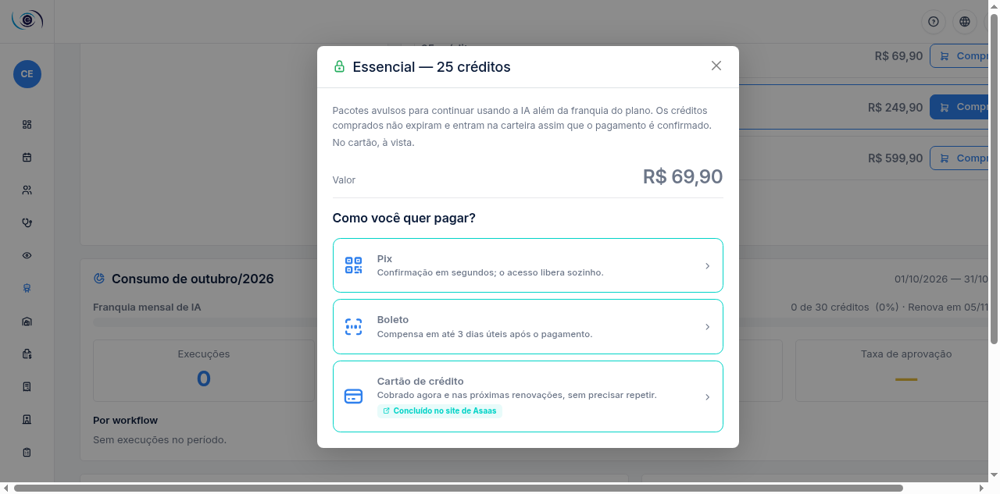

- Os créditos entram na carteira **assim que o pagamento é confirmado** (no Pix, em
  segundos; no boleto, em até 3 dias úteis) e a tela se atualiza sozinha.
- Créditos comprados **não expiram**.
- A compra só fica disponível com a assinatura **em dia** — com o pagamento atrasado, a IA
  fica bloqueada (veja a [seção 17](#17-avisos-de-cobrança-o-que-acontece-em-cada-etapa)).

### Pedido de créditos aguardando pagamento

Se você começou uma compra e não concluiu o pagamento, o pedido aparece no topo do
quadro, com duas opções:

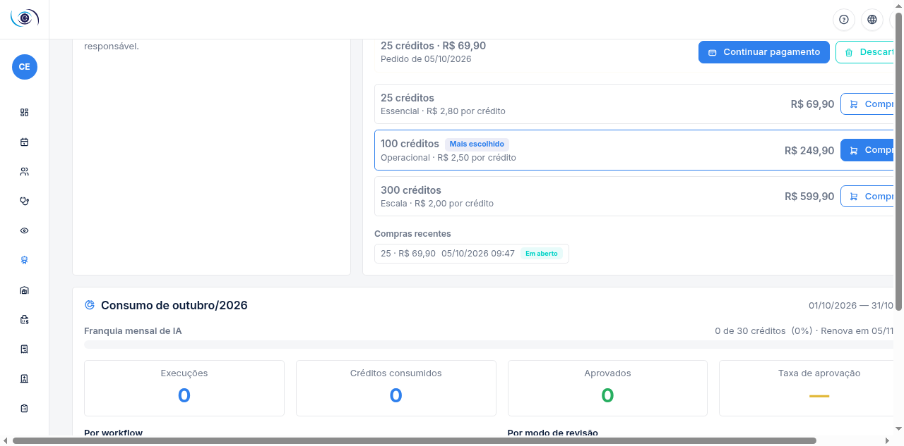

- **Continuar pagamento** — reabre o pagamento do mesmo pedido, de onde parou.
- **Descartar** — cancela o pedido (pede confirmação; o Pix/boleto gerado é cancelado).

Pedidos não pagos são descartados sozinhos depois de alguns dias. O pedido **não é uma
dívida**: só vira créditos se for pago.

### Sem créditos (paywall)

Quando a clínica fica sem créditos, a tela de IA mostra o motivo (franquia do mês acabou,
teste grátis ou cortesia sem franquia mensal) e o botão **Comprar créditos**. Os médicos
veem a mesma mensagem com a orientação de pedir ao administrador — **médico não compra
créditos**; quem compra é o administrador, o financeiro (em Minha assinatura) ou o dono
da clínica.

---

## 13. Operação: agenda e pacientes

O administrador opera a agenda e os pacientes exatamente como a secretária — incluindo
mural de recados, fila de espera e importação por planilha:

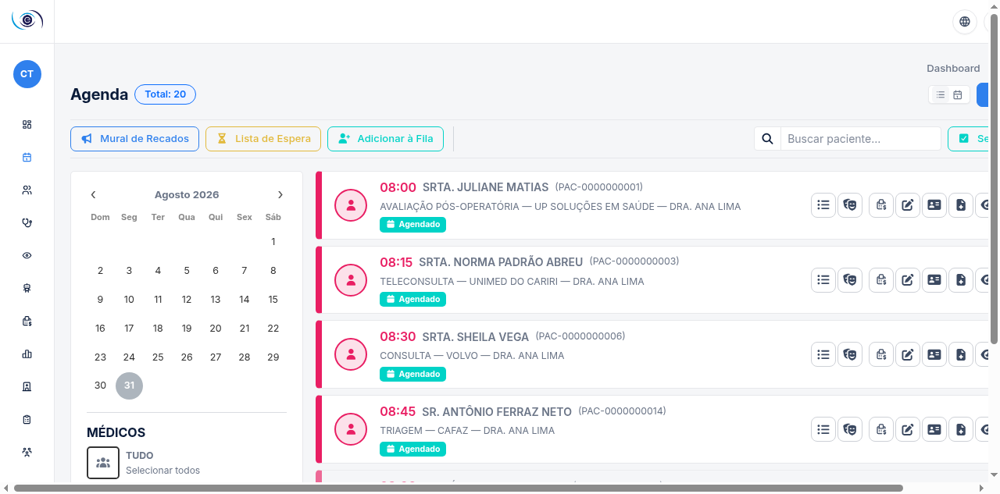

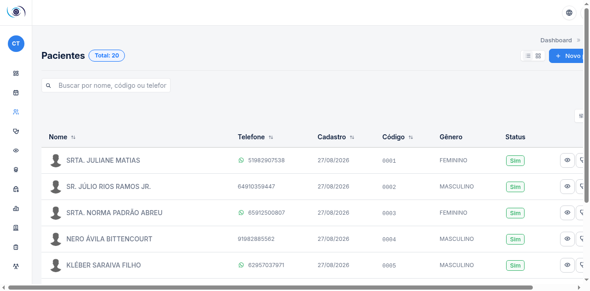

No detalhe de um agendamento (drawer), os códigos de identificação, paciente e médico têm
um botão de **copiar** ao lado (ícone de clipe) — útil para colar em mensagens/prontuário
sem digitar o código manualmente. Passo a passo completo, com telas, no
[Manual da Secretária](../manual-secretaria/README.md#2-agenda-lista-calendário-e-busca).

Passo a passo completo da operação no [Manual da Secretária](../manual-secretaria/README.md).

---

## 14. Imagens oftálmicas e Portal do Paciente

### Comparar exames (sem emitir laudo)

O administrador acessa o Gerenciador de Imagens para organizar exames, mas **não** emite
laudo — **Novo laudo** é ato médico exclusivo (CFM Res. 2.227/2018) e o botão nem existe
no DOM para este perfil:

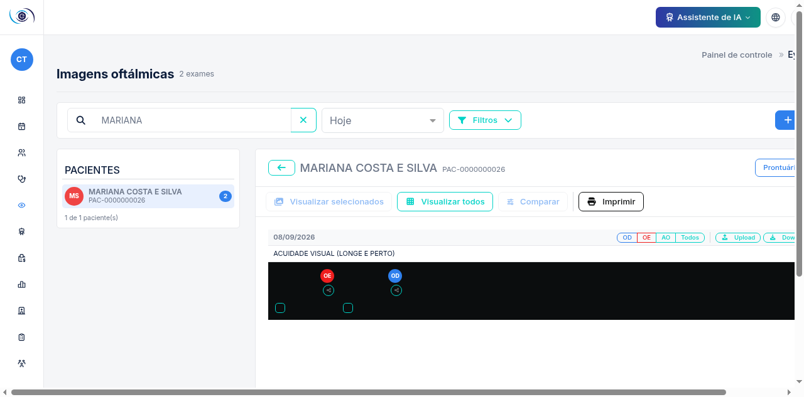

Selecione **2 exames** e clique em **Comparar** para sobrepor ou ver lado a lado (mesma
ferramenta do médico — passo a passo detalhado no
[Manual do Médico](../manual-medico/README.md#8-pacientes-e-imagens-oftálmicas)):

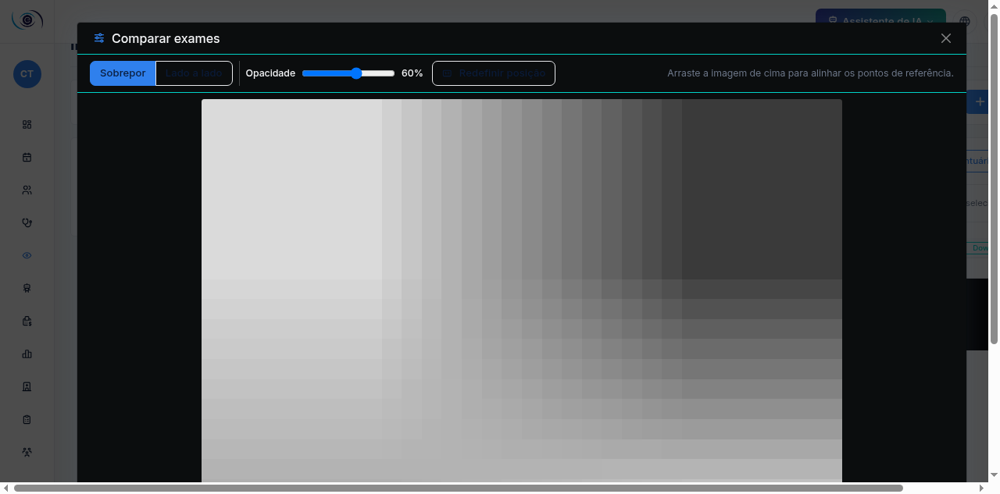

### Portal do Paciente: convite de acesso

> O que o paciente vê do outro lado (login, telas de documentos, download) está no
> [Manual do Portal do Paciente](../manual-portal-paciente/README.md).

Na ficha do paciente (**Pacientes → ícone de visualizar**), o administrador também pode
convidar o paciente para o **Portal do Paciente** (mesmo fluxo do médico):

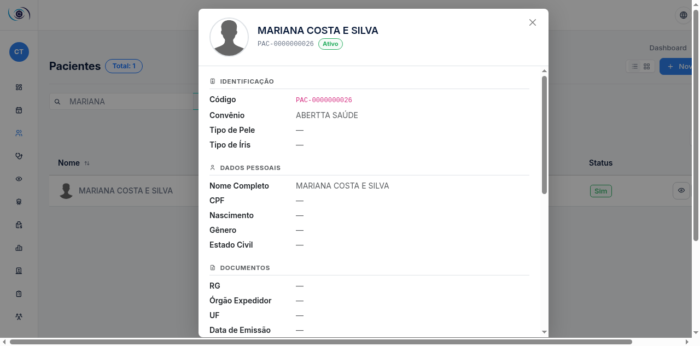

**Convidar para o portal** envia um e-mail com link de criação de login único — a visão do
paciente no portal fica restrita às clínicas onde ele já foi atendido:

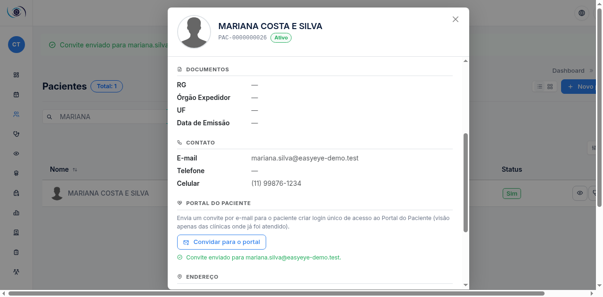

### Compartilhar laudo do prontuário com o paciente

No detalhe de um prontuário **assinado**, o ícone de compartilhamento libera o laudo no
Portal do Paciente:

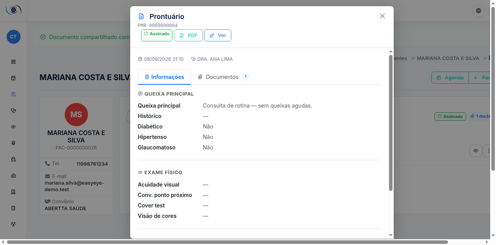

> **Quem pode compartilhar o quê**: compartilhar **laudo** (conteúdo clínico assinado) é
> permitido a **Administrador e Médico** — a secretária não tem esse botão (decisão de
> produto: conteúdo clínico não é decisão dela). Compartilhar **exame de imagem** (sem
> interpretação clínica) é permitido também à secretária, no Gerenciador de Imagens.

---

## 15. Minha conta e limites do perfil

**Avatar → Editar perfil** — dados, senha e o seu 2FA pessoal:

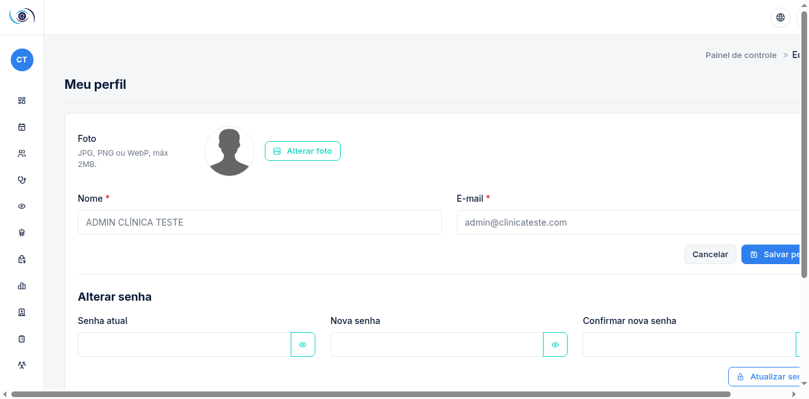

Mesmo sendo administrador da clínica, duas fronteiras permanecem:

- **Painel do SaaS** (`/panel/manager`) — administração da plataforma EasyEye; o acesso
  redireciona com o aviso de área exclusiva:

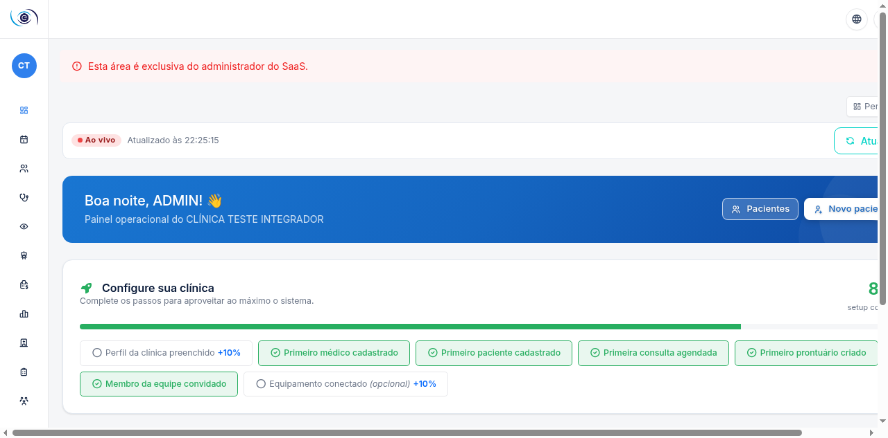

- **Atos médicos** — criação/edição de prontuário, diagnóstico e prompts de IA são
  exclusivos do perfil Médico (exigência CFM).

---

## 16. Minha assinatura: plano, faturas e pagamento

**Minha assinatura** (menu lateral) reúne tudo sobre a assinatura da clínica no EasyEye.
Só o **administrador**, o **financeiro** e o **dono** da clínica veem esta tela — os demais
perfis não têm o item no menu.

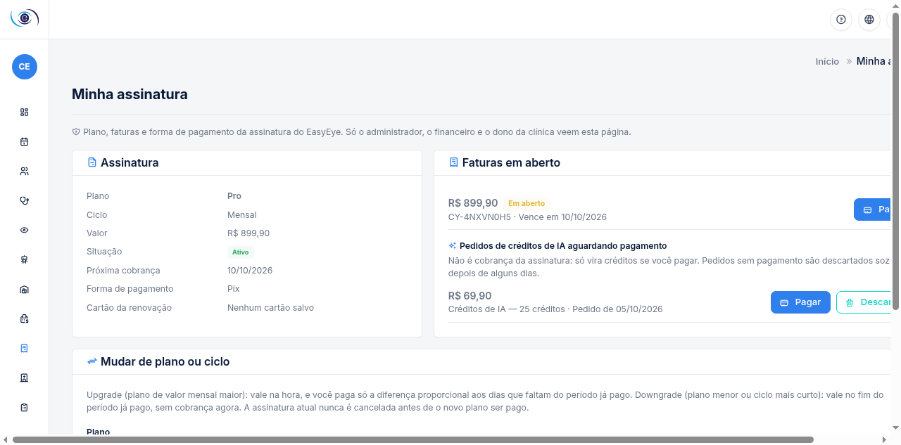

| Quadro | O que mostra |
|---|---|
| Assinatura | Plano, ciclo (mensal, anual…), valor, situação, próxima cobrança, forma de pagamento e o cartão usado nas renovações |
| Faturas em aberto | Cobranças a pagar, com vencimento e o botão **Pagar** |
| Mudar de plano ou ciclo | Planos disponíveis e o botão **Contratar e pagar** |
| Créditos de IA | Os mesmos pacotes da tela de IA (veja a [seção 12](#12-assistente-de-ia-consumo-e-créditos)) |
| Histórico de faturas | Todas as faturas, com período, vencimento, valor, situação e data do pagamento |

### Pagar uma fatura

Em **Faturas em aberto**, clique em **Pagar**. O pagamento abre numa janela **dentro do
EasyEye** — escolha a forma:

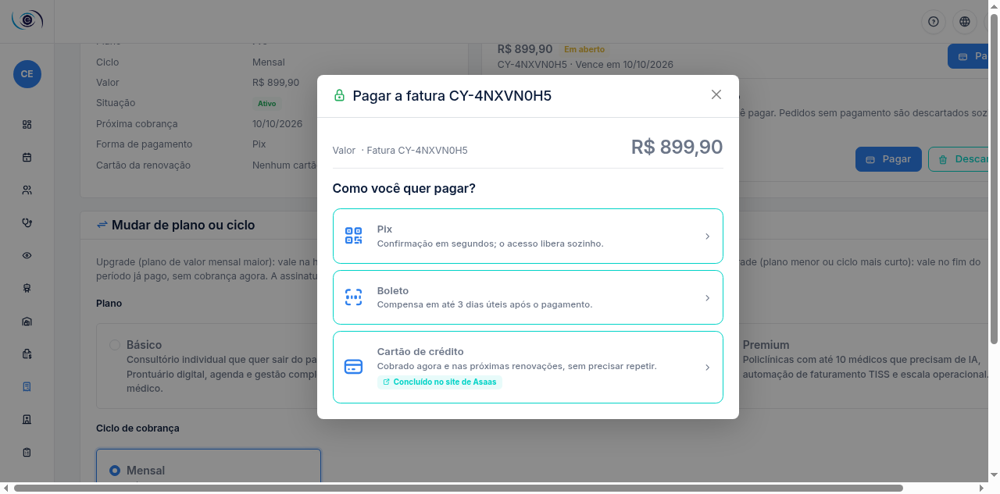

- **Pix** — mostra o **QR Code** e o código **copia e cola** (botão **Copiar**), com a
  validade do código. Pague pelo app do banco; a confirmação chega em segundos e a tela
  atualiza sozinha. Código vencido? Clique em **Gerar novo código Pix**.

  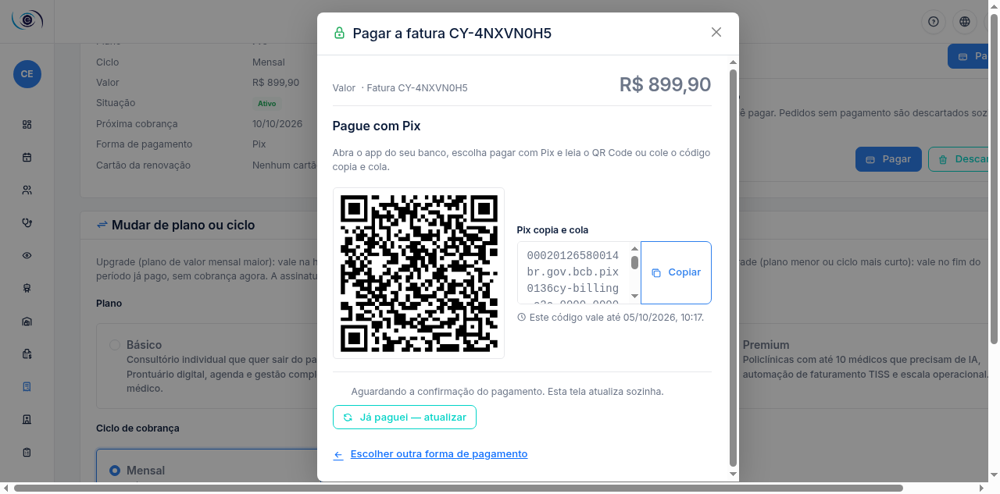

- **Boleto** — mostra a **linha digitável** (com **Copiar**), o botão para **baixar o
  boleto em PDF** e o vencimento. O banco leva até 3 dias úteis para confirmar.

  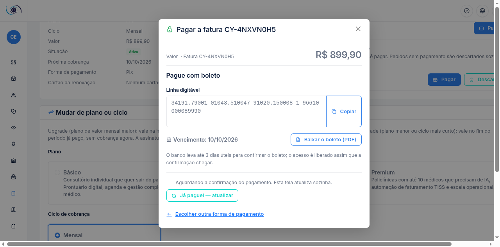

- **Cartão de crédito** — você digita os dados do cartão no formulário seguro do próprio
  meio de pagamento (o EasyEye não vê nem guarda o número do cartão). Em alguns meios de
  pagamento o cartão é concluído no **site do meio de pagamento**, que abre em uma nova
  aba — a opção avisa antes ("Concluído no site de …").

Enquanto espera a confirmação, a janela mostra "Aguardando a confirmação do pagamento". Se
a atualização automática estiver indisponível, use **Já paguei — atualizar**. Confirmado o
pagamento, aparece **Pagamento confirmado. Obrigado!** e a fatura sai da lista.

> Os avisos de cobrança (no topo do painel, por e-mail e por WhatsApp) trazem o link
> **Pagar agora**, que abre exatamente esta tela já na fatura certa.

### Trocar o cartão da renovação

Quando a assinatura é renovada no cartão, o quadro **Assinatura** mostra o cartão atual
(bandeira e final) e o botão **Trocar cartão**. O novo cartão vale para as próximas
cobranças — **nada é cobrado na troca**. Alguns meios de pagamento não permitem trocar o
cartão separadamente; nesse caso o botão não aparece e o cartão novo é informado no
próximo pagamento.

### Mudar de plano ou de ciclo

Em **Mudar de plano ou ciclo**, escolha o plano e o ciclo e clique em **Contratar e pagar**.
Antes de qualquer cobrança, o sistema mostra o que vai acontecer:

- **Upgrade** (plano de valor maior) — vale **na hora**: você paga só a **diferença
  proporcional** aos dias que faltam do período já pago. O novo plano começa assim que esse
  pagamento é confirmado; se não pagar, a assinatura atual continua como está.

  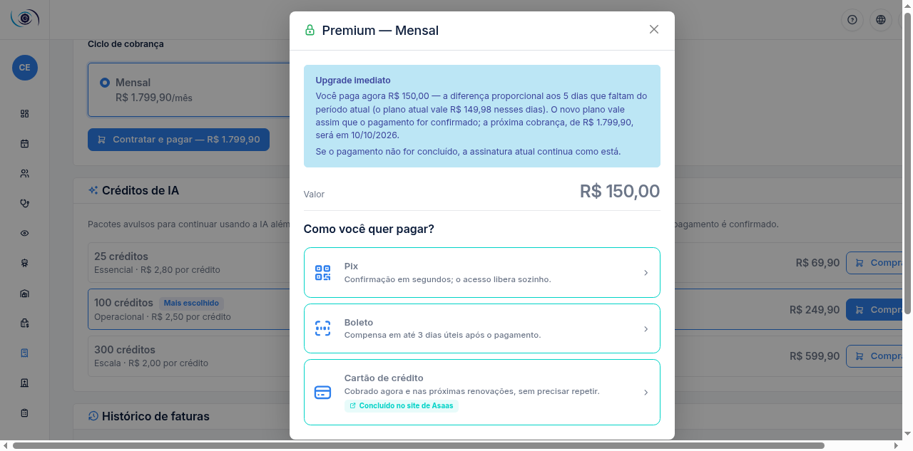

- **Downgrade** (plano menor ou ciclo mais curto) — vale **no fim do período já pago**,
  sem cobrança agora. Clique em **Confirmar a mudança**; a assinatura passa a mostrar
  "Mudança agendada" com a data e o novo valor.

  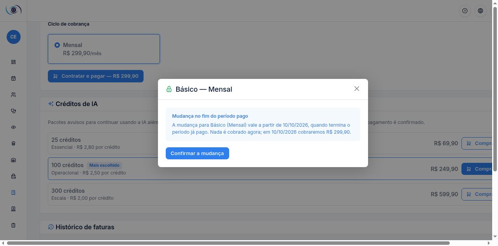

> **Plano anual no cartão:** pode ser parcelado **sem juros** na contratação (o número de
> parcelas aparece na escolha do ciclo). A **renovação** no cartão é cobrada **à vista**.

### Teste grátis: contratar

Durante o teste grátis, o aviso no topo do painel mostra quantos dias faltam e o botão
**Contratar agora**, que leva a Minha assinatura:

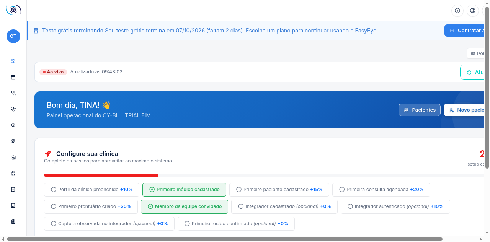

O teste grátis **não tem dias extras**: no fim do último dia o painel é bloqueado. Na tela
de bloqueio, cada plano tem o botão **Contratar**, que abre a contratação já com o
pagamento dentro do sistema — confirmado o pagamento, o acesso volta na hora:

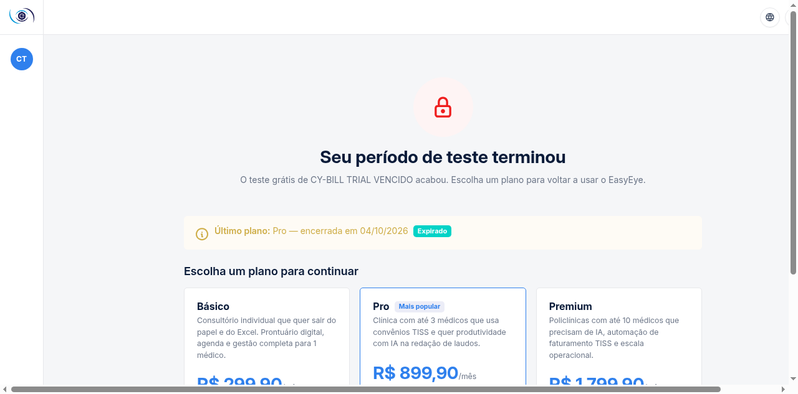

Você também recebe lembretes por **e-mail e WhatsApp** 3 dias antes, 1 dia antes e no dia
em que o teste termina.

---

## 17. Avisos de cobrança: o que acontece em cada etapa

Quando uma fatura da assinatura vence sem pagamento, o EasyEye avisa e vai restringindo o
acesso aos poucos. Os avisos vão por **e-mail** e por **WhatsApp** para o administrador, o
financeiro e o dono da clínica (WhatsApp só para quem tem o número confirmado no cadastro)
e sempre trazem o link para pagar dentro do sistema.

| Quando | O que acontece |
|---|---|
| 5 dias antes do vencimento | Lembrete da cobrança |
| 1 dia depois do vencimento | Aviso de pagamento em atraso — **tudo continua funcionando** |
| 3 dias depois do vencimento | **Acesso limitado**: IA e módulo financeiro bloqueados |
| 7 dias depois do vencimento | **Acesso suspenso**: o painel fica bloqueado até o pagamento |

Pagou? O acesso volta **sozinho**, assim que o pagamento é confirmado (Pix em segundos,
boleto em até 3 dias úteis).

### Pagamento em atraso (aviso)

Um aviso amarelo aparece no topo de todas as telas, com as datas em que a IA/financeiro
serão bloqueados e em que o painel será suspenso. Ele não pode ser fechado. **Pagar
agora** abre a fatura em Minha assinatura:

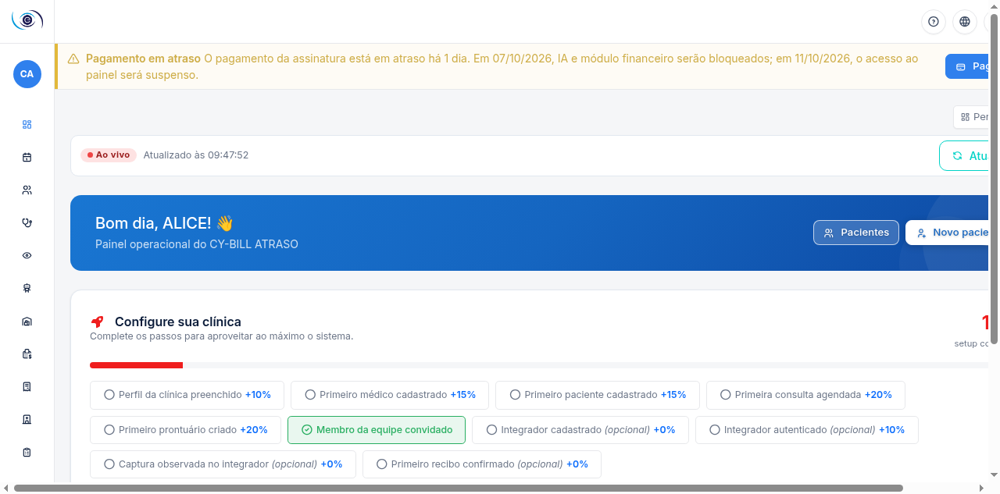

### Acesso limitado

O aviso fica vermelho e passa a dizer o que está bloqueado:

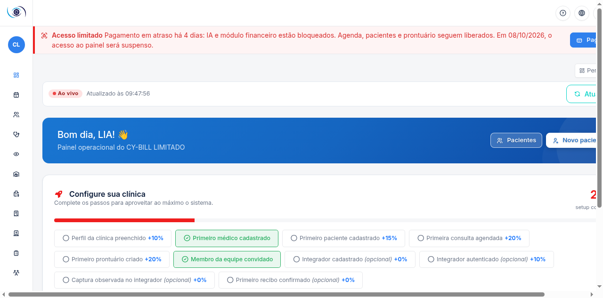

- **Bloqueados:** inteligência artificial (análises, assistente, chat e compra de
  créditos) e o módulo financeiro (caixa, faturamento TISS, glosas, repasses, tabela de
  preços e relatórios financeiros). Ao abrir uma dessas telas, o sistema explica o motivo
  e oferece o pagamento:

  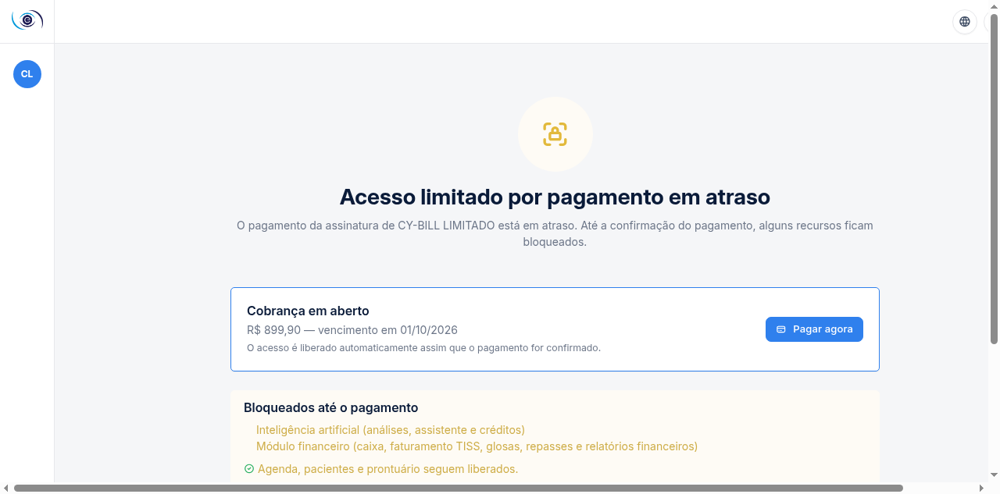

- **Continuam funcionando:** agenda, pacientes, prontuário, imagens e o restante do
  painel — inclusive o **Lançar no caixa** do atendimento, feito pela agenda.
- **Minha assinatura** continua aberta para pagar.

Secretárias e médicos veem o mesmo aviso, **sem valor nem link**, com a orientação de
procurar o administrador da clínica.

### Acesso suspenso

Ao entrar no painel, qualquer tela leva à página de bloqueio, com a cobrança em aberto e o
botão **Pagar agora** — o pagamento abre dentro do sistema (Minha assinatura continua
liberada, assim como o seu perfil):

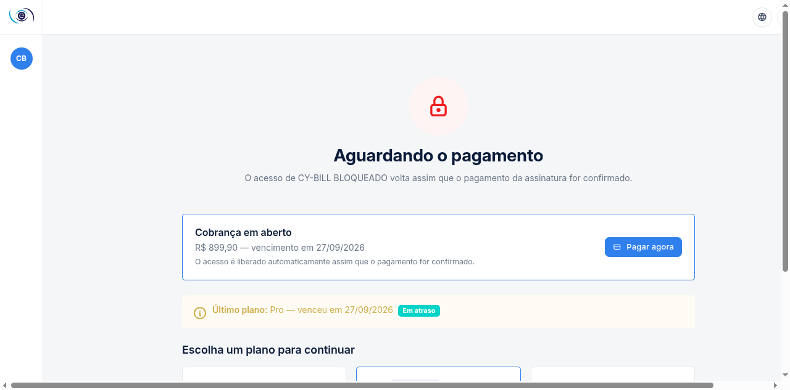

Enquanto o acesso estiver suspenso:

- as **mensagens automáticas de WhatsApp aos pacientes** (confirmação de consulta,
  pesquisa de satisfação e respostas automáticas) **param** — e voltam sozinhas com o
  pagamento;
- a **TV do painel de chamadas** mostra "Serviço indisponível no momento":

  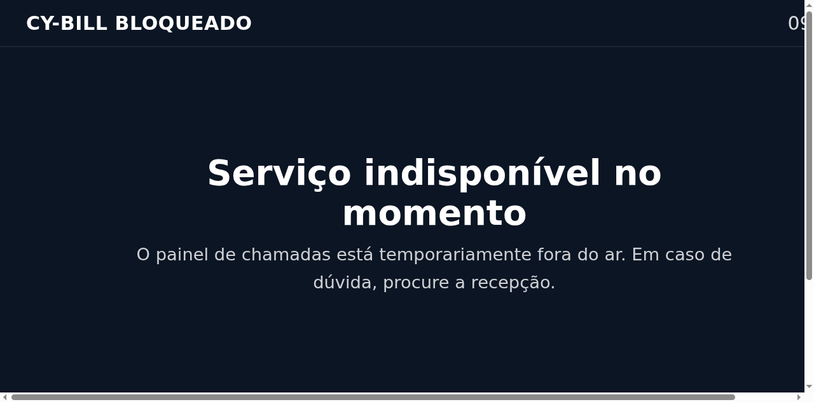

- o **Portal do Paciente** continua no ar, mas **só para consulta**: o paciente vê e baixa
  os documentos já liberados e não consegue fazer solicitações. O aviso para o paciente é
  neutro — não fala em pagamento.

> **Cortesia:** clínicas em cortesia não têm franquia mensal de IA; para usar a IA,
> compram créditos avulsos (seção 12).

---

*Manual gerado a partir de telas reais do EasyEye — perfil Administrador da clínica.
Interface evoluiu? Gere novas capturas com o comando indicado no topo deste documento.*
