# Manual do Financeiro — EasyEye

Guia completo de utilização do sistema para o perfil **Financeiro**, passo a passo com telas
reais. Cobre a gestão financeira da clínica de ponta a ponta: dashboard gerencial, fluxo de
caixa, fechamento de períodos, tabela de preços, faturamento TISS, conciliação de glosas e
relatórios.

> As capturas são geradas automaticamente a partir do sistema real
> (`e2e/cypress/e2e/docs/financial-manual.cy.js`). Para atualizá-las após mudanças de tela:
> `php artisan tinker --execute="require 'e2e/scripts/seed-docs-financial.php';"` e depois
> `cd e2e && npx cypress run --browser chrome --spec cypress/e2e/docs/financial-manual.cy.js`;
> copie as imagens de `e2e/cypress/screenshots/financial-manual.cy.js/` para
> `docs/manual-financeiro/img/` e finalize com
> `php artisan tinker --execute="require 'e2e/scripts/clean-docs-financial.php';"`.

---

## Sumário

1. [Acesso ao sistema](#1-acesso-ao-sistema)
2. [Dashboard Gerencial (BI)](#2-dashboard-gerencial-bi)
3. [Fluxo de Caixa](#3-fluxo-de-caixa)
4. [Fechamento de Caixa](#4-fechamento-de-caixa)
5. [Tabela de Preços](#5-tabela-de-preços)
6. [Faturamento TISS](#6-faturamento-tiss)
7. [Conciliação de Glosas](#7-conciliação-de-glosas)
8. [Relatórios financeiros](#8-relatórios-financeiros)
9. [Relatórios operacionais](#9-relatórios-operacionais)
10. [Minha conta](#10-minha-conta)
11. [O que o perfil financeiro NÃO acessa](#11-o-que-o-perfil-financeiro-não-acessa)

---

## 1. Acesso ao sistema

1. Acesse o painel da clínica com **e-mail** e **senha** (e o código do autenticador, se o
   2FA estiver ativo).
2. Você chega ao **Painel de controle**:

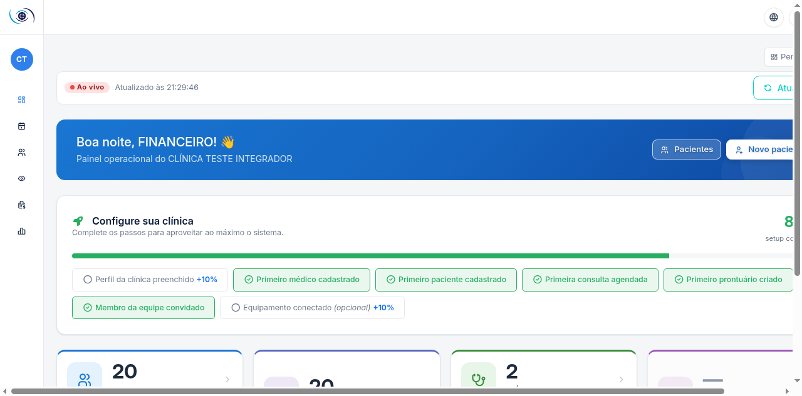

O **menu lateral** do perfil financeiro (passe o mouse na barra à esquerda para expandir).
O grupo **Financeiro** concentra o seu trabalho:

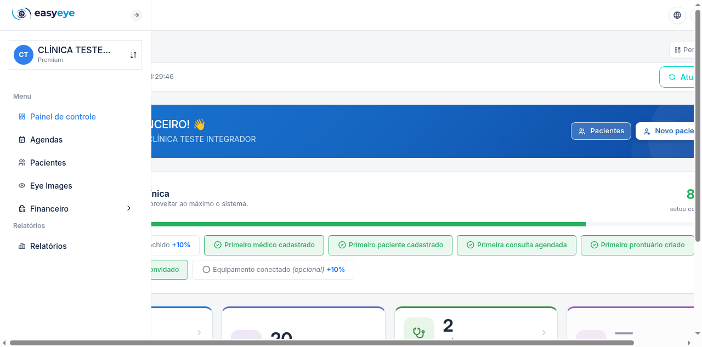

| Item do grupo Financeiro | O que faz |
|---|---|
| Dashboard Gerencial | Indicadores financeiros consolidados (BI) |
| Fluxo de Caixa | Lançamentos de receitas e despesas |
| Faturamento TISS | Guias e lotes para convênios |
| Conciliação de Glosas | Recursos de valores glosados |
| Rel. Fluxo de Caixa | Relatório detalhado com exportação |
| Rel. Faturamento | Faturamento por convênio com exportação |

---

## 2. Dashboard Gerencial (BI)

**Financeiro → Dashboard Gerencial** — visão executiva: receitas, despesas, saldo,
faturamento por convênio e evolução no período:

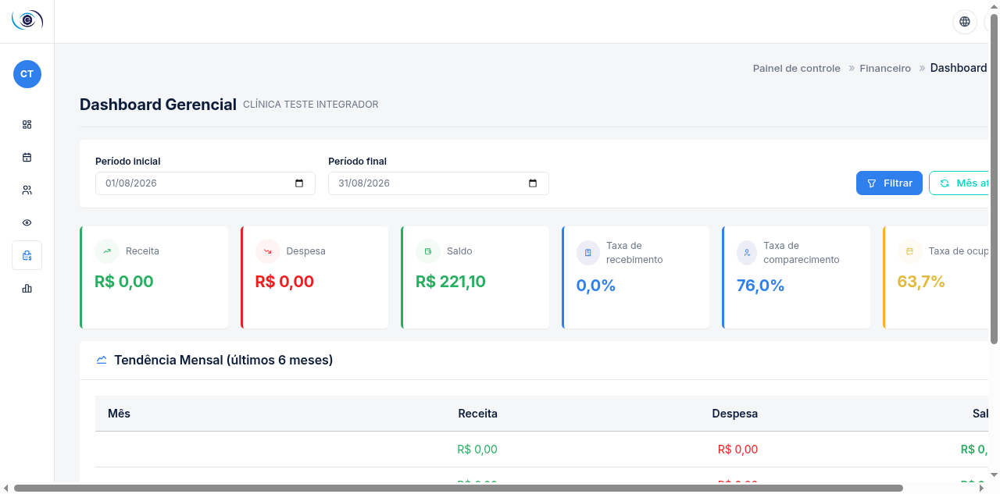

Use os filtros de período para comparar meses e acompanhar tendências.

---

## 3. Fluxo de Caixa

**Financeiro → Fluxo de Caixa** — o livro-caixa da clínica:

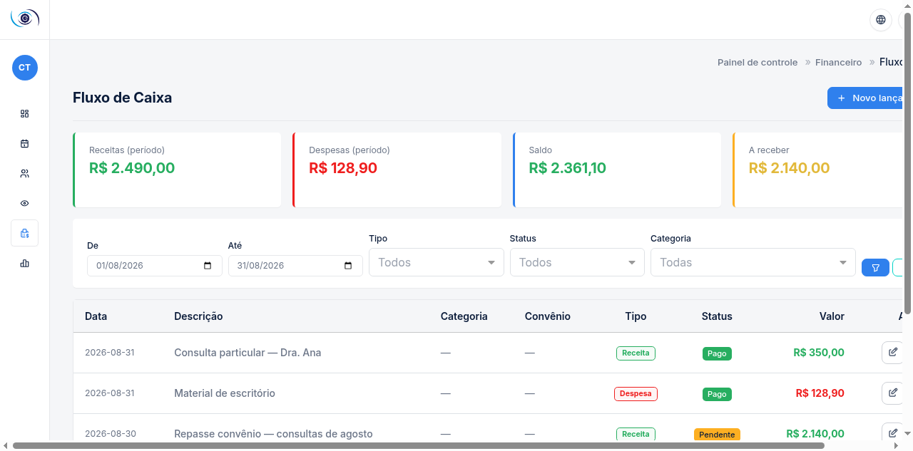

A tela mostra os **cartões de resumo** (Receitas, Despesas, Saldo e A receber do período),
os **filtros** (datas, tipo, status, categoria) e a lista de lançamentos.

### Novo lançamento

1. Clique em **Novo lançamento**.
2. Preencha:
   - **Data** (padrão: hoje);
   - **Tipo** — Receita ou Despesa;
   - **Descrição** (ex.: "Compra de colírios anestésicos");
   - **Categoria** (opcional, filtrada pelo tipo);
   - **Status** — Pago, Pendente ou Cancelado;
   - **Valor (R$)** e **Observações**.
3. Clique em **Cadastrar**.

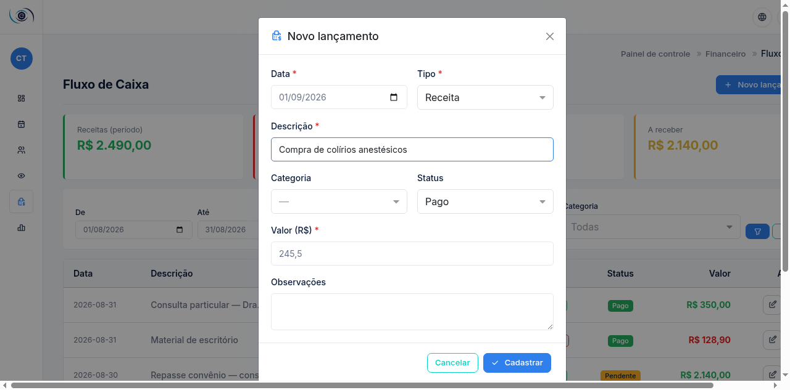

- **Editar** (lápis) altera um lançamento; **Excluir** (lixeira) remove após confirmação.
- Lançamentos vinculados a faturamento (com guia) ficam protegidos contra edição.

> Lançamentos em período **fechado** (ver capítulo 4) não podem ser criados nem alterados —
> reabra o período primeiro.

---

## 4. Fechamento de Caixa

Acesse `Fluxo de Caixa → Fechamento` (ou `/panel/financial/cash-closing`). O fechamento
**trava os lançamentos** de um período conferido — proteção contra alterações retroativas:

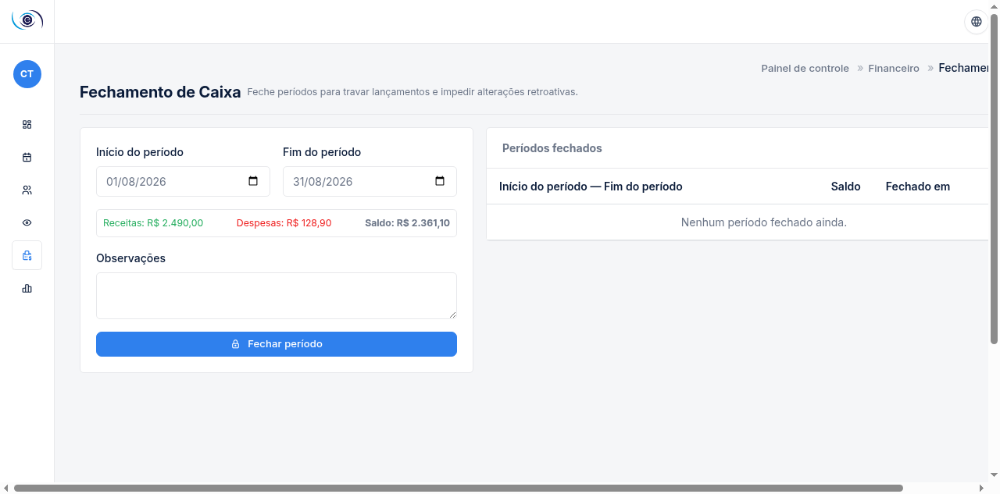

1. Informe **Início** e **Fim do período** — a prévia mostra Receitas, Despesas e Saldo.
2. Registre observações (ex.: "Conferido com extrato bancário").
3. Clique em **Fechar período**. Ele aparece na lista "Períodos fechados".

Para corrigir algo num período fechado: botão **Reabrir** (com confirmação), ajuste os
lançamentos e feche novamente.

---

## 5. Tabela de Preços

Acesse `/panel/financial/procedure-prices` — o preço de cada procedimento **por convênio**:

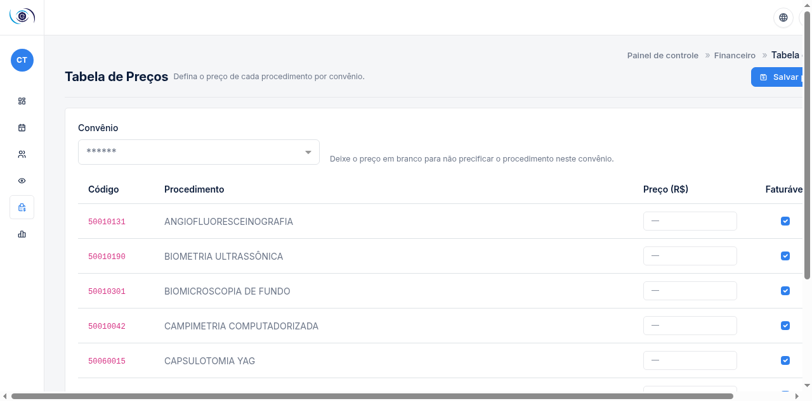

1. Selecione o **convênio** no topo.
2. Preencha o **preço** de cada procedimento (em branco = não precificado) e marque
   **Faturável** nos que entram no faturamento TISS.
3. Clique em **Salvar preços**.

> A grade salva por convênio — troque o convênio somente depois de salvar, ou as
> alterações da grade atual são descartadas.

---

## 6. Faturamento TISS

**Financeiro → Faturamento TISS** — três abas:

### Elegíveis

Atendimentos concluídos (situação Atendido) ainda sem guia — a fila do que falta faturar:

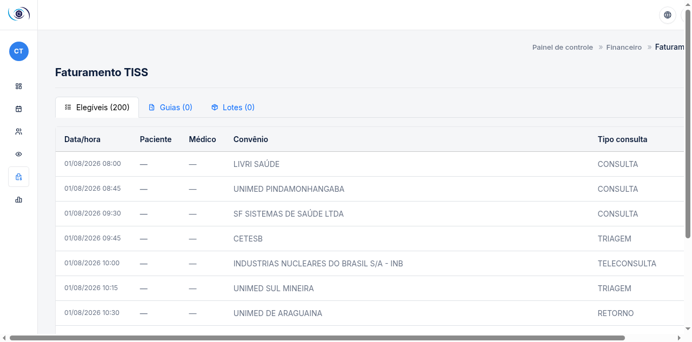

### Guias

Guias geradas, com status (pendente, enviada, paga, negada):

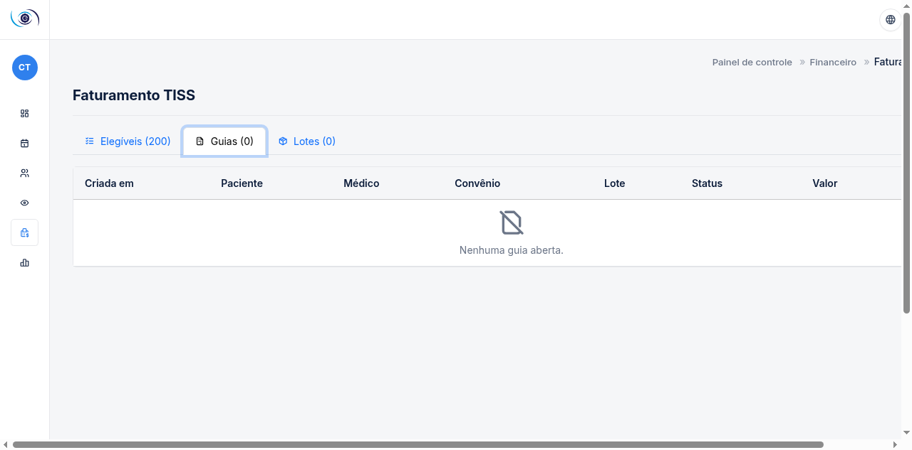

- ✔ **Marcar como paga** — quando o convênio confirmar o pagamento.
- ✖ **Marcar como negada** — informe o motivo da negativa (vira glosa para recurso).

### Lotes

Lotes de guias para envio ao convênio, com download do **XML TISS** no padrão ANS:

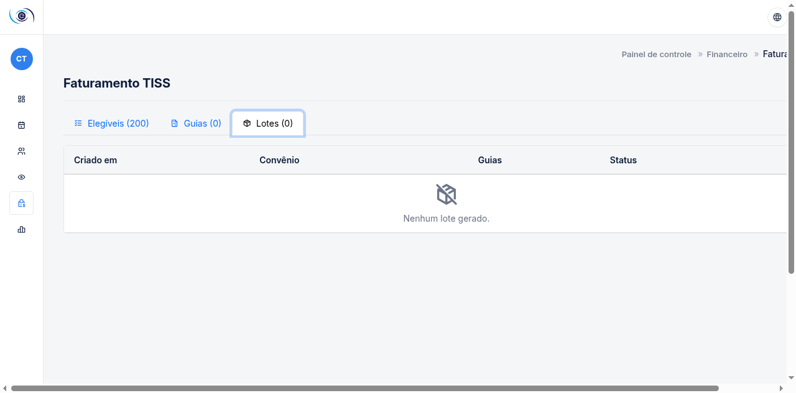

---

## 7. Conciliação de Glosas

**Financeiro → Conciliação de Glosas** — valores glosados pelos convênios:

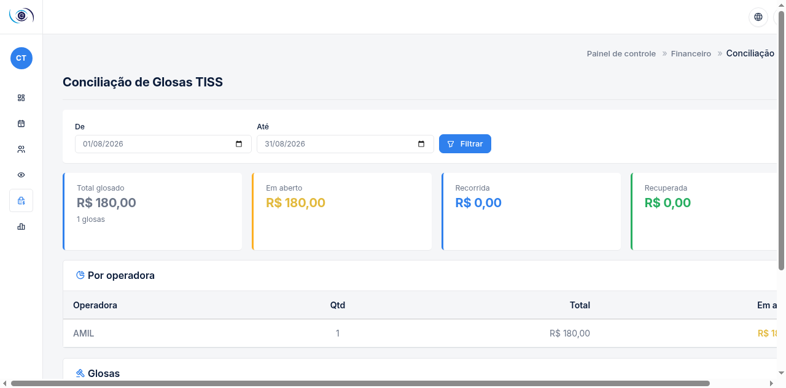

A tela consolida: **Total glosado, Em aberto, Recorrida e Recuperada**, o resumo por
operadora e a lista de glosas do período.

### Recorrer de uma glosa

1. Na linha da glosa (status Aberta), clique em **Recorrer**.
2. Escreva a **justificativa** do recurso (mínimo 10 caracteres) — argumente por que a
   cobrança está correta.
3. Clique em **Enviar recurso**. O status muda para **Recorrida**; quando o convênio
   responder, registre o desfecho.

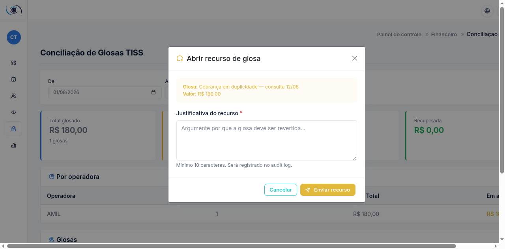

---

## 8. Relatórios financeiros

### Relatório de Fluxo de Caixa

**Financeiro → Rel. Fluxo de Caixa** — KPIs, consolidação por categoria e por dia, e a
lista completa de lançamentos do período. **Exportar CSV** gera o arquivo para o contador:

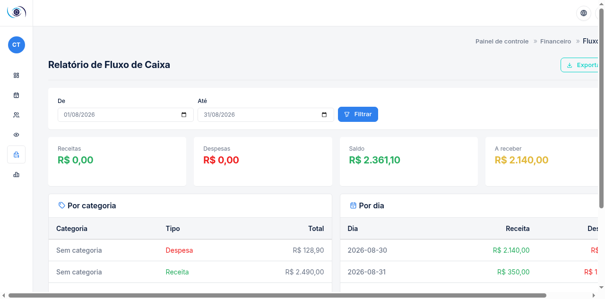

### Relatório de Faturamento por Convênio

**Financeiro → Rel. Faturamento** — guias, faturado, pago e glosado por convênio, com
exportação CSV:

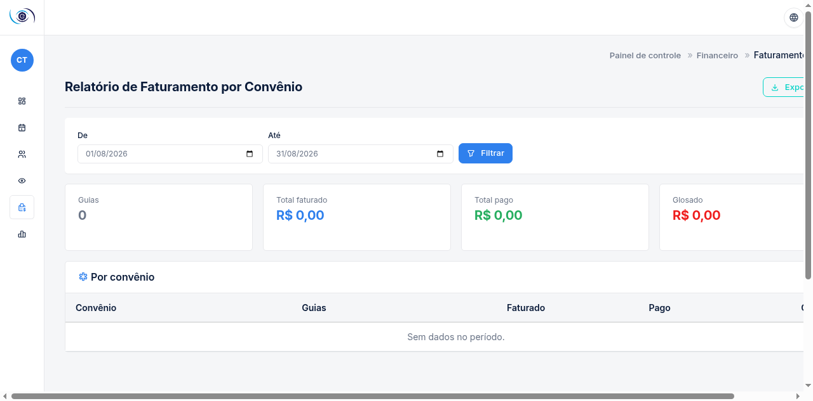

---

## 9. Relatórios operacionais

O perfil financeiro também acessa os relatórios operacionais em **Relatórios**:

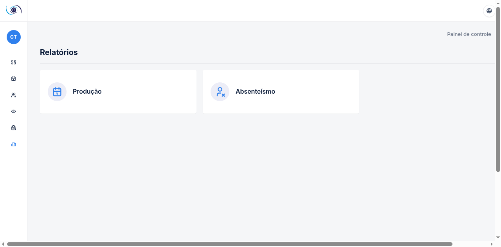

- **Produção** — agendamentos por período e por médico, taxa de presença:

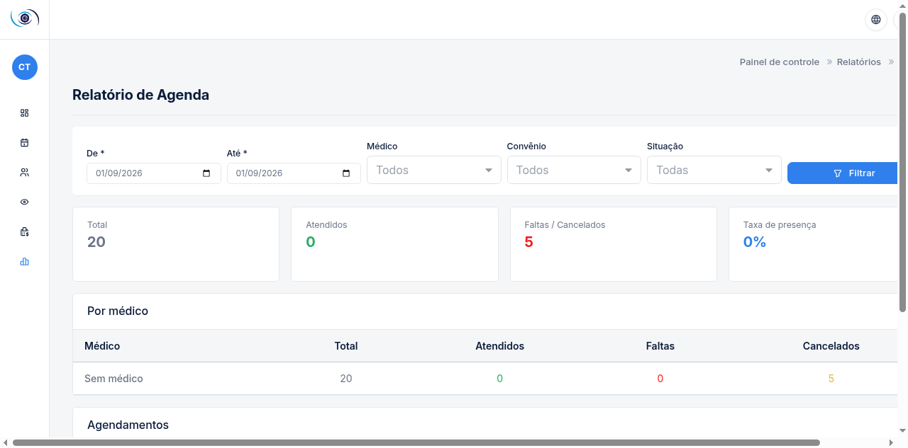

- **Absenteísmo** — faltas e cancelamentos (impacto direto na receita).

Informe o período (De/Até) e clique em **Filtrar**.

---

## 10. Minha conta

Avatar (canto superior direito) → **Editar perfil**: nome, e-mail, foto, senha e
autenticação em dois fatores (recomendado):

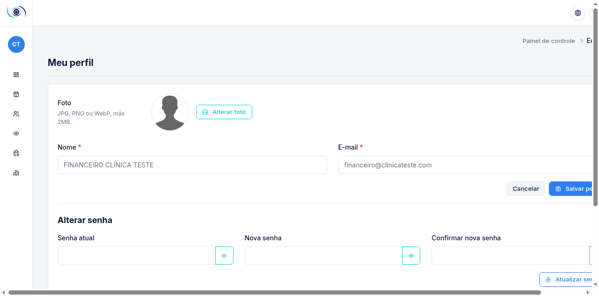

**Sair**: avatar → Sair.

---

## 11. O que o perfil financeiro NÃO acessa

Por desenho de segurança, estas áreas retornam **acesso negado**:

| Área | Motivo | Quem acessa |
|---|---|---|
| Controle de acesso (usuários e perfis) | Gestão de credenciais | Administrador |
| Configurações da clínica (catálogos, convênios, salas) | Parametrização | Administrador |
| Cadastro de médicos | Cria credencial de login | Administrador |
| Prontuários (criação/edição) | Ato médico | Médico |
| Compliance (trilhas LGPD/CFM) | Auditoria | Administrador |
| Painel do SaaS | Administração da plataforma | Equipe EasyEye |

Precisa de algo nessas áreas? Fale com o administrador da clínica.

---

*Manual gerado a partir de telas reais do EasyEye — perfil Financeiro. Interface evoluiu?
Gere novas capturas com os comandos indicados no topo deste documento.*
