# Manual do Médico — EasyEye

Guia completo de utilização do sistema para o perfil **Médico**, passo a passo com telas reais.
Cobre o dia inteiro de atendimento: agenda, prontuário eletrônico completo (documentações,
atestados, evolução, anexos, receitas e laudos), assistente de IA, imagens oftálmicas,
pacientes e conta.

> As capturas são geradas automaticamente a partir do sistema real
> (`e2e/cypress/e2e/docs/doctor-manual.cy.js`). Para atualizá-las após mudanças de tela:
> `php artisan tinker --execute="require 'e2e/scripts/seed-docs-doctor.php';"` e depois
> `cd e2e && npx cypress run --browser chrome --config excludeSpecPattern=__none__ --spec cypress/e2e/docs/doctor-manual.cy.js`;
> copie as imagens de `e2e/cypress/screenshots/doctor-manual.cy.js/` para
> `docs/manual-medico/img/` e finalize com
> `php artisan tinker --execute="require 'e2e/scripts/clean-docs-doctor.php';"`.

---

## Sumário

1. [Acesso ao sistema](#1-acesso-ao-sistema)
2. [Agenda do dia e início do atendimento](#2-agenda-do-dia-e-início-do-atendimento)
3. [Prontuário: preenchimento e salvamento](#3-prontuário-preenchimento-e-salvamento)
4. [Documentações do prontuário](#4-documentações-do-prontuário)
5. [Finalização da consulta](#5-finalização-da-consulta)
6. [Assistente de IA](#6-assistente-de-ia)
7. [Meus prompts de IA e consumo](#7-meus-prompts-de-ia-e-consumo)
8. [Pacientes e imagens oftálmicas](#8-pacientes-e-imagens-oftálmicas)
9. [Minha conta](#9-minha-conta)
10. [O que o perfil de médico NÃO acessa](#10-o-que-o-perfil-de-médico-não-acessa)

---

## 1. Acesso ao sistema

1. Acesse o painel da clínica com **e-mail** e **senha** (e o código do autenticador, se o
   2FA estiver ativo).
2. Você chega ao **Painel de controle** com os números do dia:

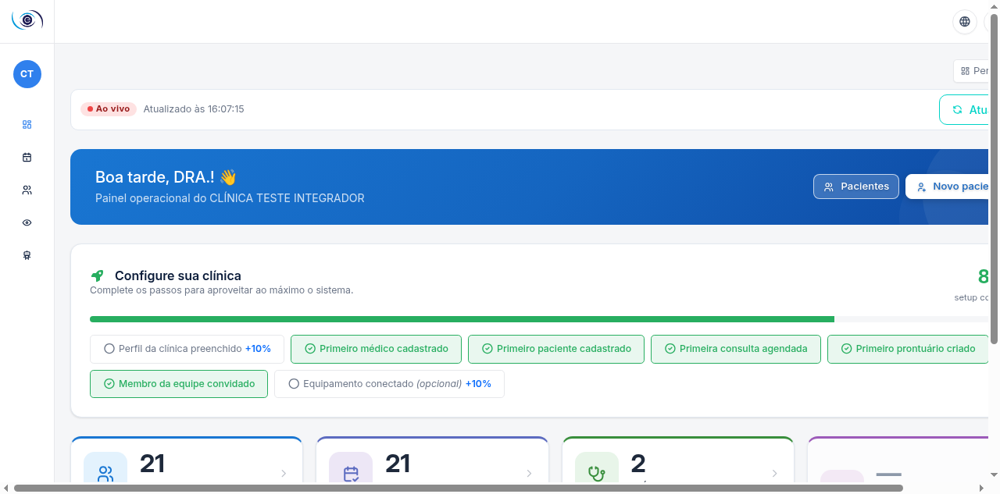

O **menu lateral** do médico (passe o mouse na barra à esquerda para expandir):

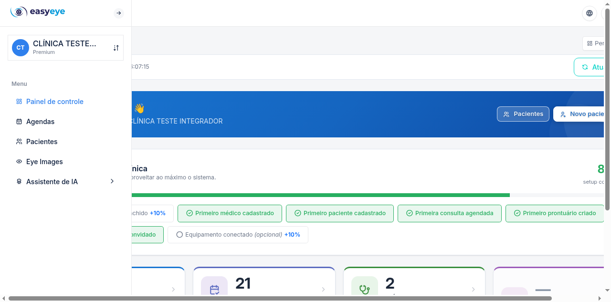

| Item | O que faz |
|---|---|
| Painel de controle | Indicadores e atalhos |
| Agendas | Sua agenda de atendimentos |
| Pacientes | Cadastro de pacientes |
| Imagens oftálmicas | Exames de imagem e diagnóstico |
| Assistente de IA | Meus prompts e consumo de IA |

---

## 2. Agenda do dia e início do atendimento

Clique em **Agendas**. A tela abre no dia atual com seus atendimentos:

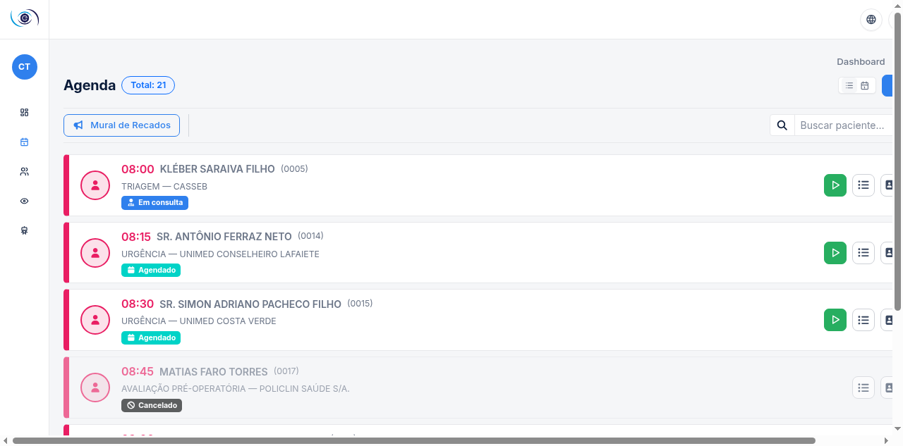

Cada card mostra horário, paciente, convênio e a situação atual. Quando o paciente estiver
na recepção (situação **Aguardando** ou **Confirmado**), o card exibe o botão verde de
**Iniciar atendimento** (ícone ▶):

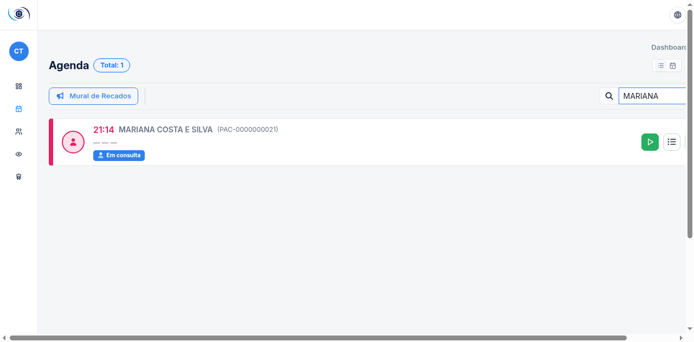

Clique no ▶ para abrir o **prontuário** do atendimento:

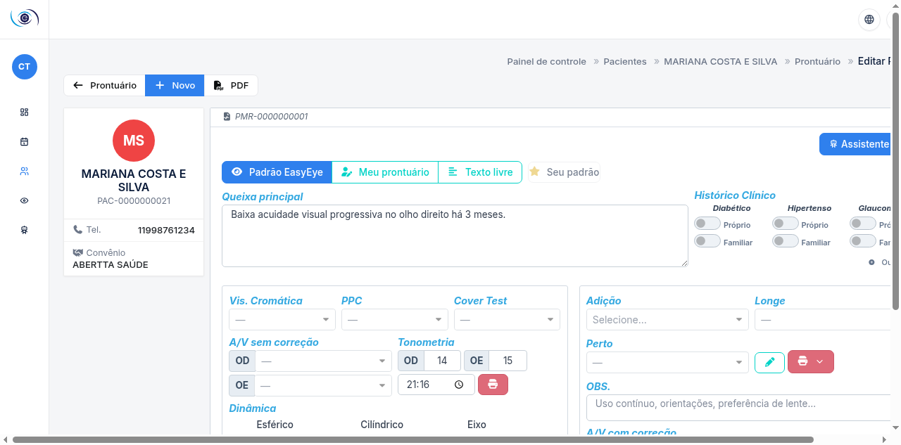

---

## 3. Prontuário: preenchimento e salvamento

O prontuário oftalmológico organiza o exame em seções OD/OE (olho direito/esquerdo):

- **Queixa principal** e HDA — texto livre (obrigatória a queixa OU a observação geral).
- **Acuidade visual** sem/com correção, **Tonometria** (mmHg, com horário da medida),
  refração **Dinâmica** e **Estática** (esférico/cilíndrico/eixo), **Adição**, **Vis.
  Cromática**, **PPC**, **Cover Test**, **Biomicroscopia**, **Fundoscopia**, prescrição
  de lentes (**Longe/Perto**) e **Observação geral**.

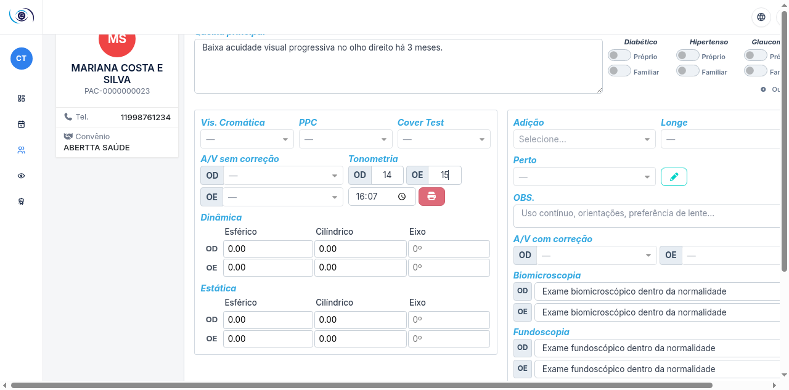

1. Preencha as seções pertinentes à consulta.
2. Clique em **Salvar** (botão no topo). O registro é criado e vinculado ao atendimento —
   o sistema retorna à agenda.

> **Modos de exibição**: o prontuário pode ser usado no layout **padrão**, num layout
> **personalizado** (você escolhe quais seções aparecem e em que coluna) ou em
> **texto livre**. A preferência é sua e fica salva por médico — ajuste no seletor de
> layout no topo do prontuário.

> **Compliance**: cada alteração gera versão e trilha de auditoria. Prontuário assinado
> fica travado contra edição (CFM/LGPD).

Para retomar um prontuário salvo, abra o card na agenda (▶) ou vá em
**Pacientes → Prontuário**:

---

## 4. Documentações do prontuário

Com o prontuário **salvo**, a barra de documentações libera as ações rápidas:

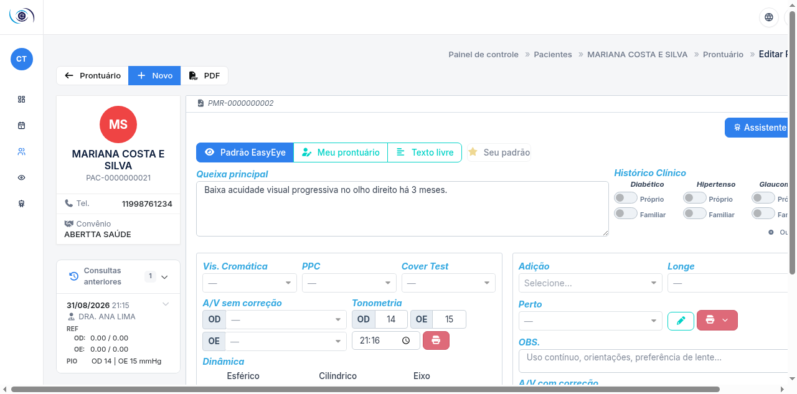

| Botão | O que gera |
|---|---|
| Atestado Comparecim. | Declaração de comparecimento à consulta |
| Atestado Médico | Atestado com dias de afastamento |
| Laudos de Exame | Laudo a partir dos exames do prontuário |
| Evolução | Registro de evolução clínica |
| Documentações | Documentos por modelo (receitas, solicitações, laudos personalizados) |
| Anexo | Upload de arquivos ao prontuário (PDF, imagens) |

### Atestado médico

1. Clique em **Atestado Médico**.
2. Informe os **dias de afastamento** — a pré-visualização atualiza sozinha.
3. Clique em **Emitir**: o PDF é gerado e fica listado nas documentações do prontuário.

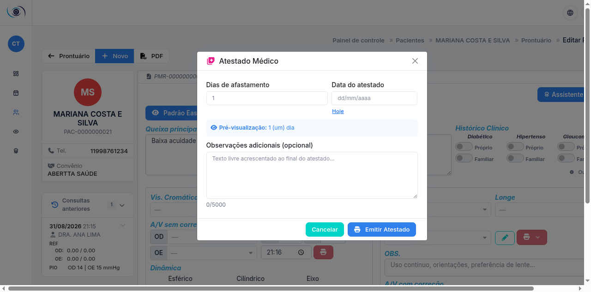

### Evolução clínica

Registro rápido da evolução do paciente (fica no histórico, com autor e data):

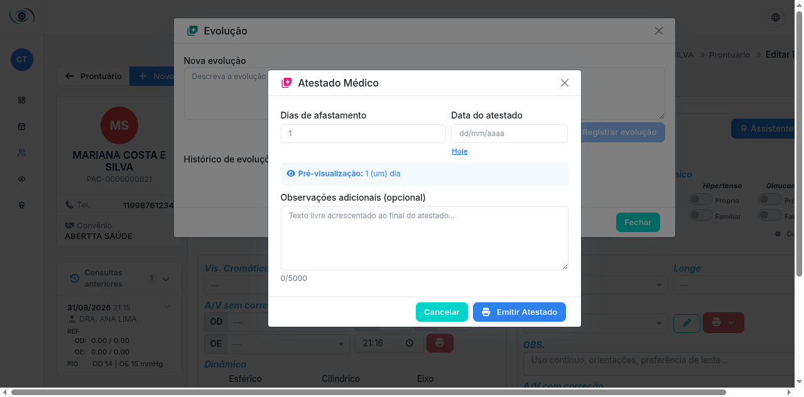

### Anexos

Envie exames e documentos externos (PDF, JPG, PNG — armazenamento seguro):

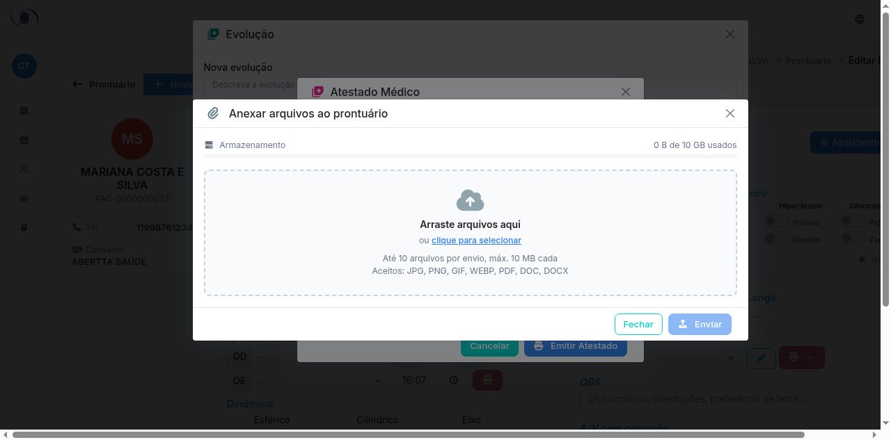

### Documentos por modelo (receitas, laudos, solicitações)

O botão **Documentações** abre os modelos configurados pela clínica — receituário com busca
de **medicamentos** e posologia, solicitações de procedimento e laudos. O conteúdo aceita
os dados do prontuário e busca **CID-10** integrada:

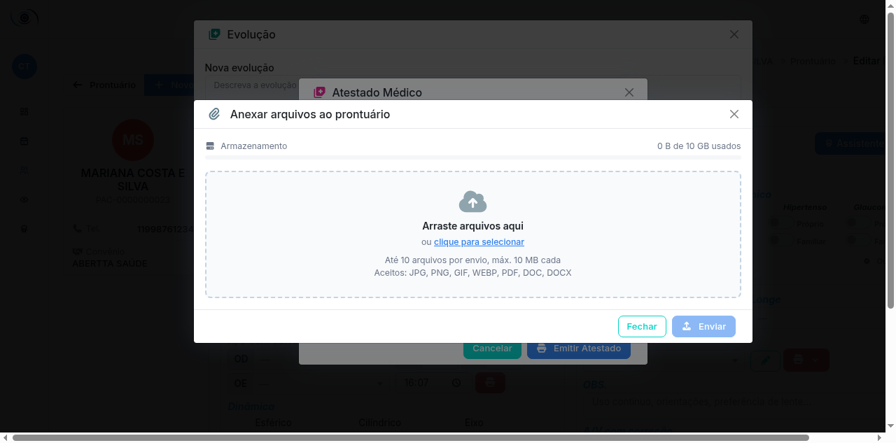

Todos os documentos emitidos geram **PDF** com o padrão visual da clínica e ficam
listados no prontuário.

### Exames de imagem do paciente

O botão **Exames de imagem** (barra de documentações) abre os exames do módulo de
Imagens Oftálmicas do paciente em atendimento — retinografias, OCTs e demais imagens,
com tipo, data, olho (OD/OE/AO) e CIDs — sem sair da consulta:

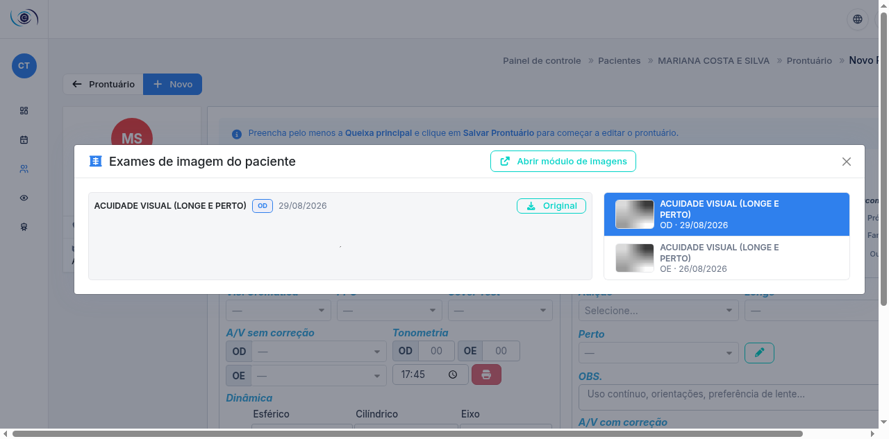

- Clique numa miniatura à direita para ampliar; **Original** baixa o arquivo (ou o PDF
  do laudo).
- **Abrir módulo de imagens** leva ao visualizador completo (até 4 painéis comparativos).
- Disponível já ao **iniciar o atendimento**, antes mesmo de salvar o prontuário.
- Cada consulta a essas imagens é registrada na trilha de acesso (LGPD).

---

## 5. Finalização da consulta

Ao sair do prontuário (botão ← no topo), o sistema pergunta o **desfecho** do atendimento:

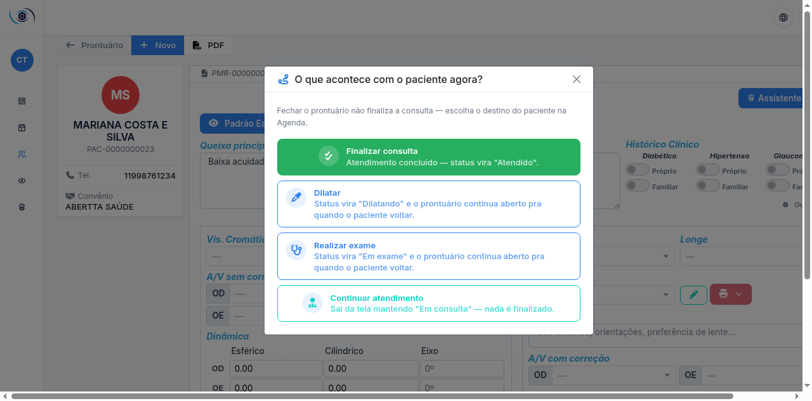

- **Finalizar consulta** — marca o atendimento como **Atendido** na agenda (card verde).
- **Continuar depois** — mantém o atendimento em andamento para retomar.

---

## 6. Assistente de IA

O botão flutuante ✨ (canto inferior direito, exclusivo do médico) abre o
**Assistente virtual**:

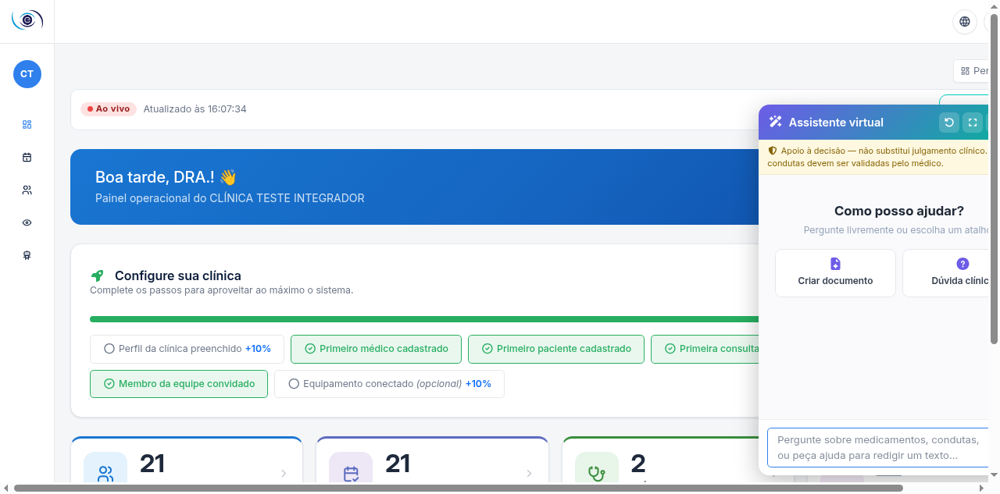

- **Criar documento** — rascunhos de laudos e relatórios a partir do contexto do paciente.
- **Dúvida clínica** — perguntas livres com apoio à decisão.

Regras importantes:

1. O assistente é **apoio à decisão — não substitui o julgamento clínico**. Todo conteúdo
   gerado fica **pendente da sua aprovação** antes de valer.
2. Cada execução consome **créditos de IA** da clínica; a estimativa aparece antes de
   confirmar.
3. Os dados enviados são minimizados (iniciais do paciente, sem CPF/contatos) — evite
   digitar identificadores no texto livre.

---

## 7. Meus prompts de IA e consumo

Em **Assistente de IA → Meus prompts**, salve instruções reutilizáveis (ex.: estilo de
laudo preferido). São pessoais, por médico:

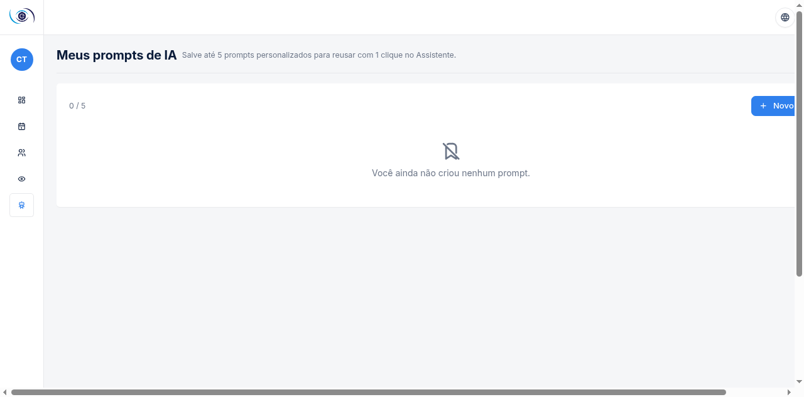

**Novo prompt** pede título e conteúdo; arraste para reordenar; exclua os que não usar:

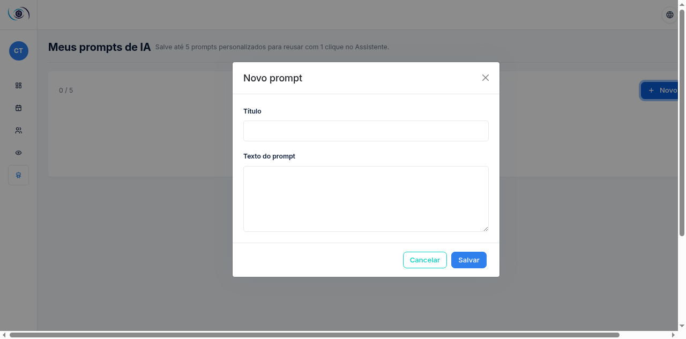

Em **Assistente de IA → consumo**, acompanhe créditos, execuções e aprovações:

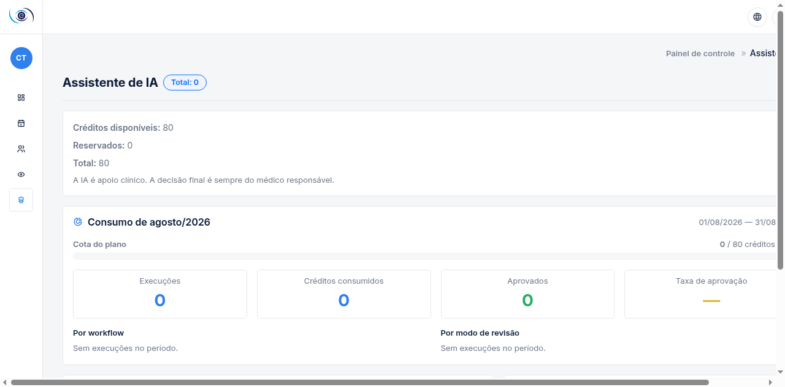

---

## 8. Pacientes e imagens oftálmicas

**Pacientes** — cadastro completo: criar, editar, ver detalhes e abrir o prontuário de
qualquer paciente da clínica:

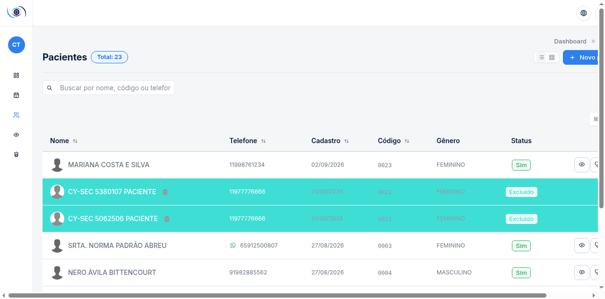

**Imagens oftálmicas** — exames de imagem por paciente, com visualizador em até 4 painéis,
importação de exames externos e **emissão de diagnóstico** (CID-10) — a escrita de
diagnóstico é exclusiva do médico:

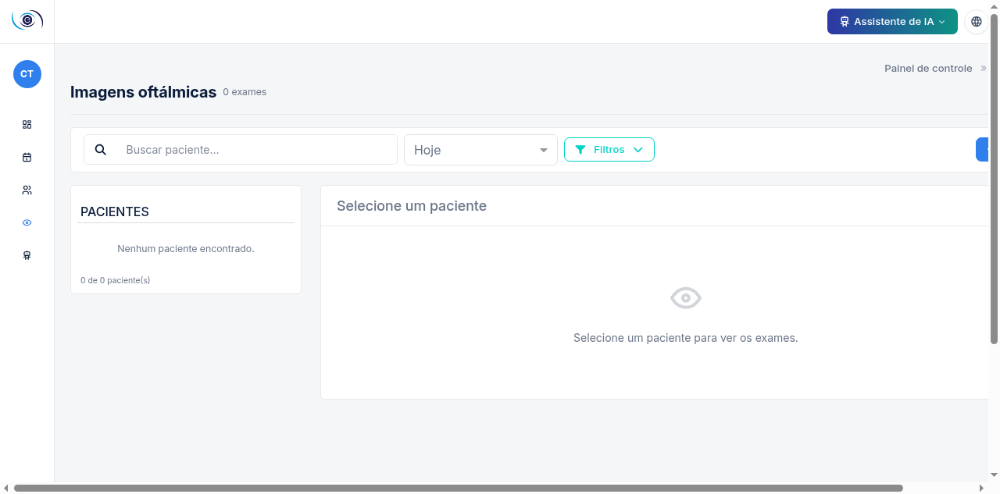

---

## 9. Minha conta

Avatar (canto superior direito) → **Editar perfil**: nome, e-mail, foto, senha e
autenticação em dois fatores (recomendado):

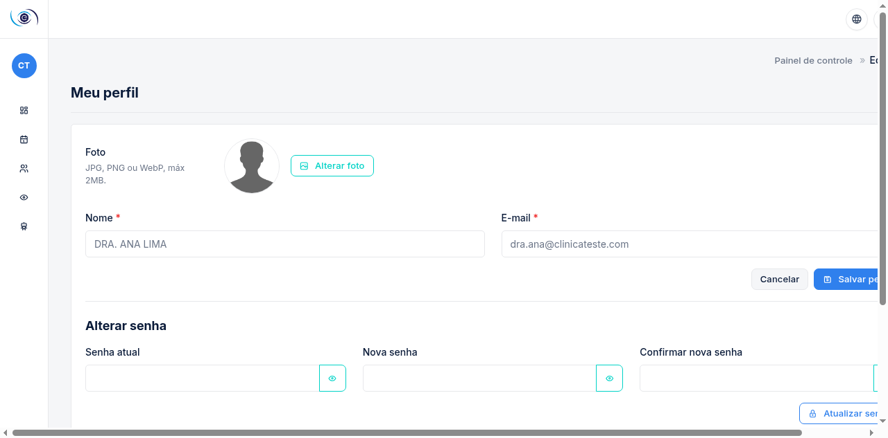

**Sair**: avatar → Sair.

---

## 10. O que o perfil de médico NÃO acessa

Por desenho de segurança, estas áreas retornam **acesso negado** ao médico:

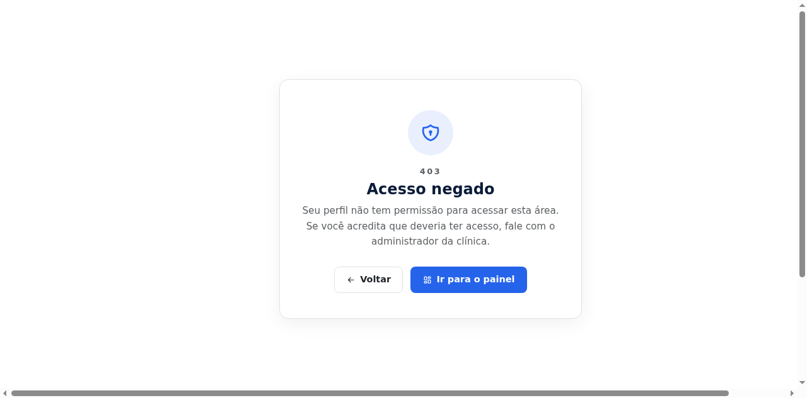

| Área | Motivo | Quem acessa |
|---|---|---|
| Lista e cadastro de médicos | Gestão administrativa do corpo clínico | Administrador (e secretária para escala) |
| Financeiro (caixa, faturamento, TISS) | Dados financeiros | Administrador e Financeiro |
| Relatórios e Compliance | Gestão e auditoria | Administrador |
| Controle de acesso e configurações | Parametrização da clínica | Administrador |
| Compra de créditos de IA | Decisão financeira | Administrador |
| Painel do SaaS | Administração da plataforma | Equipe EasyEye |

Precisa de algo nessas áreas? Fale com o administrador da clínica.

---

*Manual gerado a partir de telas reais do EasyEye — perfil Médico. Interface evoluiu?
Gere novas capturas com os comandos indicados no topo deste documento.*
