# Manual do Médico — EasyEye

Guia completo de utilização do sistema para o perfil **Médico**, passo a passo com telas reais.
Cobre o dia inteiro de atendimento: agenda, prontuário eletrônico completo (documentações,
atestados, evolução, anexos, receitas e laudos), assistente de IA, imagens oftálmicas,
pacientes e conta.

> As capturas são geradas automaticamente a partir do sistema real
> (`e2e/cypress/e2e/docs/doctor-manual.cy.js`). Para atualizá-las após mudanças de tela:
> `php artisan tinker --execute="require 'e2e/scripts/seed-docs-doctor.php';"` e depois
> `cd e2e && npx cypress run --browser chrome --config excludeSpecPattern=__none__ --spec cypress/e2e/docs/doctor-manual.cy.js`;
> copie as imagens de `e2e/cypress/screenshots/doctor-manual.cy.js/` para
> `docs/manual-medico/img/` e finalize com
> `php artisan tinker --execute="require 'e2e/scripts/clean-docs-doctor.php';"`.

---

## Sumário

1. [Acesso ao sistema](#1-acesso-ao-sistema)
2. [Agenda do dia e início do atendimento](#2-agenda-do-dia-e-início-do-atendimento)
3. [Prontuário: preenchimento e salvamento](#3-prontuário-preenchimento-e-salvamento)
4. [Documentações do prontuário](#4-documentações-do-prontuário)
5. [Andamento e finalização da consulta](#5-andamento-e-finalização-da-consulta)
6. [Assistente de IA](#6-assistente-de-ia)
7. [Meus prompts de IA e consumo](#7-meus-prompts-de-ia-e-consumo)
8. [Pacientes e imagens oftálmicas](#8-pacientes-e-imagens-oftálmicas)
9. [Portal do Paciente: convite e compartilhamento de documentos](#9-portal-do-paciente-convite-e-compartilhamento-de-documentos)
10. [Minha conta](#10-minha-conta)
11. [O que o perfil de médico NÃO acessa](#11-o-que-o-perfil-de-médico-não-acessa)

---

## 1. Acesso ao sistema

1. Acesse o painel da clínica com **e-mail** e **senha** (e o código do autenticador, se o
   2FA estiver ativo).
2. Você chega ao **Painel de controle** com os números do dia:

O **menu lateral** do médico (passe o mouse na barra à esquerda para expandir):

| Item | O que faz |
|---|---|
| Painel de controle | Indicadores e atalhos |
| Agendas | Sua agenda de atendimentos |
| Pacientes | Cadastro de pacientes |
| Imagens oftálmicas | Exames de imagem e diagnóstico |
| Assistente de IA | Meus prompts e consumo de IA |

---

## 2. Agenda do dia e início do atendimento

Clique em **Agendas**. A tela abre no dia atual com seus atendimentos:

Cada card mostra horário, paciente, convênio e a situação atual. Quando o paciente estiver
na recepção (situação **Aguardando** ou **Confirmado**), o card exibe o botão verde de
**Iniciar atendimento** (ícone ▶):

Clique no ▶ para abrir o **prontuário** do atendimento:

---

## 3. Prontuário: preenchimento e salvamento

O prontuário oftalmológico organiza o exame em seções OD/OE (olho direito/esquerdo):

- **Queixa principal** e HDA — texto livre (obrigatória a queixa OU a observação geral).
- **Acuidade visual** sem/com correção, **Tonometria** (mmHg, com horário da medida),
  refração **Dinâmica** e **Estática** (esférico/cilíndrico/eixo), **Adição**, **Vis.
  Cromática**, **PPC**, **Cover Test**, **Biomicroscopia**, **Fundoscopia**, prescrição
  de lentes (**Longe/Perto**) e **Observação geral**.

1. Preencha as seções pertinentes à consulta.
2. Clique em **Salvar** (barra inferior). O registro é criado e vinculado ao atendimento —
   você **continua no prontuário**, com receitas, atestados e laudos liberados. A consulta
   só termina quando você escolher **Finalizar consulta** (seção 5).

> **Modos de exibição**: o prontuário pode ser usado no layout **padrão**, num layout
> **personalizado** (você escolhe quais seções aparecem e em que coluna) ou em
> **texto livre**. A preferência é sua e fica salva por médico — ajuste no seletor de
> layout no topo do prontuário.

> **Compliance**: cada alteração gera versão e trilha de auditoria. Prontuário assinado
> fica travado contra edição (CFM/LGPD).

Para retomar um prontuário salvo, abra o card na agenda (▶) ou vá em
**Pacientes → Prontuário**:

---

## 4. Documentações do prontuário

A barra de documentações fica disponível **desde o início do atendimento**. Antes do
primeiro salvamento, clicar numa ação salva o prontuário e abre a ação em seguida:

| Botão | O que gera |
|---|---|
| Atestado Comparecim. | Declaração de comparecimento à consulta |
| Atestado Médico | Atestado com dias de afastamento |
| Laudos de Exame | Laudo a partir dos exames do prontuário |
| Evolução | Registro de evolução clínica |
| Documentações | Documentos por modelo (receitas, solicitações, laudos personalizados) |
| Anexo | Upload de arquivos ao prontuário (PDF, imagens) |

### Atestado médico

1. Clique em **Atestado Médico**.
2. Informe os **dias de afastamento** — a pré-visualização atualiza sozinha.
3. Clique em **Emitir**: o PDF é gerado e fica listado nas documentações do prontuário.

### Evolução clínica

Registro rápido da evolução do paciente (fica no histórico, com autor e data):

### Anexos

Envie exames e documentos externos (PDF, JPG, PNG — armazenamento seguro):

### Documentos por modelo (receitas, laudos, solicitações)

O botão **Documentações** abre os modelos configurados pela clínica — receituário com busca
de **medicamentos** e posologia, solicitações de procedimento e laudos. O conteúdo aceita
os dados do prontuário e busca **CID-10** integrada:

Todos os documentos emitidos geram **PDF** com o padrão visual da clínica e ficam
listados no prontuário.

### Exames de imagem do paciente

O botão **Exames de imagem** (barra de documentações) abre os exames do módulo de
Imagens Oftálmicas do paciente em atendimento — retinografias, OCTs e demais imagens,
com tipo, data, olho (OD/OE/AO) e CIDs — sem sair da consulta:

- Clique numa miniatura à direita para ampliar; **Original** baixa o arquivo (ou o PDF
  do laudo).
- **Abrir módulo de imagens** leva ao visualizador completo (até 4 painéis comparativos).
- Disponível já ao **iniciar o atendimento**, antes mesmo de salvar o prontuário.
- Cada consulta a essas imagens é registrada na trilha de acesso (LGPD).

---

## 5. Andamento e finalização da consulta

**Salvar não é finalizar.** A barra inferior do prontuário tem botões separados para
cada momento do atendimento:

- **Salvar** — grava o que já foi preenchido e **mantém a consulta aberta** (a tela
  continua no prontuário, com receitas, atestados, laudos e solicitações liberados).
- **Dilatar** — grava, muda o status na agenda para **Dilatando** (a recepção vê que
  precisa dilatar) e volta para a Agenda. O prontuário continua editável; quando o
  paciente voltar, **Iniciar atendimento** reabre o mesmo prontuário e o status volta a
  **Em consulta**.
- **Realizar exame** — mesma lógica, com o status **Em exame**.
- **Finalizar consulta** — grava, marca o atendimento como **Atendido** (card verde na
  agenda) e volta para a Agenda para o próximo paciente.

Fluxo típico: `Aguardando → Em consulta → Dilatando / Em exame → Em consulta → Atendido`.

> Receita, atestado, laudo, solicitação de exame e procedimentos ficam disponíveis
> **durante** a consulta. Antes do primeiro salvamento, clicar em qualquer um desses
> botões salva o prontuário e abre a ação escolhida em seguida.

Ao sair pelo botão **←** no topo, o sistema também pergunta o **desfecho** do atendimento
(Finalizar / Dilatar / Realizar exame / Continuar atendimento):

Se a clínica exige lançamento no caixa para concluir (Configurações), **Finalizar** avisa
e mantém a consulta aberta até o caixa ser registrado pela recepção.

---

## 6. Assistente de IA

O botão flutuante ✨ (canto inferior direito, exclusivo do médico) abre o
**Assistente virtual**:

- **Criar documento** — rascunhos de laudos e relatórios a partir do contexto do paciente.
- **Dúvida clínica** — perguntas livres com apoio à decisão.

Regras importantes:

1. O assistente é **apoio à decisão — não substitui o julgamento clínico**. Todo conteúdo
   gerado fica **pendente da sua aprovação** antes de valer.
2. Cada execução consome **créditos de IA** da clínica; a estimativa aparece antes de
   confirmar.
3. Os dados enviados são minimizados (iniciais do paciente, sem CPF/contatos) — evite
   digitar identificadores no texto livre.

---

## 7. Meus prompts de IA e consumo

Em **Assistente de IA → Meus prompts**, salve instruções reutilizáveis (ex.: estilo de
laudo preferido). São pessoais, por médico:

**Novo prompt** pede título e conteúdo; arraste para reordenar; exclua os que não usar:

Em **Assistente de IA → consumo**, acompanhe créditos, execuções e aprovações:

---

## 8. Pacientes e imagens oftálmicas

**Pacientes** — cadastro completo: criar, editar, ver detalhes e abrir o prontuário de
qualquer paciente da clínica:

**Imagens oftálmicas** — exames de imagem por paciente, com visualizador em até 4 painéis,
importação de exames externos e **emissão de diagnóstico** (CID-10) — a escrita de
diagnóstico é exclusiva do médico:

Busque o paciente na lista à esquerda e selecione-o para ver os exames de imagem
sementeados/importados:

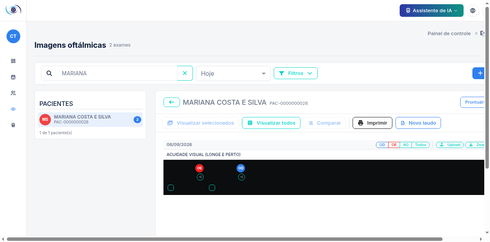

### Emitir laudo manual (Novo laudo)

O botão **Novo laudo** só aparece para o médico (nem chega a existir na tela para outros
perfis — não é apenas desabilitado). Ele abre um editor de texto rico para redigir o laudo
do exame de imagem sem depender de um atendimento em andamento:

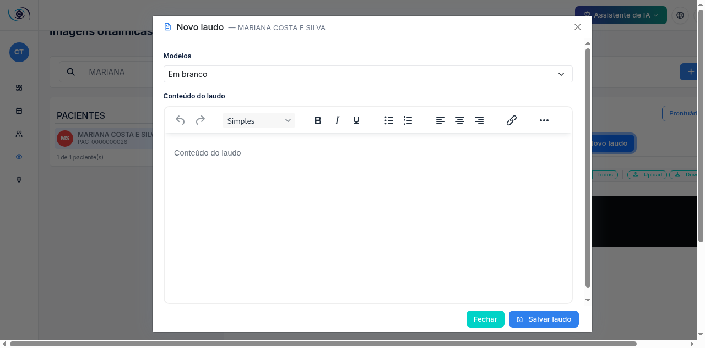

1. Escolha um **modelo** cadastrado pela clínica (categoria *laudos*/*exames
   especializados*) — o conteúdo é pré-preenchido e pode ser ajustado — ou fique em
   **Em branco** para redigir livremente.
2. Escreva o laudo no editor:

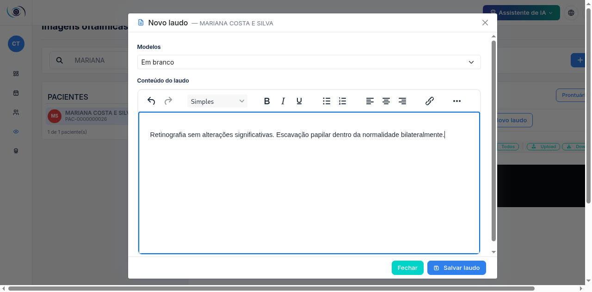

3. Clique em **Salvar laudo**. Se o sistema pedir confirmação de vínculo com o prontuário
   do dia, confirme. O laudo é salvo e o **PDF** fica disponível para download/impressão:

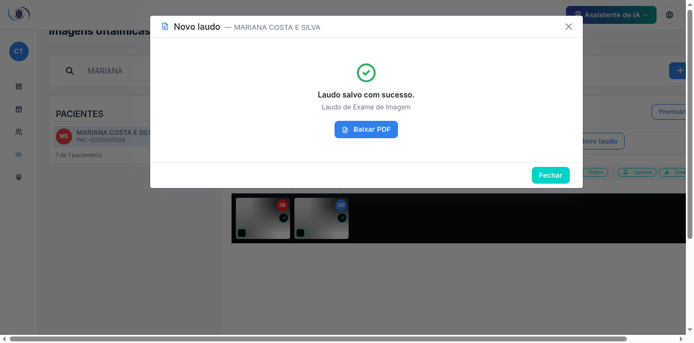

> Emissão de laudo de imagem é ato médico (CFM Res. 2.227/2018) — por isso o botão é
> exclusivo do médico, mesmo quando administrador/secretária têm acesso ao módulo de
> Imagens Oftálmicas para as demais operações (upload, organização, comparação).

### Comparar exames

Selecione **exatamente 2 exames** nas miniaturas do paciente — o botão **Comparar** só
habilita com essa seleção:

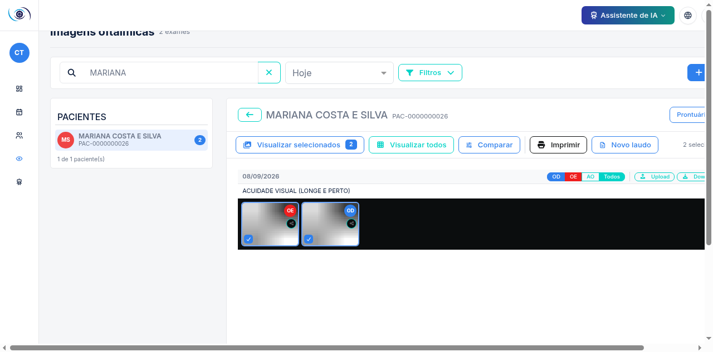

O modal abre no modo **Sobrepor**: arraste a imagem de cima para alinhar os pontos de
referência e ajuste a **opacidade** para enxergar a evolução entre os dois exames:

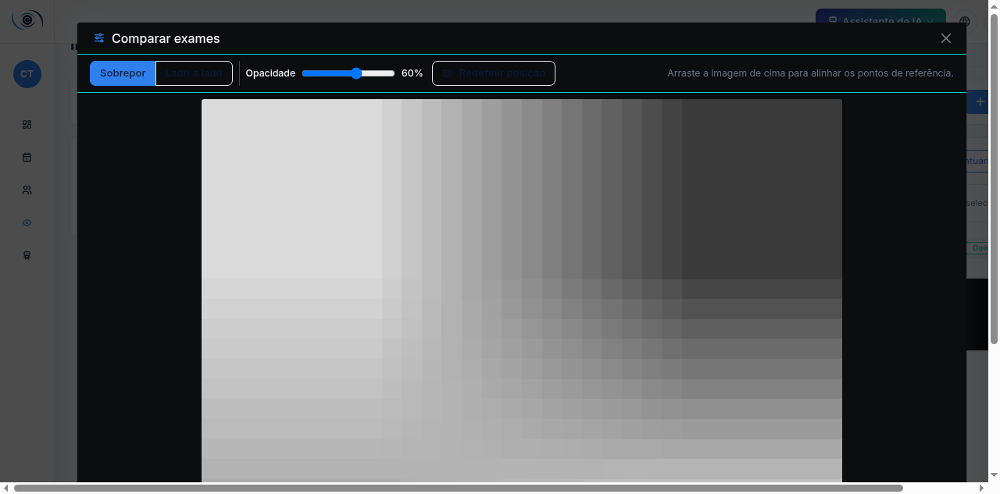

Alterne para **Lado a lado** para ver as duas imagens lado a lado, com data/hora e
identificação de cada exame:

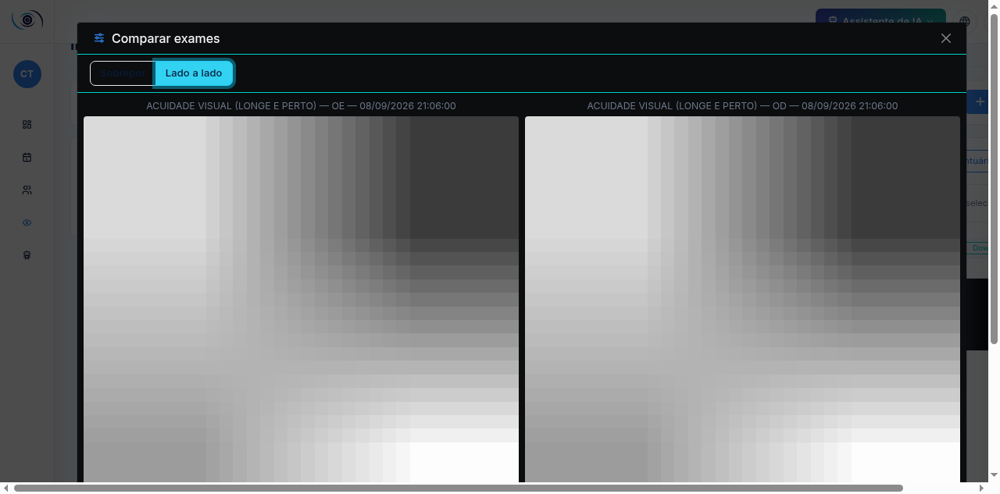

---

## 9. Portal do Paciente: convite e compartilhamento de documentos

O **Portal do Paciente** dá ao paciente um login próprio (fora do `/panel`) para consultar
seus laudos e exames compartilhados. O médico participa de duas etapas: **convidar** o
paciente para criar a conta e **compartilhar** documentos específicos com ele. O passo a
passo completo da experiência do paciente (login, tela de documentos, download) está no
[Manual do Portal do Paciente](../manual-portal-paciente/README.md).

### Enviar convite de acesso ao portal

Abra a ficha do paciente (**Pacientes → ícone de visualizar**) e role até **Portal do
Paciente**:

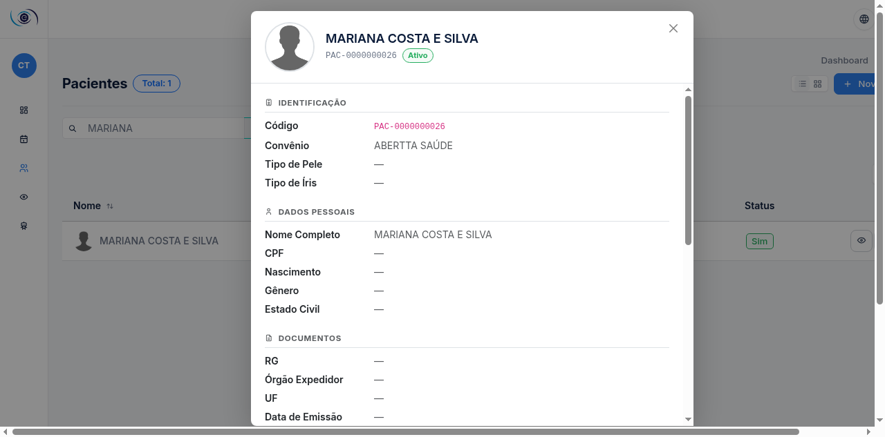

Clique em **Convidar para o portal**. O sistema envia um e-mail com um link de criação de
login único de acesso — a visão do paciente fica restrita às clínicas onde ele já foi
atendido:

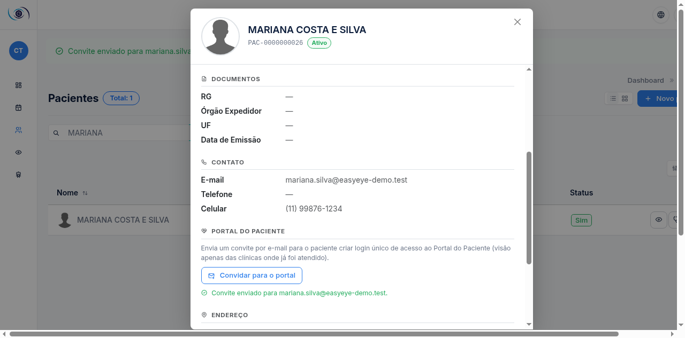

- O botão fica indisponível se o paciente **não tiver e-mail cadastrado** ou já tiver
  conta ativa no portal.
- Reenviar o convite é seguro (idempotente) — não cria uma segunda conta.

### Compartilhar laudo do prontuário

Abra o **detalhe do prontuário assinado** (Pacientes → Prontuário → ícone de visualizar) e
use o ícone de compartilhamento ao lado do documento:

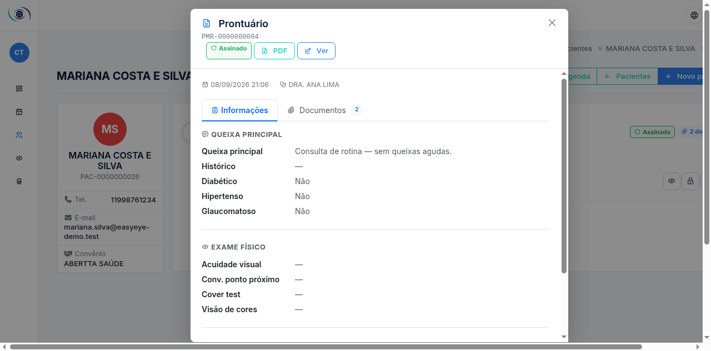

Clique no ícone **Compartilhar este documento com o paciente**. Um aviso de sucesso
confirma o envio e o ícone muda para **Revogar acesso**, indicando que o compartilhamento
está ativo:

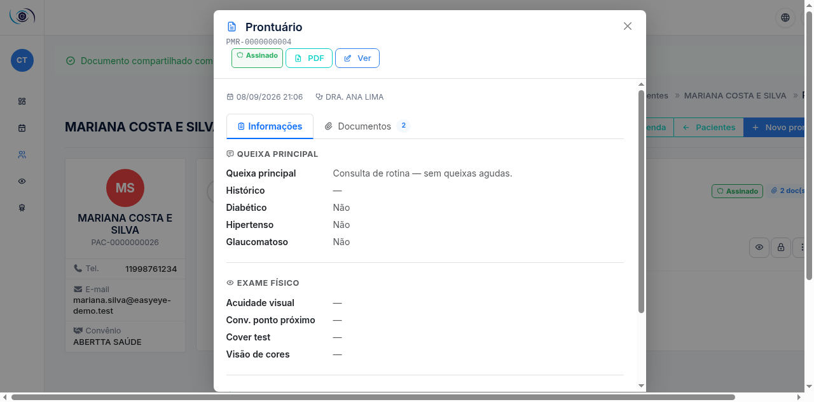

> Compartilhar **laudo** (prontuário) é restrito a **Administrador e Médico** — a
> secretária não tem esse botão. Só é possível compartilhar um prontuário **assinado**
> (bloqueado contra edição).

### Compartilhar exame de imagem

No **Gerenciador de Imagens**, cada miniatura tem um selo circular de compartilhamento.
Clique nele para liberar o exame ao paciente pelo portal — a secretária também pode
compartilhar exames (diferente do laudo):

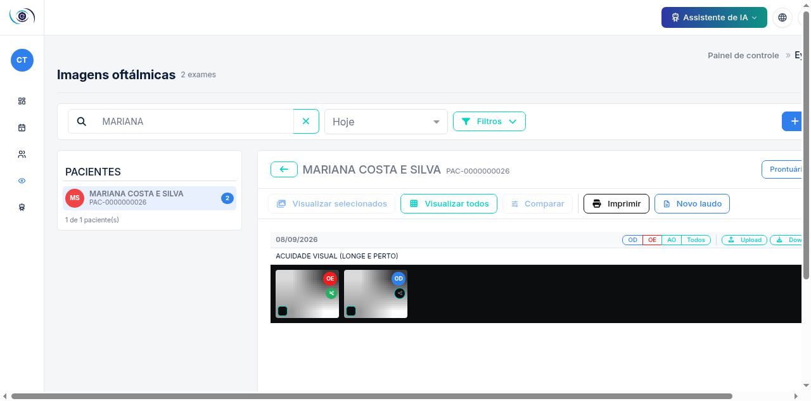

Clicar novamente no mesmo selo **revoga** o acesso do paciente àquele exame.

---

## 10. Minha conta

Avatar (canto superior direito) → **Editar perfil**: nome, e-mail, foto, senha e
autenticação em dois fatores (recomendado):

**Sair**: avatar → Sair.

---

## 11. O que o perfil de médico NÃO acessa

Por desenho de segurança, estas áreas retornam **acesso negado** ao médico:

| Área | Motivo | Quem acessa |
|---|---|---|
| Lista e cadastro de médicos | Gestão administrativa do corpo clínico | Administrador (e secretária para escala) |
| Financeiro (caixa, faturamento, TISS) | Dados financeiros | Administrador e Financeiro |
| Relatórios e Compliance | Gestão e auditoria | Administrador |
| Controle de acesso e configurações | Parametrização da clínica | Administrador |
| Compra de créditos de IA | Decisão financeira | Administrador |
| Painel do SaaS | Administração da plataforma | Equipe EasyEye |

Precisa de algo nessas áreas? Fale com o administrador da clínica.

---

*Manual gerado a partir de telas reais do EasyEye — perfil Médico. Interface evoluiu?
Gere novas capturas com os comandos indicados no topo deste documento.*
