# Manual do Portal do Paciente — EasyEye

Guia completo de utilização do **Portal do Paciente**, a área externa do EasyEye pela qual o
paciente acompanha seus laudos e exames — passo a passo com telas reais. É um sistema
**separado** do painel da clínica (`/panel`): endereço próprio (`/portal-paciente/...` e
`/meus-documentos`), login próprio (guard `patient`, tabela `patient_accounts`) e visual
próprio. Nenhuma equipe da clínica acessa por aqui — este manual é para o **paciente final**.

> As capturas são geradas automaticamente a partir do sistema real
> (`e2e/cypress/e2e/docs/patient-portal-manual.cy.js`). Para atualizá-las após mudanças de tela:
> `php artisan tinker --execute="require 'e2e/scripts/seed-docs-patient.php';"` e depois
> `cd e2e && npx cypress run --browser chrome --config excludeSpecPattern=__none__ --spec cypress/e2e/docs/patient-portal-manual.cy.js`;
> copie as imagens de `e2e/cypress/screenshots/patient-portal-manual.cy.js/` para
> `docs/manual-portal-paciente/img/` e finalize com
> `php artisan tinker --execute="require 'e2e/scripts/clean-docs-doctor.php';"`.

---

## Sumário

1. [Como o paciente entra no Portal (convite)](#1-como-o-paciente-entra-no-portal-convite)
2. [Login](#2-login)
3. [Esqueci minha senha](#3-esqueci-minha-senha)
4. [Minhas Clínicas (painel inicial)](#4-minhas-clínicas-painel-inicial)
5. [Documentos de uma clínica](#5-documentos-de-uma-clínica)
6. [Visualizar e baixar um documento](#6-visualizar-e-baixar-um-documento)
7. [Baixar meus dados (LGPD)](#7-baixar-meus-dados-lgpd)
8. [Sair (logout)](#8-sair-logout)
9. [Perguntas frequentes / limitações atuais](#9-perguntas-frequentes--limitações-atuais)
10. [Para a equipe da clínica: como liberar o Portal para um paciente](#10-para-a-equipe-da-clínica-como-liberar-o-portal-para-um-paciente)

---

## 1. Como o paciente entra no Portal (convite)

O Portal **não tem cadastro aberto** — não existe "criar conta" a partir da tela de login. A
única porta de entrada é um **convite enviado pela clínica** (veja a
[seção 10](#10-para-a-equipe-da-clínica-como-liberar-o-portal-para-um-paciente)): a secretária,
o médico ou o administrador clica em **Convidar para o portal** na ficha do paciente, e um
e-mail chega com um link exclusivo.

Ao clicar no link do e-mail, o paciente cai direto na tela de criação de senha, já com seu nome
e e-mail preenchidos automaticamente:

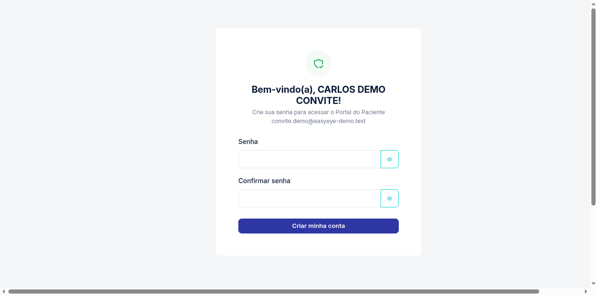

1. Crie uma **senha** (mínimo 8 caracteres, com maiúsculas, minúsculas, números e símbolos) e
   repita no campo de confirmação.
2. Clique em **Criar minha conta**.

Pronto — a conta é criada e o paciente já entra **automaticamente logado**, direto na tela
principal do Portal:

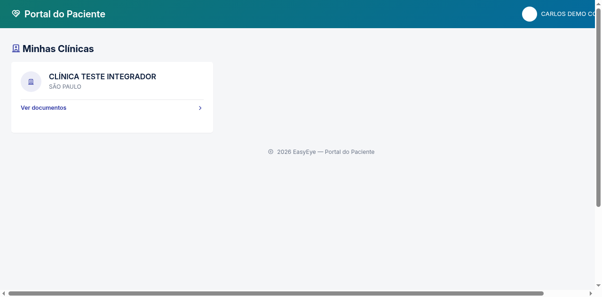

> **Um login para todas as clínicas.** A conta do Portal é única por pessoa (mesmo CPF/e-mail),
> não por clínica. Se o paciente já foi atendido em mais de uma clínica EasyEye e recebe um
> convite de cada uma, o **primeiro convite aceito já cria a conta** — os convites seguintes de
> outras clínicas apenas liberam aquela clínica na mesma conta (não pedem senha de novo).

**Se ainda não há nenhum documento liberado** (o convite acabou de ser aceito e a clínica ainda
não compartilhou nada), a tela de documentos daquela clínica aparece vazia:

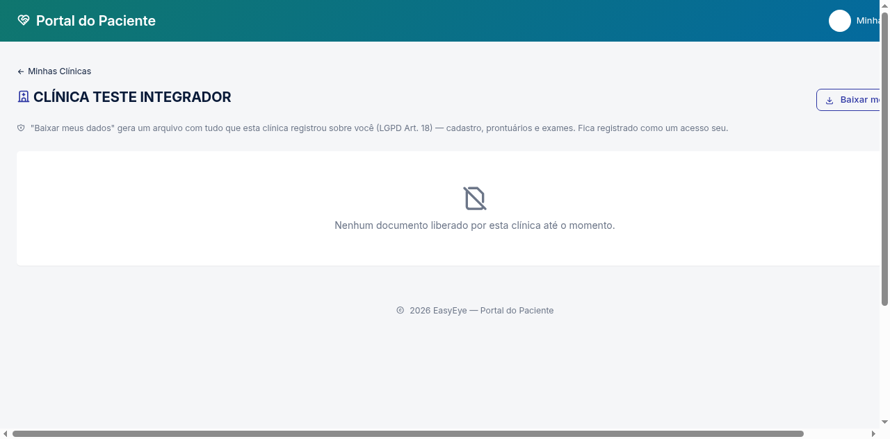

Isso é normal — volte mais tarde, depois que a clínica liberar o laudo/exame da consulta.

> **O link do convite expira em 3 dias.** Depois disso, peça à clínica para reenviar. Um link já
> usado (conta já criada) mostra o aviso "Este convite já foi utilizado — faça login com sua
> senha" e leva direto para a tela de login.

---

## 2. Login

Depois que a conta existe, o acesso é sempre por aqui: `/portal-paciente/login` (o mesmo link
enviado no e-mail de boas-vindas, ou que a clínica pode informar).

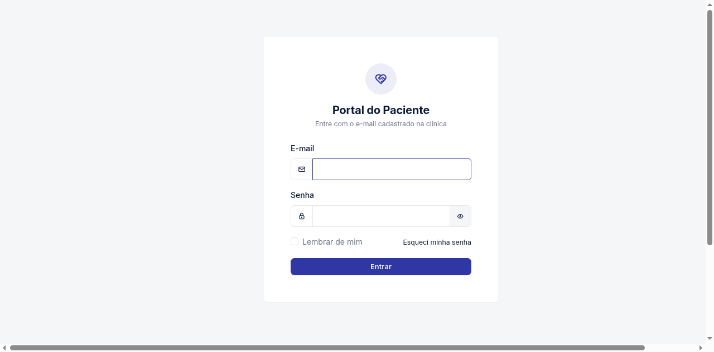

1. Informe o **e-mail** cadastrado na clínica.
2. Informe a **senha**. O ícone de olho mostra/esconde o que foi digitado.
3. Marque **Lembrar de mim** para continuar logado por mais tempo neste dispositivo.
4. Clique em **Entrar**.

Login e senha incorretos mostram uma mensagem genérica — o sistema nunca revela se o e-mail
existe ou não (proteção contra descoberta de contas):

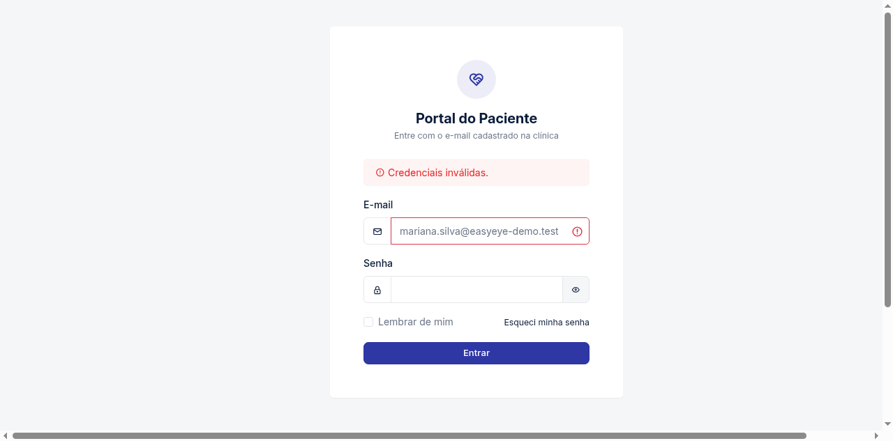

> Após várias tentativas seguidas com a mesma combinação de e-mail (de qualquer computador), o
> sistema passa a **limitar novas tentativas por alguns minutos** — proteção padrão contra
> tentativa de adivinhação de senha.

---

## 3. Esqueci minha senha

Na tela de login, clique em **Esqueci minha senha**:

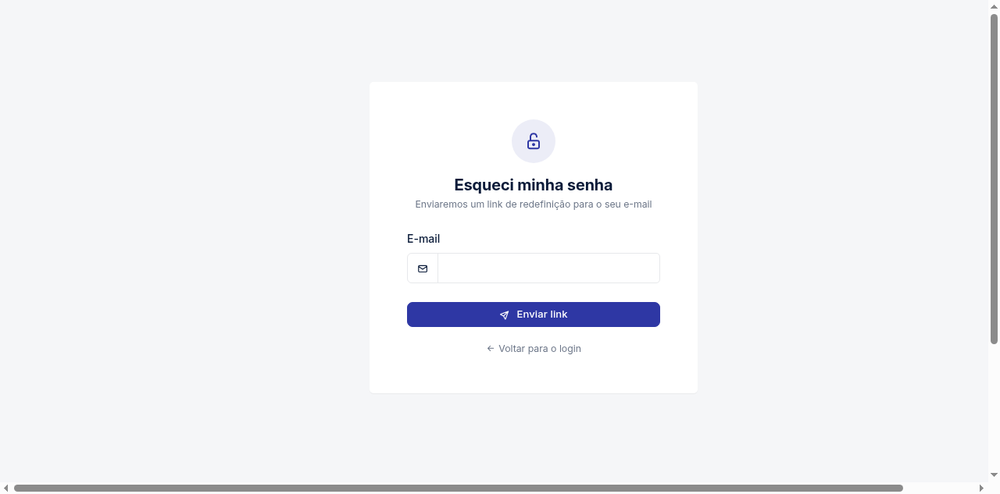

1. Informe o e-mail cadastrado e clique em **Enviar link**.
2. A mensagem de confirmação aparece **sempre**, mesmo se o e-mail não existir no sistema — de
   novo, para não revelar se uma conta existe:

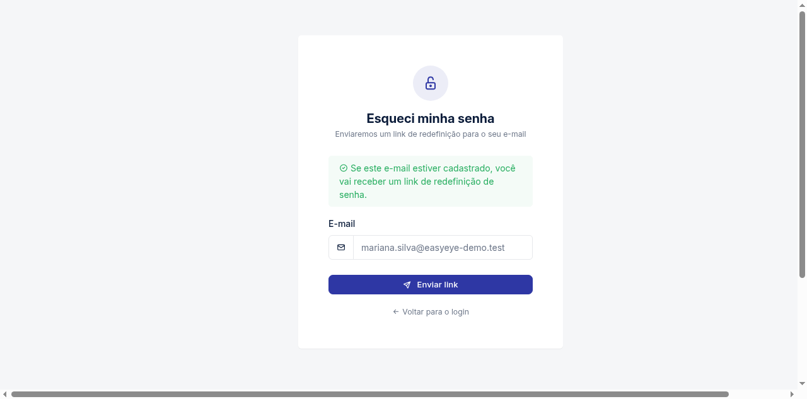

3. Abra o e-mail recebido e clique no link. Ele leva a uma tela para criar a nova senha:

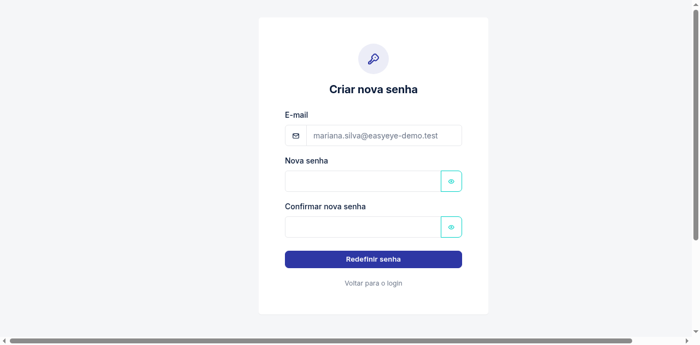

4. Preencha a nova senha (duas vezes) e clique em **Redefinir senha**. O link do e-mail vale por
   **30 minutos** — depois disso, peça um novo link.

---

## 4. Minhas Clínicas (painel inicial)

Após o login, esta é a primeira tela — a lista de **todas as clínicas EasyEye** onde o paciente
já foi atendido, cada uma com sua própria caixinha de documentos:

Clique em **Ver documentos** no card da clínica desejada. Se o paciente nunca foi atendido em
nenhuma clínica EasyEye vinculada a este e-mail, a tela mostra "Nenhuma clínica encontrada para
o seu cadastro."

---

## 5. Documentos de uma clínica

Dentro de uma clínica, a lista mostra **só o que essa clínica liberou explicitamente** para o
paciente — nada é compartilhado automaticamente:

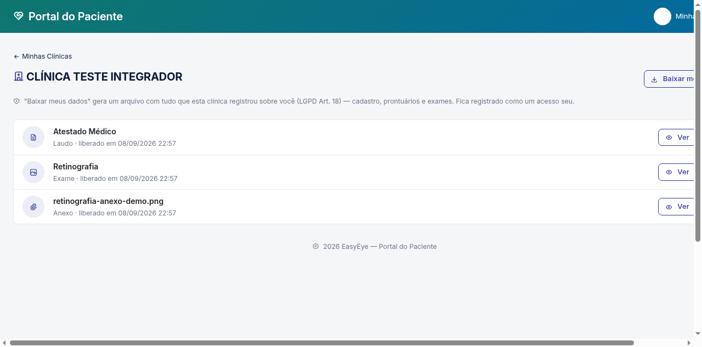

Cada linha mostra um ícone por tipo, o título do documento e a data em que foi liberado:

| Ícone | Tipo | O que é |
|---|---|---|
| 📄 Laudo | **Laudo** | Documento clínico assinado pelo médico (atestado, relatório, laudo de exame de imagem…) |
| 🖼️ Exame | **Exame** | Imagem de um exame oftalmológico (retinografia, topografia, OCT…) |
| 📎 Anexo | **Anexo** | Arquivo anexado ao prontuário (PDF/imagem trazido de outro serviço, laudo externo…) |

Clique em **Ver** para abrir, ou no ícone de download para baixar direto.

> **Nem todo laudo emitido aparece aqui.** Só os documentos que a clínica **decidiu
> compartilhar** — a equipe pode revogar o acesso a qualquer momento; nesse caso o item some da
> lista na próxima vez que a página carregar.

---

## 6. Visualizar e baixar um documento

Ao clicar em **Ver**, o documento abre numa tela própria, com **Baixar** sempre disponível no
topo.

**Laudo** (PDF, renderizado na hora a partir do prontuário):

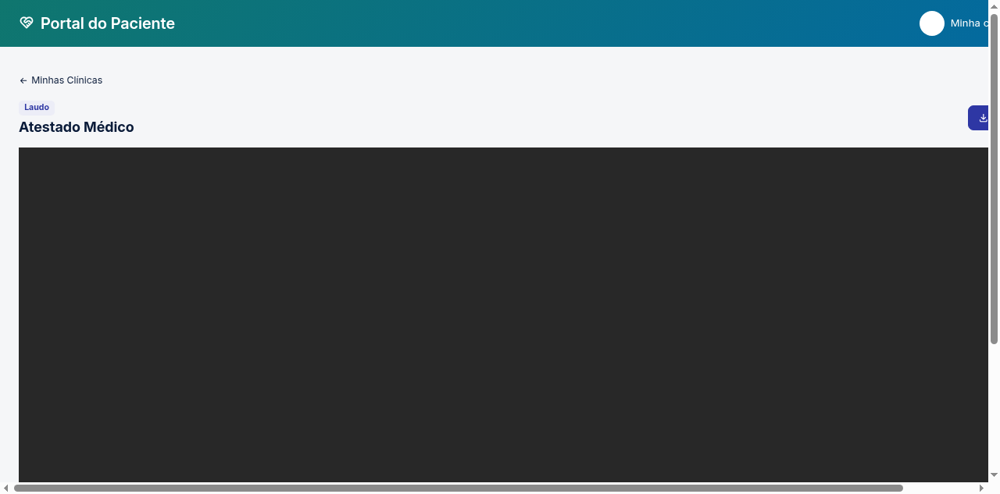

**Exame/Anexo** (imagem):

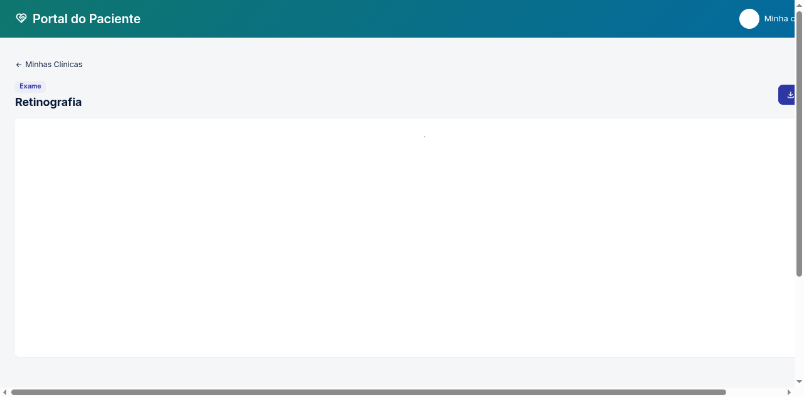

- Arquivos de imagem/PDF abrem direto na tela; outros formatos mostram apenas o botão de
  download (sem pré-visualização).
- Cada abertura de documento é registrada na trilha de acesso da clínica — não é uma ação
  anônima.
- Se a clínica **revogar** o compartilhamento enquanto o paciente está com a tela aberta, um
  clique em **Baixar** logo depois pode retornar erro — é esperado; volte para **Minhas
  Clínicas** e confira a lista atualizada.

---

## 7. Baixar meus dados (LGPD)

No topo da tela de documentos de cada clínica, o botão **Baixar meus dados** permite ao próprio
paciente exportar tudo que aquela clínica específica registrou sobre ele (cadastro, prontuários,
exames) — o exercício do direito de acesso previsto no **Art. 18 da LGPD**:

- A exportação é **por clínica** (não existe um botão único para "todas as clínicas de uma vez").
- Cada exportação fica registrada como um acesso seu aos próprios dados.
- Por ser uma operação pesada (relê boa parte do histórico clínico), o sistema limita quantas
  exportações podem ser feitas em um curto intervalo — se aparecer um erro de "muitas
  tentativas", aguarde um minuto e tente de novo.

---

## 8. Sair (logout)

Clique no seu nome (canto superior direito) para abrir o menu:

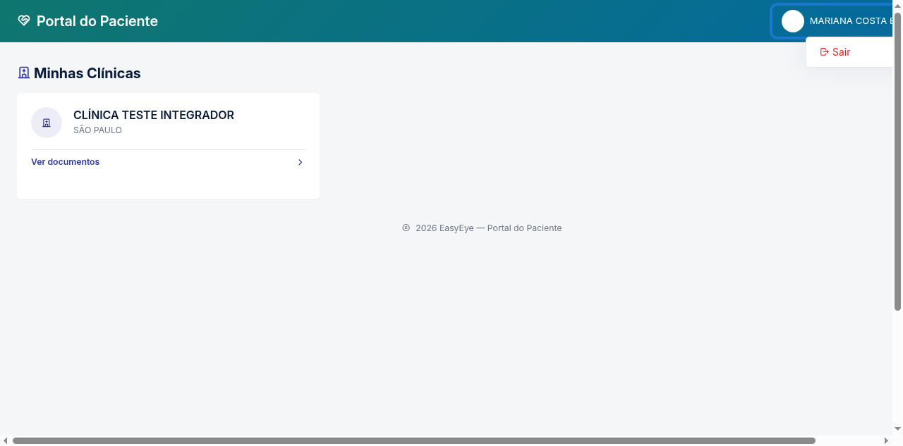

Clique em **Sair**. A sessão é encerrada imediatamente e o Portal volta para a tela de login.

> Em computadores compartilhados (lan house, recepção de outra clínica, etc.), sempre saia ao
> terminar — não há um tempo automático curto de expiração de sessão além do "Lembrar de mim".

---

## 9. Perguntas frequentes / limitações atuais

- **"Não recebi o e-mail de convite/redefinição de senha."** Confira a caixa de spam. Peça à
  clínica para reenviar o convite (não invalida um link anterior ainda válido) ou solicite um
  novo link em **Esqueci minha senha**.
- **"Meu telefone/endereço estão errados — como corrijo?"** O Portal **ainda não tem** uma tela
  de "Editar meus dados". Peça a correção diretamente à recepção da clínica; o cadastro é
  mantido por ela.
- **"Posso trocar meu e-mail de login?"** Ainda não pela tela do Portal — solicite à clínica.
- **"Vejo um documento na lista, mas 'Ver'/'Baixar' dá erro."** O compartilhamento pode ter sido
  revogado entre o carregamento da lista e o clique — volte a **Minhas Clínicas** e entre de
  novo na clínica para atualizar a lista.
- **Autenticação em duas etapas (2FA)**: ainda não está disponível para contas do Portal do
  Paciente (existe apenas no painel da equipe da clínica).

---

## 10. Para a equipe da clínica: como liberar o Portal para um paciente

Duas ações, feitas de dentro do `/panel` (perfis Administrador, Médico e Secretária):

1. **Convidar o paciente** — na ficha do paciente, botão **Convidar para o portal** (exige
   e-mail cadastrado). Documentado em detalhe nos manuais de cada perfil:
   [Administrador](../manual-administrador/README.md#14-imagens-oftálmicas-e-portal-do-paciente) ·
   [Médico](../manual-medico/README.md#9-portal-do-paciente-convite-e-compartilhamento-de-documentos) ·
   [Secretária](../manual-secretaria/README.md#11-portal-do-paciente-convite-e-compartilhamento-de-exame).
2. **Compartilhar um documento** — o ícone de compartilhamento no prontuário (laudo — exclusivo
   de Administrador e Médico) ou no Gerenciador de Imagens (exame — Administrador, Médico e
   Secretária). Sem esse passo, a conta do paciente existe mas a lista de documentos fica vazia.

---

*Manual gerado a partir de telas reais do EasyEye — Portal do Paciente. Interface evoluiu? Gere
novas capturas com os comandos indicados no topo deste documento.*
