# Manual da Secretária — EasyEye

Guia completo de utilização do sistema para o perfil **Secretária**, passo a passo com telas reais.
Cobre todas as áreas que o perfil acessa: agenda, mural de recados, fila de espera, pacientes,
importação, médicos (escala e bloqueios), imagens oftálmicas, assistente de IA e conta.

> As capturas deste manual são geradas automaticamente a partir do sistema real
> (`e2e/cypress/e2e/docs/secretary-manual.cy.js`). Para atualizá-las após mudanças de tela:
> `cd e2e && npx cypress run --browser chrome --config excludeSpecPattern=__none__ --spec cypress/e2e/docs/secretary-manual.cy.js`
> e copie as imagens de `e2e/cypress/screenshots/secretary-manual.cy.js/` para `docs/manual-secretaria/img/`.

---

## Sumário

1. [Acesso ao sistema](#1-acesso-ao-sistema)
2. [Agenda](#2-agenda)
3. [Novo agendamento](#3-novo-agendamento)
4. [Situações do atendimento e cancelamento](#4-situações-do-atendimento-e-cancelamento)
5. [Mural de recados](#5-mural-de-recados)
6. [Fila de espera](#6-fila-de-espera)
7. [Pacientes](#7-pacientes)
8. [Importação de pacientes por planilha](#8-importação-de-pacientes-por-planilha)
9. [Médicos: consulta, escala e bloqueios](#9-médicos-consulta-escala-e-bloqueios)
10. [Imagens oftálmicas](#10-imagens-oftálmicas)
11. [Assistente de IA (consumo)](#11-assistente-de-ia-consumo)
12. [Minha conta e saída do sistema](#12-minha-conta-e-saída-do-sistema)
13. [O que o perfil de secretária NÃO acessa](#13-o-que-o-perfil-de-secretária-não-acessa)

---

## 1. Acesso ao sistema

1. Acesse o endereço do painel da clínica e informe **e-mail** e **senha**.
2. Se a clínica exigir, conclua a verificação em duas etapas (código do aplicativo autenticador).
3. Após o login você chega ao **Painel de controle**, com os indicadores do dia:

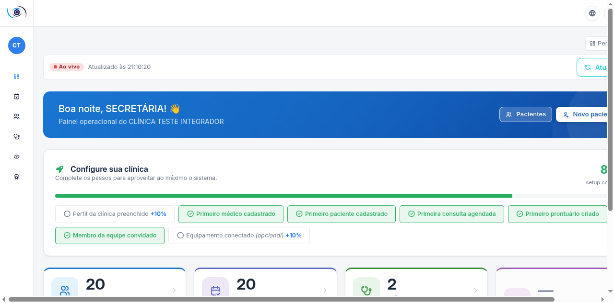

O **menu lateral** (passe o mouse sobre a barra à esquerda para expandir) mostra exatamente as
áreas do seu perfil:

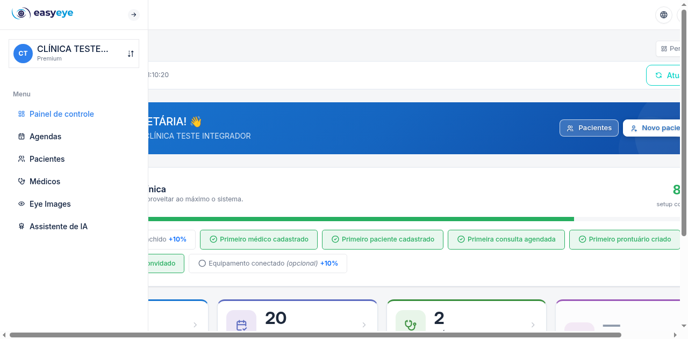

| Item do menu | O que faz |
|---|---|
| Painel de controle | Indicadores do dia e atalhos |
| Agendas | Agenda da clínica (o centro do seu trabalho) |
| Pacientes | Cadastro completo de pacientes |
| Médicos | Consulta ao corpo clínico, escala e bloqueios |
| Imagens oftálmicas | Exames de imagem dos pacientes |
| Assistente de IA | Acompanhamento do uso de IA da clínica |

---

## 2. Agenda

Clique em **Agendas** no menu. A tela abre no dia atual, em visão de lista:

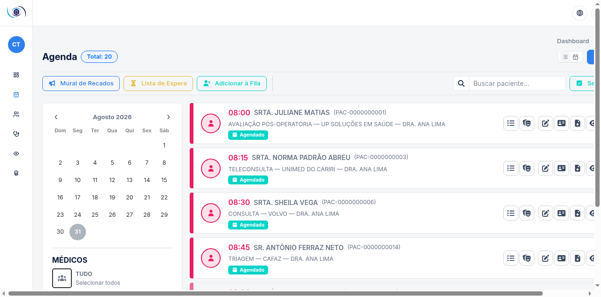

Elementos da tela:

- **Calendário lateral** — clique num dia para trocar a data; as setas mudam o mês.
- **Filtro por médico** — na coluna MÉDICOS, selecione um profissional ou "TUDO".
- **Cards de atendimento** — cada card mostra horário, paciente, código, tipo de consulta,
  convênio, médico e a **situação** (etiqueta colorida: Agendado, Confirmado, Atendido…).
- Botões do topo: **Mural de Recados**, **Lista de Espera**, **Adicionar à Fila**, busca e **Novo**.

### Visão de calendário

Use os botões no canto superior direito para alternar entre **lista** e **calendário**:

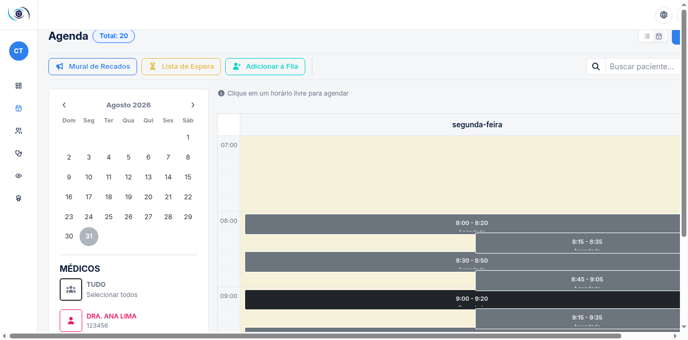

### Buscar um paciente na agenda

Digite parte do nome no campo **Buscar paciente...** — a lista filtra sozinha:

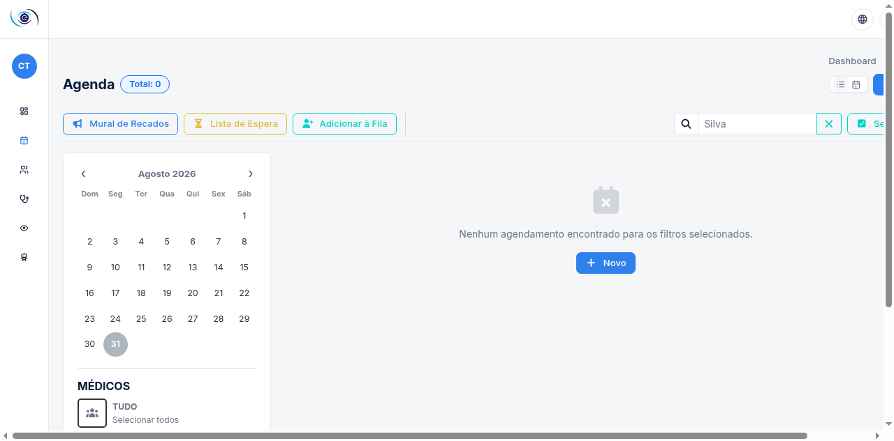

---

## 3. Novo agendamento

1. Na Agenda, clique no botão **Novo** (canto superior direito).
2. O painel de novo agendamento abre:

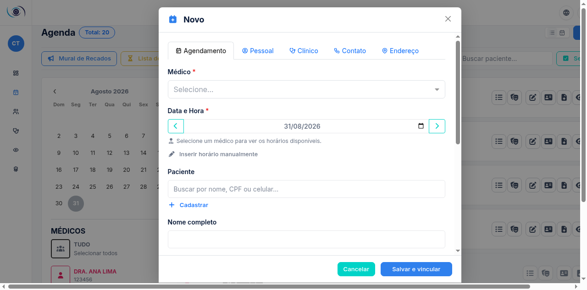

3. Selecione o **médico**. Os **horários disponíveis** do dia aparecem automaticamente,
   respeitando a escala do profissional e o intervalo entre consultas:

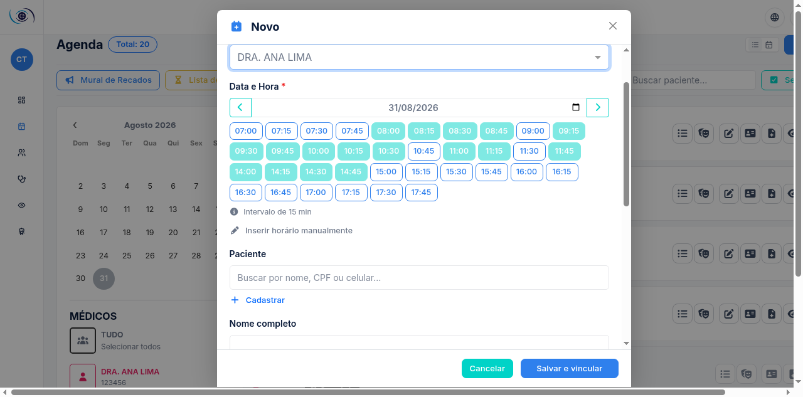

4. Escolha a **data** (setas ou campo de data) e clique no **horário** desejado.
   Horários já ocupados aparecem desabilitados. Se precisar de um horário fora da grade,
   use **Inserir horário manualmente**.
5. No campo **Paciente**, busque por nome, CPF ou celular.
   - Paciente ainda não cadastrado? Clique em **+ Cadastrar** e preencha o nome completo —
     o cadastro rápido cria o paciente junto com o agendamento.
6. Informe o tipo de consulta e o convênio, se solicitados.
7. Clique em **Salvar e vincular**. O card aparece na agenda na data escolhida.

> **Recorrência**: para consultas que se repetem (retornos semanais, por exemplo),
> use a seção de recorrência no fim do painel, informando o padrão e a data limite.

---

## 4. Situações do atendimento e cancelamento

Cada card da agenda tem um botão de **situação** (ícone de lista). Ele abre as opções do fluxo
de atendimento:

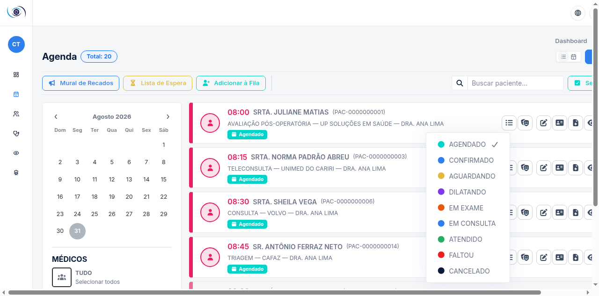

Fluxo típico do dia:

1. **Agendado** → paciente marcou.
2. **Confirmado** → paciente confirmou presença (por telefone/WhatsApp).
3. **Aguardando** → paciente chegou à recepção.
4. **Dilatando / Em exame / Em consulta** → etapas clínicas.
5. **Atendido** → consulta concluída.
6. **Faltou** → paciente não compareceu.
7. **Cancelado** → consulta cancelada (o sistema pede o **motivo** do cancelamento).

> Ao escolher **Cancelado**, uma janela pede o motivo — descreva-o e confirme.
> O horário volta a ficar livre para novos agendamentos.

Os demais botões do card permitem **editar** o agendamento, **reagendar** para outro
horário e abrir os dados do paciente.

---

## 5. Mural de recados

Comunicação interna da equipe, direto na Agenda. Clique em **Mural de Recados**:

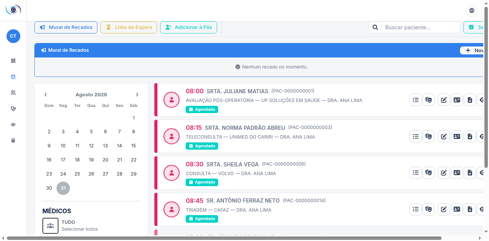

Para publicar um recado:

1. Clique em **Novo** (botão com "+" no cabeçalho azul do mural).
2. Digite o recado (até 1000 caracteres).
3. Opcional: marque **Urgente** (o recado ganha destaque) e defina **Expira em** (data em que
   o recado some sozinho).
4. Clique em **Publicar**.

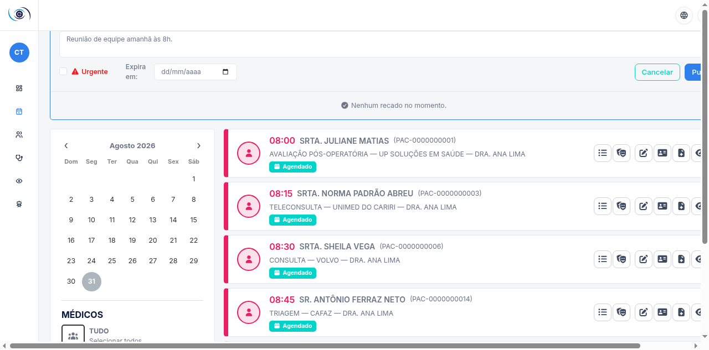

- **Li** — marca o recado como lido (check verde para a equipe saber quem viu).
- **×** — exclui um recado seu.

---

## 6. Fila de espera

Para pacientes que querem consulta, mas não há horário disponível.

### Adicionar à fila

1. Na Agenda, clique em **Adicionar à Fila**.
2. Preencha o painel:

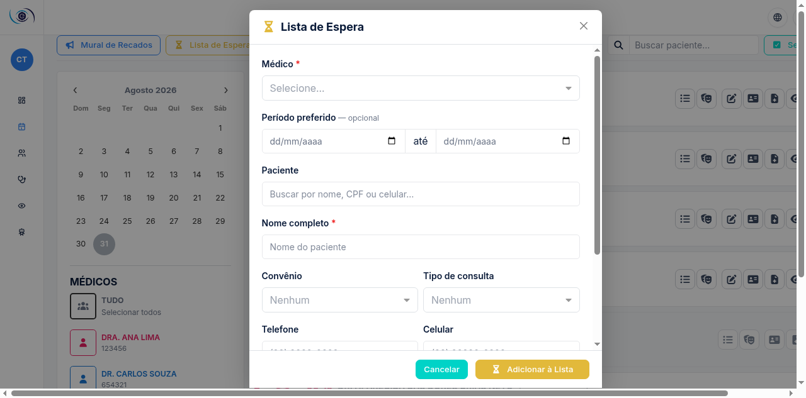

   - **Médico** (obrigatório) — fila é por profissional.
   - **Período preferido** — datas em que o paciente pode vir.
   - **Paciente** — busque um cadastro existente ou informe o **nome completo**
     (com telefone/celular e a opção WhatsApp para contato).
   - **Observações** — motivo da consulta, urgência.
3. Clique em **Adicionar à Lista**.

### Gerenciar a fila

Clique em **Lista de Espera** para abrir o painel:

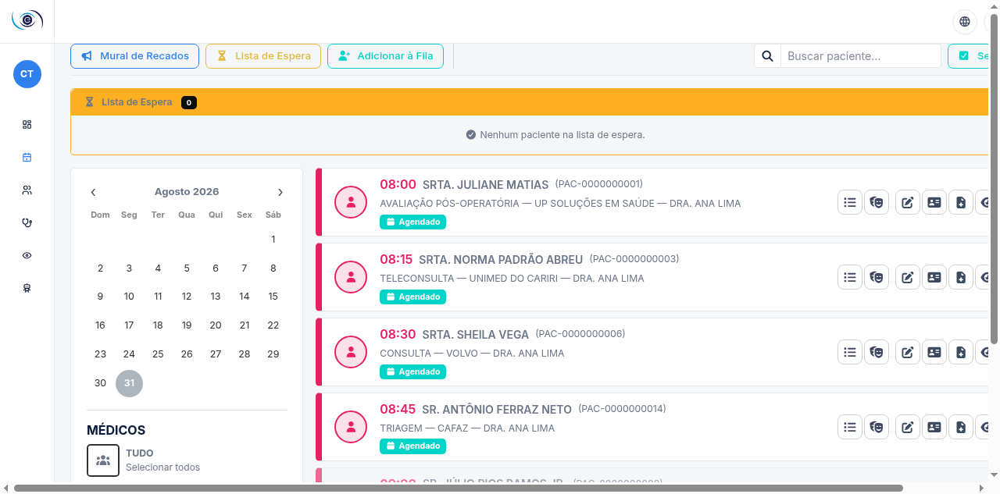

- As **setas ▲▼** mudam a ordem de prioridade.
- **Agendar** abre o novo agendamento já preenchido com os dados do paciente — use quando
  surgir um horário vago (por exemplo, após um cancelamento).
- **Remover** tira o paciente da fila.

---

## 7. Pacientes

Clique em **Pacientes** no menu:

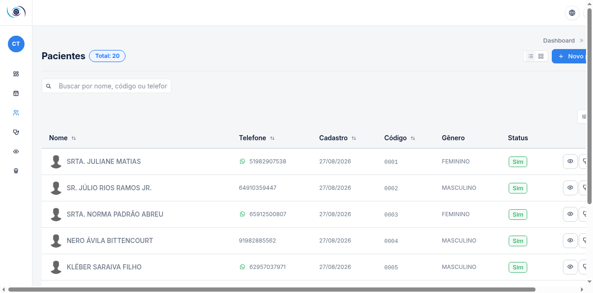

- **Busca** — por nome, código ou documento; a lista filtra automaticamente.
- Colunas personalizáveis pelo botão de engrenagem.
- Cada linha tem: **Visualizar** (olho), **Prontuário** (estetoscópio) e o menu **⋮**
  com Editar, Desativar e Excluir.

### Cadastrar um paciente

1. Clique em **Novo paciente**.
2. Preencha a aba **Pessoal** (nome completo é obrigatório; CPF, nascimento, gênero…):

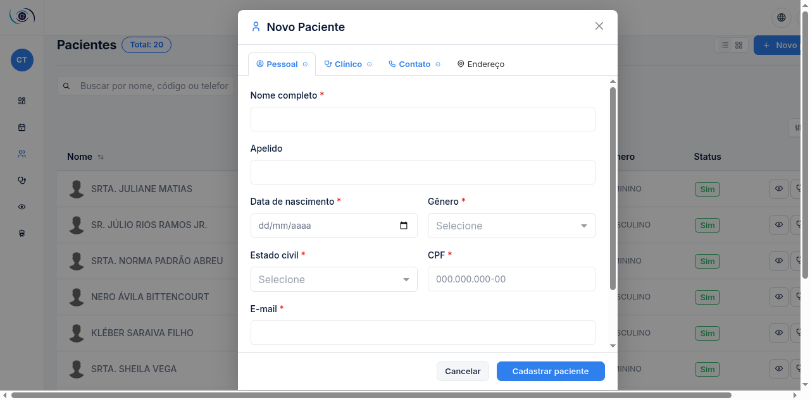

3. Na aba **Clínico**, informe o **convênio** do paciente:

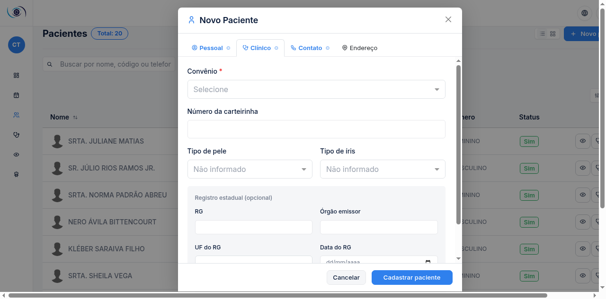

4. Preencha o contato (celular, e-mail, endereço — o **CEP preenche o endereço sozinho**).
5. Clique em **Salvar**.

### Consultar e editar

- O botão **Visualizar** abre o resumo do paciente:

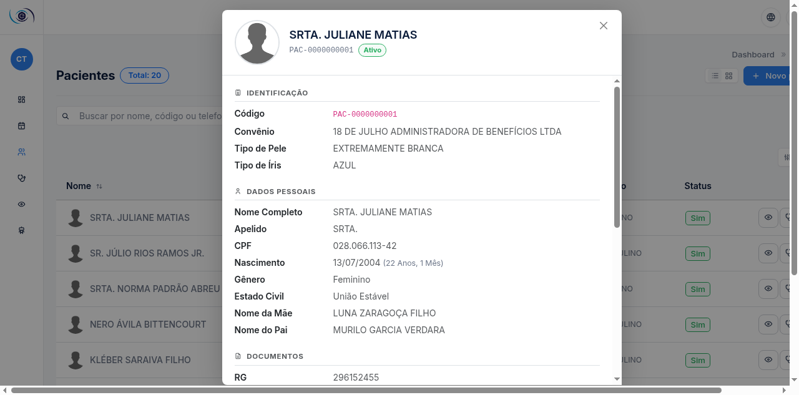

- Para alterar dados, use **⋮ → Editar**, mude o que precisar e salve.
- **Desativar** marca o paciente como inativo (badge "Não" na coluna Ativo) sem apagar nada;
  **Ativar** reverte.
- **Excluir** remove o paciente da operação (a linha fica marcada como Excluída) e
  **Restaurar** desfaz a exclusão. Nenhum histórico é perdido.

### Prontuário (leitura)

O botão **Prontuário** abre o histórico clínico do paciente. O perfil de secretária
**visualiza** os prontuários; criação e edição são exclusivas do médico.

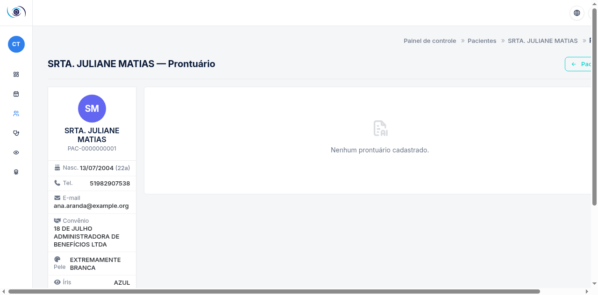

---

## 8. Importação de pacientes por planilha

Para migrar cadastros de outro sistema. Menu **Pacientes → Importar** (ou `/panel/patients/import`):

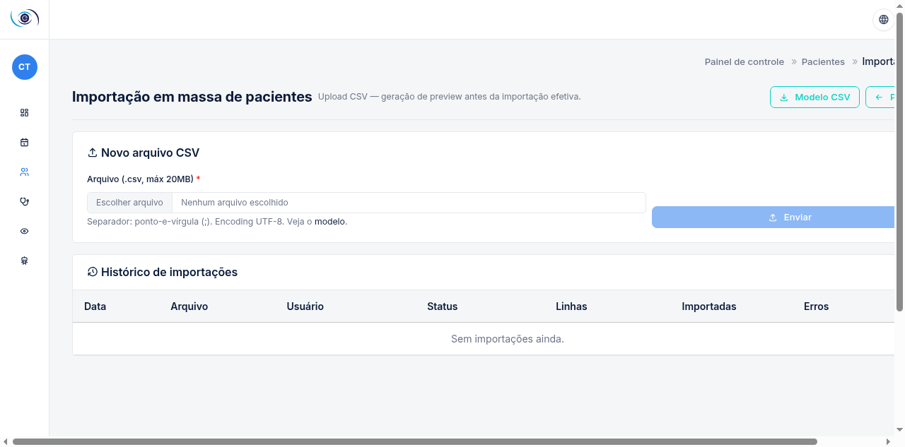

1. Clique em **Baixar modelo** e preencha a planilha (CSV) com os pacientes.
2. Envie o arquivo na área de upload.
3. O sistema mostra a **prévia**: quantos registros serão criados e os erros encontrados
   (linhas com problema não são importadas).
4. Revise e clique em **Confirmar** para efetivar — ou **Cancelar** para descartar tudo
   (nada é gravado até a confirmação).

---

## 9. Médicos: consulta, escala e bloqueios

Clique em **Médicos** no menu:

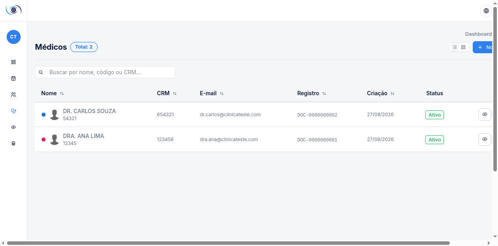

O perfil de secretária **consulta** o corpo clínico e **administra a agenda** dos médicos.
O cadastro de novos médicos é exclusivo do administrador (cria credencial de acesso).

### Escala de atendimento

Na linha do médico, clique no ícone **Horários de atendimento**:

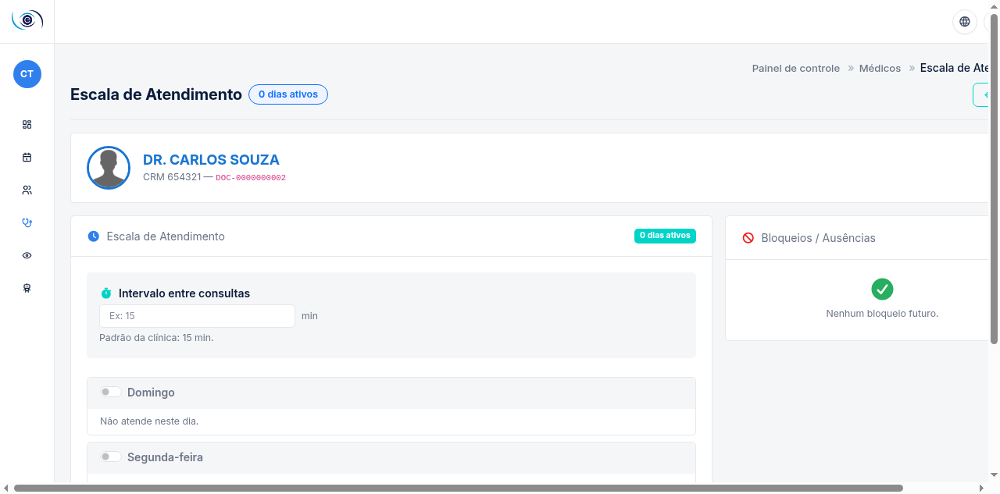

1. **Intervalo entre consultas** — duração padrão de cada atendimento (ex.: 15 min).
2. Ative os **dias da semana** em que o médico atende e defina as **faixas de horário**
   (ex.: 07:00–12:00 e 14:00–18:00). Use **+ Faixa** para períodos adicionais no mesmo dia.
3. Clique em **Salvar Escala**.

A escala alimenta os horários oferecidos no novo agendamento.

### Bloqueios e ausências

No cartão **Bloqueios / Ausências** (mesma tela):

1. Clique no **+** para abrir o formulário.
2. Escolha o **tipo** (Ausência, Feriado, Reunião/Compromisso, Outro), o período
   (início e fim) e um motivo opcional.
3. Clique em **Adicionar Bloqueio**.

Durante um bloqueio o médico não recebe agendamentos. A lixeira remove um bloqueio futuro.

---

## 10. Imagens oftálmicas

Menu **Imagens oftálmicas** — central de exames de imagem dos pacientes:

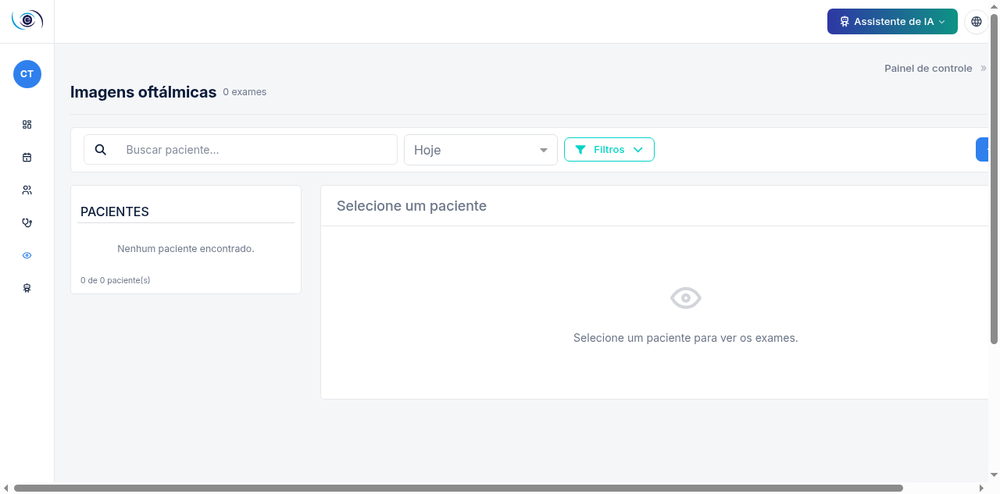

- Busque o paciente na coluna esquerda para ver os exames dele.
- **Filtros** refina por olho (OD/OE/AO), tipo de exame, equipamento, médico e período.
- **Novo** importa um exame externo (arquivo trazido pelo paciente): selecione o paciente,
  o tipo de exame, a data e anexe os arquivos (JPG, PNG ou PDF).

---

## 11. Assistente de IA (consumo)

Menu **Assistente de IA** — acompanhamento do uso de inteligência artificial da clínica:

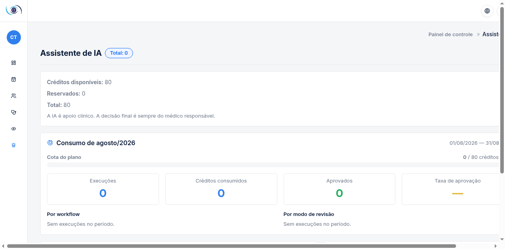

A secretária **acompanha** o consumo de créditos e o histórico de execuções.
A geração e aprovação de conteúdo clínico por IA é exclusiva dos médicos;
a compra de créditos é do administrador.

---

## 12. Minha conta e saída do sistema

### Meu perfil

Clique no seu avatar (canto superior direito) → **Editar perfil**:

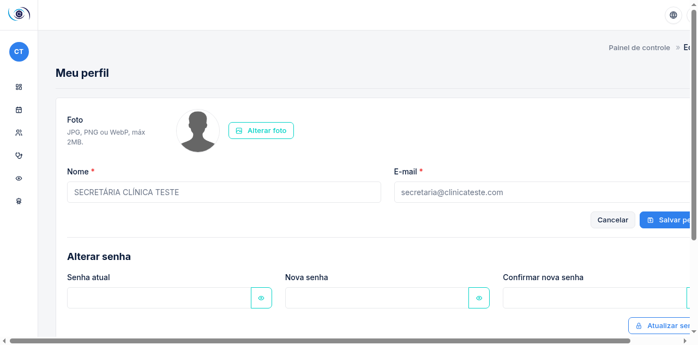

- Altere **nome**, **e-mail** e **foto**.
- Na seção **Alterar senha**, informe a senha atual e a nova senha
  (mínimo 8 caracteres com maiúsculas, minúsculas, números e símbolos).
- Em **Autenticação em dois fatores**, configure seu aplicativo autenticador
  (Google/Microsoft Authenticator) — recomendado.

### Sair

Avatar → **Sair**:

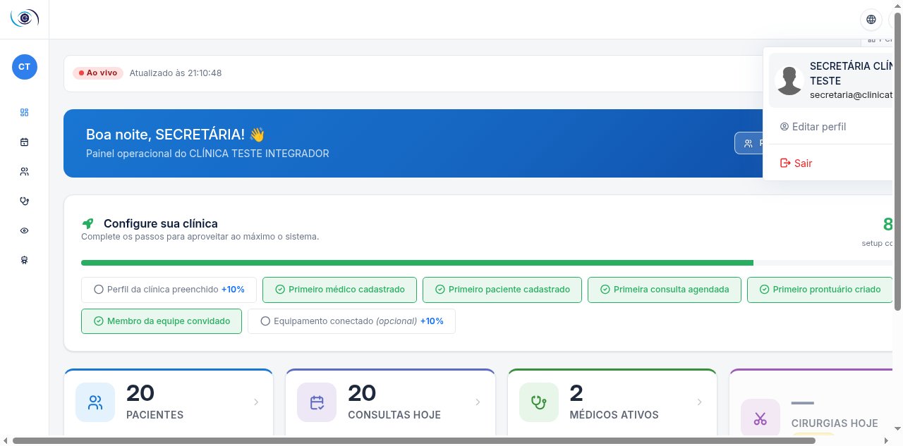

---

## 13. O que o perfil de secretária NÃO acessa

Por segurança e conformidade (LGPD/CFM), estas áreas retornam **acesso negado** para o
perfil de secretária:

| Área | Motivo | Quem acessa |
|---|---|---|
| Financeiro (caixa, faturamento, TISS) | Dados financeiros | Administrador e Financeiro |
| Relatórios e Compliance | Dados gerenciais e trilhas de auditoria | Administrador |
| Controle de acesso (usuários e perfis) | Gestão de credenciais | Administrador |
| Configurações da clínica (catálogos, convênios, salas) | Parametrização | Administrador |
| Cadastro/edição/exclusão de médicos | Cria credencial de login | Administrador |
| Criação e edição de prontuários | Ato médico | Médico |
| Prompts de IA e aprovação de conteúdo IA | Responsabilidade clínica | Médico |
| Painel do SaaS (`/panel/manager`) | Administração da plataforma | Equipe EasyEye |

Se precisar de algo nessas áreas, procure o administrador da clínica.

---

*Manual gerado a partir do EasyEye em produção de telas reais — perfil Secretária.
Dúvidas ou telas divergentes? A interface pode ter evoluído: gere novas capturas com o
comando indicado no topo deste documento.*
