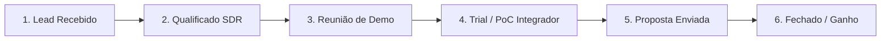
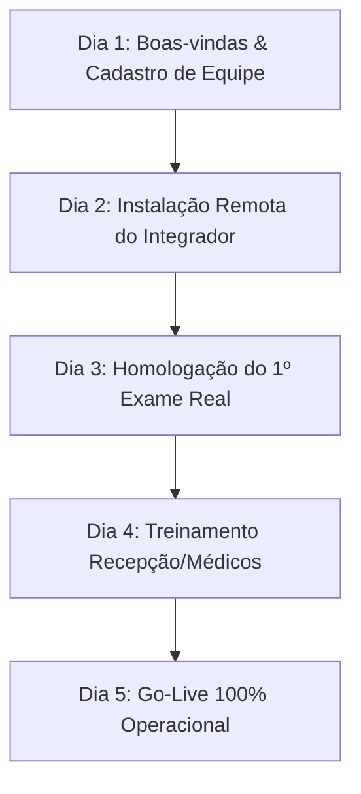

# Plano Comercial, Estrutura de CRM e Go-To-Market — EasyEye

**Documento Estratégico para Alinhamento de Sócios**  
**Versão:** 1.0  
**Data:** Setembro de 2026  
**Produto:** EasyEye SaaS (Gestão Clínica/TISS) + Engine Integrador de Equipamentos  

---

## 1. Sumário Executivo

O **EasyEye** é uma solução completa para clínicas de oftalmologia que combina gestão clínica (PEP, TISS, LGPD) com um diferencial competitivo único: **o Integrador de Aparelhos**, que captura automaticamente exames de equipamentos (Topcon, Nidek, ZEISS, etc.) e os envia para a nuvem.

Com o desenvolvimento do produto em fase final, este documento estabelece o **Playbook Comercial e Processo de CRM** baseado nas metodologias mais eficientes de startups B2B SaaS (*Predictable Revenue*, *SPIN Selling* e *Product-Assisted Sales*).

---

## 2. Modelo de Go-To-Market (GTM)

Adotaremos um **modelo híbrido de vendas**:

1. **Self-Service (Inbound PLG):** Voltado a consultórios individuais / pequenos médicos que entram pelo site, fazem trial de 14 dias com o integrador em modo simulação e assinam online.
2. **Sales-Led / Venda Consultiva (SDR + Closer):** Voltado a clínicas de médio e grande porte (múltiplos médicos e aparelhos). Requer reunião de demonstração e instalação assistida do integrador.

---

## 3. Arquitetura do Funil de CRM (Pipeline de Vendas)

No CRM comercial (ex: Pipedrive ou HubSpot), o funil de aquisição será dividido em **6 etapas bem definidas**:



### Detalhamento das Etapas e Gatilhos de Passagem

| Etapa | Responsável | Ação Principal | Critério para Avançar (Gatilho) |
| :--- | :--- | :--- | :--- |
| **1. Lead Recebido** | Marketing / Outbound | Entrada do lead via formulário, WhatsApp ou prospecção ativa. | Contato inicial realizado em < 15 minutos. |
| **2. Qualificado (SDR)** | SDR (Pré-vendas) | Diagnóstico rápido de perfil (ICP) e aparelhos da clínica. | Clínica possui aparelhos compatíveis + agendou demo. |
| **3. Reunião de Demo** | Closer / Vendedor | Apresentação ao vivo focada na dor da digitação manual de exames. | Cliente solicitou proposta ou autorizou instalação de teste. |
| **4. Trial / PoC Integrador** | CS / Suporte Técnico | Instalação remota do integrador de teste (7 dias) no PC da clínica. | **1º exame capturado com sucesso** pelo integrador. |
| **5. Proposta / Checkout** | Closer / Vendedor | Envio do link de checkout ou contrato assinado. | Proposta aceita / link de pagamento acessado. |
| **6. Fechado / Ganho** | Sistema / Financeiro | Confirmação do pagamento do 1º mês ou anuidade. | Transfere lead para o **Pipeline de Onboarding**. |

---

## 4. Playbook de Pré-Vendas (SDR / Qualificação)

### Perfil de Cliente Ideal (ICP)
- **Foco Principal:** Clínicas de oftalmologia com 1 a 10 médicos.
- **Equipamentos:** Clínicas que realizam exames frequentes (Topografia, Tonometria, Autorefrator, OCT, Campo Visual).
- **Operação:** Realizam atendimento por convênios (TISS) e/ou particular.

### Script de Diagnóstico (SPIN Selling)

- **Situação (S):** *"Quantos médicos atendem hoje na clínica e quais marcas de aparelhos de exame vocês utilizam?"*
- **Problema (P):** *"Como os resultados dos exames dos aparelhos chegam até o prontuário do paciente hoje? O médico ou a secretária precisam digitar manualmente?"*
- **Implicação (I):** *"Quanto tempo isso atrasa a consulta? Já aconteceu de ter erro de digitação de grau ou pressão ocular que gerou retrabalho?"*
- **Necessidade de Solução (N):** *"Se o exame saísse do aparelho e aparecesse instantaneamente no prontuário do EasyEye, quantas horas de atendimento vocês economizariam por dia?"*

---

## 5. Playbook de Vendas & Fechamento (Closer)

### Estrutura da Reunião de Demonstração (30 Minutos)

1. **Primeiros 5 min:** Alinhamento de expectativas e recapitulação das dores identificadas pelo SDR.
2. **Minutos 5 a 20 (O Momento "UAU"):**
   - Apresentação do **Integrador de Aparelhos** (diferencial único).
   - Demonstração do Prontuário Oftalmológico com gráficos e laudos.
   - Apresentação do módulo TISS / Faturamento de convênios.
3. **Minutos 20 a 30:** Apresentação dos planos, tira-dúvidas e definição dos próximos passos.

---

## 6. Playbook de Onboarding & Customer Success (CS)

O maior risco de cancelamento (*churn*) em SaaS médico ocorre na fase de implantação. Definimos o **SLA de Implantação em 5 dias úteis**:



### Health Score & Alertas de Retenção
O SaaS monitorará automaticamente o uso e emitirá alertas para a equipe de CS:

- 🟢 **Saudável:** Integrador enviando exames diariamente + médicos ativos.
- 🟡 **Atenção:** 3 dias sem envio de exames (possível queda de internet ou troca de PC na clínica).
- 🔴 **Risco Crítico:** 5+ dias sem exames ou sem login no sistema. **Ação imediata:** Contato ativo do CS para suporte.

---

## 7. Estratégia de Canais & Parceiros (Growth Hacks)

Aproveitando o **Módulo de Parceiros** já existente na arquitetura do EasyEye:

1. **Parceria com Técnicos de Manutenção de Equipamentos:**
   - Técnicos autônomos que prestam manutenção em aparelhos oftalmológicos visitarão clínicas semanalmente.
   - **Programa de Afiliados:** Comissão recorrente de 10% a 20% para cada indicação convertida via portal do parceiro.
2. **Fabricantes/Distribuidores de Aparelhos:**
   - Apresentar o EasyEye como software recomendado para automatizar os aparelhos vendidos por distribuidores regionais.

---

## 8. Planejamento de Equipe & Capacidade (Evolução Enxuta)

Para manter custos sob controle antes da tração financeira:

```
[ FASE 0: 0 a 10 Clientes ] ──► 100% Fundadores (Desenvolvimento + Vendas + Suporte)
          │
          ▼
[ FASE 1: 10 a 30 Clientes ] ──► Fundadores + 1x Analista de Suporte/Implantação (CS)
          │
          ▼
[ FASE 2: 30 a 80 Clientes ] ──► 1x SDR (Pré-Vendas) + 1x CS (Implantação) + Fundadores (Estratégia/Dev)
```

---

## 9. Próximos Passos Recomendados para os Sócios

1. **Aprovar o modelo de precificação e planos do EasyEye** (ex: por volume de exames ou por número de médicos).
2. **Contratar/Configurar o CRM Comercial (Pipedrive ou HubSpot)** com as etapas do funil descritas neste documento.
3. **Iniciar a prospecção dos 5 primeiros clientes piloto** (oferecendo acompanhamento VIP e condições especiais de lançamento).
4. **Cadastrar os 3 primeiros parceiros/técnicos** no Módulo de Parceiros do EasyEye.
